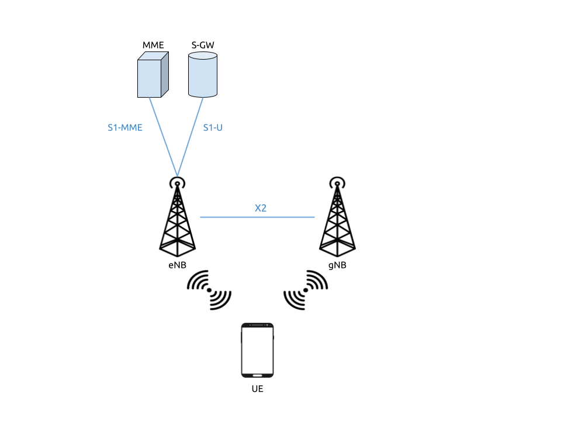
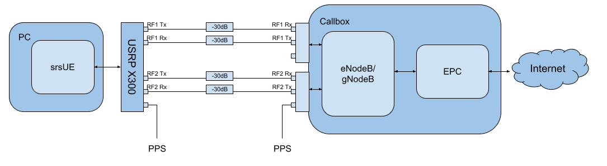
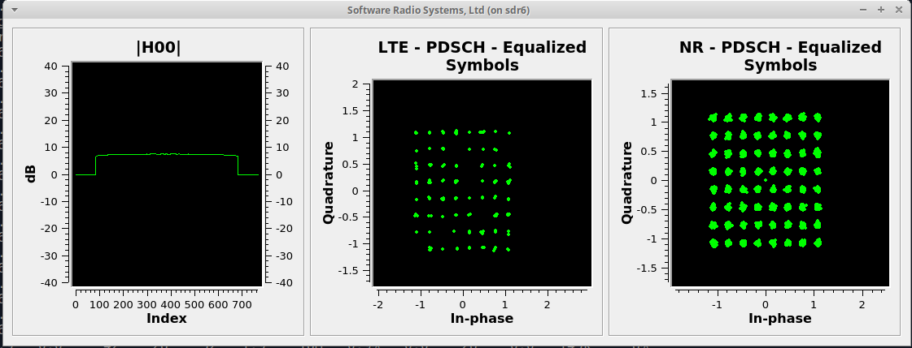

.. srsRAN 4G - 5G NSA Application Note

.. _5g_nsa_amari_appnote:

5G NSA srsUE
============

Introduction
************

The 21.04 release of srsRAN 4G brought 5G NSA (Non-Standalone) support to srsUE.
This application note shows how the UE can be used with a third-party 5G NSA network. In this example,
we use the Amari Callbox Classic from Amarisoft to provide the network.

5G NSA: What you need to know
*****************************

  
  5G NSA Mode 3

5G Non-Standalone mode provides 5G support by building upon and using pre-existing 4G infrastructure.
A secondary 5G carrier is provided in addition to the primary 4G carrier. A 5G NSA UE connects first 
to the 4G carrier before also connecting to the secondary 5G carrier. The 4G anchor carrier is used
for control plane signaling while the 5G carrier is used for high-speed data plane traffic.

This approach has been used for the majority of commercial 5G network deployments to date. It provides
improved data rates while leveraging existing 4G infrastructure. UEs must support 5G NSA to take advantage
of 5G NSA services, but existing 4G devices are not disrupted.

Limitations
***********

The current 5G NSA UE application has a few feature limitations that require certain configuration
settings at both the gNB and the core network. The key feature limitations are as follows:

  * 4G and NR carrier need to use the same subcarrier-spacing (i.e. 15 kHz) and bandwidth (we've tested 10 and 20 MHz)
  * Only DCI format 0_0 (for Uplink) and 1_0 (for Downlink) supported
  * NR carrier needs to use RLC UM (NR RLC AM not yet supported)
  * Support for sub-6Ghz (FR1) spectrum

Hardware Requirements
*********************

For this application note, the following components are used:

  * Amari Callbox with 5G NSA support as eNB/gNB and core
  * AMD Ryzen5 3600X Linux PC as UE compute platform
  * Ettus Research USRP X310 connected over 10GigE as UE RF front-end

The Amari Callbox is an LTE/NR SDR-based UE test solution from Amarisoft.
It contains an EPC/5GC, an eNodeB, a gNodeB, an IMS server, an 
eMBMS server and an Intel i7 Linux PC with PCIe SDR cards. The gNodeB is release 15 compliant and 
supports both NSA and SA modes. A further outline of the specifications can be found in the 
`data sheet <https://www.amarisoft.com/app/uploads/2020/02/AMARI-Callbox-Classic.pdf>`_.
This test solution was chosen as it's widely available, easily configurable, and user-friendly.

Hardware Setup
**************

Tests may be carried out over-the-air or using a cabled setup.
For this example, we use a cabled setup between the UE and the eNB/gNB (i.e from the X310 to the PCIe SDR cards 
on the Callbox). These connections run through 30dB attenuators as shown in the figure above. The 
PPS inputs for the accurate clocking of both the UE and Callbox are also shown.
Both UE and Callbox require accurate clocks - in our testing we provide PPS inputs to both.

Configuration
*************

To set-up and run the 5G NSA network and UE, the configuration files for both the 
Callbox and srsUE must be changed.

All of the modified configuration files have been included as attachments to this App Note. It is 
recommended you use these files to avoid errors while changing configs manually. Any configuration
files not included here do not require modification from the default settings.

UE files: 

  * :download:`UE config example <ue.conf.example>`

Callbox files:

  * :download:`MME config <mme.cfg>`
  * :download:`gNB NSA config <gnb-nsa.cfg>`

srsUE
-----

The following changes need to be made to the UE configuration file to allow it to connect to 
the Callbox in NSA mode. 

Firstly the following parameters need to be changed under the **[rf]** options so that the 
X310 is configured optimally::

  [rf]
  tx_gain = 10
  nof_antennas = 1
  device_name = uhd
  device_args = type=x300,clock=external,sampling_rate=11.52e6,lo_freq_offset_hz=11.52e6
  srate = 11.52e6

The next set of changes need to be made to the **[rat.eutra]** options. This make sure 
the anchor cell is found by the UE:: 

  [rat.eutra]
  dl_earfcn = 300

Finally the **[rat.nr]** options need to be configured for 5G NSA mode operation:: 

  [rat.nr]
  #enable 5G data link 
  nof_carriers = 1

Callbox
-------

To correctly configure the Callbox changes must be made to the following files: 
*mme.cfg* and *gnb_nsa.cfg*. 

**MME Configuration**

The *mme.cfg* file must be changed to reflect the QoS Class Identifier (QCI) which will be 
used across the network. We use QCI 7 as NR RLC UM is supported by the UE.
The following change must be made to the *erabs:* configurations:: 
	
	qci: 7,

**gNB NSA Configuration**

*gnb_nsa.cfg* is responsible for the configuration of both the LTE and NR cells needed for 
NSA mode. The LTE cell will mainly be used for the control plane, 
while the NR cell will be used for the data plane. 

The number of Resource Blocks (RBs) and number of antennae used in the DL must first be 
modified::

  #define N_RB_DL             50  // Values: 6 (1.4MHz), 25 (5MHz), 50 (10MHz), 75 (15MHz), 100 (20MHz)
  #define N_ANTENNA_DL        1    // Values: 1 (SISO), 2 (MIMO 2x2), 4 (MIMO 4x4)

The NR cell bandwidth should also be set:: 

  #define NR_BANDWIDTH        10   // NR cell bandwidth. With the PCIe SDR50 board, up to 50 MHz is supported.

The TX gain, sampling rates for each cell and the UL & DL frequencies for the NR cell must 
be set. The tx_gain is set for the *rf_driver:*::

 tx_gain: 70.0, /* TX gain (in dB) */

The sample rate is set for the LTE cell in the *rf_ports:* configuration:: 

  /* RF port for the LTE cell */
  sample_rate: 11.52,

The sample rate and DL/UL frequencies are set for the NR cell in the *rf_ports:* configuration:: 

  /* RF port for the NR cell */
  sample_rate: 23.04,
  dl_freq: 3507.84, // Moves NR DL LO frequency -5.76 MHz
  ul_freq: 3507.84, // Moves NR UL LO frequency -5.76 MHz

The NR absolute radio-frequency channel number (ARFCN) for the DL needs to be changed 
to match the new DL frequency that has been set:: 

	dl_nr_arfcn: 634240,  /* 3507.84 MHz */

Next, the default settings of the NR cell must be adjusted. The subcarrier spacing(s) should 
be changed in the *nr_cell_default:* configuration:: 

  subcarrier_spacing: 15, /* kHz *
  ssb_subcarrier_spacing: 30,

The timing offset should be set to 0:: 

  n_timing_advance_offset: 0,

The TDD config options now need to be adjusted:: 

  period: 10,
  dl_slots: 6,
  dl_symbols: 0,
  ul_slots: 3,
  ul_symbols: 0,

After this the PRACH configuration needs to be adjusted:: 

  #if NR_TDD == 1
  prach_config_index: 0,

  msg1_frequency_start: 1,
  zero_correlation_zone_config: 0,
	
  ra_response_window: 10, /* in slots */

For the PDCCH configuration (starting at line 411), the following changes must be made:: 

  pdcch: {
    common_coreset: {
      rb_start: -1, /* -1 to have the maximum bandwidth */
      l_crb: -1, /* -1 means all the bandwidth */
      duration: 1,
      precoder_granularity: "sameAsREG_bundle",
      //dmrs_scid: 0,
    },

    dedicated_coreset: {
      rb_start: -1, /* -1 to have the maximum bandwidth */
      l_crb: -1, /* -1 means all the bandwidth */
      duration: 1,
      precoder_granularity: "sameAsREG_bundle",
      //dmrs_scid: 0,
    },
    
    css: {
      n_candidates: [ 1, 1, 1, 0, 0 ],
    },
    rar_al_index: 2,

    uss: {
      n_candidates: [ 0, 2, 1, 0, 0 ],
      dci_0_1_and_1_1: false,
      force_dci_0_0: true, // Forces DCI format 0_0 for Uplink
      force_dci_1_0: true, // Forces DCI format 1_0 for Downlink
    },
    al_index: 1,
  },

For the PDSCH configuration the following change needs to be made:: 

	k1: [ 8, 7, 6, 6, 5, 4],

QAM 64 must be selected for the Modulation Coding Scheme (MCS) table:: 

	mcs_table: “qam64”, 

In the PUCCH set-up frequency hopping needs to be turned off:: 

	freq_hopping: false, 

For the *pucch2* entry, the following settings can be selected, while the 
entries for *pucch3* and *pucch4* can be removed fully::

 pucch2: {
   n_symb: 2,
   n_prb: 1,
   freq_hopping: false,
   simultaneous_harq_ack_csi: false, 
   max_code_rate: 0.25,
 },

The final changes to the configuration file are made to pusch settings:: 

  pusch: {
    mapping_type: "typeA",
    n_symb: 14,
    dmrs_add_pos: 1,
    dmrs_type: 1,
    dmrs_max_len: 1,
    tf_precoding: false,
    mcs_table: "qam64", /* without transform precoding */
    mcs_table_tp: "qam64", /* with transform precoding */
    ldpc_max_its: 5,
    k2: 4, /* delay in slots from DCI to PUSCH */
    p0_nominal_with_grant: -90,
    msg3_k2: 5,
    msg3_mcs: 4,
    msg3_delta_power: 0, /* in dB */
    beta_offset_ack_index: 9,

    /* hardcoded scheduling parameters */
    n_dmrs_cdm_groups: 1,
    n_layer: 1,
    /* if defined, force the PUSCH MCS for all UEs. Otherwise it is
    computed from the last received PUSCH. */ 
    /* mcs: 16, */
  },

The Callbox should now be correctly configured for 5G NSA testing with srsUE. 

Usage
*****

Following configuration, we can run the UE and Callbox. The following order should
be used when running the network: 

	1. MME
	2. eNB/ gNB
	3. UE

MME
----
To run the MME the following command is used::
	
	sudo ltemme mme.cfg
	
eNB/ gNB
----------
Next the eNB/ gNB should be instantiated, using the following command::
	
	sudo lteenb gnb-nsa.cfg
	
Console output should be similar to:: 

	LTE Base Station version 2021-03-15, Copyright (C) 2012-2021 Amarisoft
	This software is licensed to Software Radio Systems (SRS).
	Support and software update available until 2021-10-29.
	RF0: sample_rate=11.520 MHz dl_freq=2140.000 MHz ul_freq=1950.000 MHz (band 1) dl_ant=1 ul_ant=1
	RF1: sample_rate=23.040 MHz dl_freq=3507.840 MHz ul_freq=3507.840 MHz (band n78) dl_ant=1 ul_ant=1
	
UE
----

To run the UE, use the following command:: 

	sudo srsue ue.conf

Once the UE has been initialised you should see the following::

	Opening 2 channels in RF device=uhd with args=type=x300,clock=external,sampling_rate=11.52e6,lo_freq_offset_hz=11.52e6,None
	
This will be followed by some information regarding the USRP. Once the cell has been found successfully you should see the following:: 

  Found Cell:  Mode=FDD, PCI=1, PRB=50, Ports=1, CFO=0.1 KHz
  Found PLMN:  Id=00101, TAC=7
  Random Access Transmission: seq=17, tti=8494, ra-rnti=0x5
  RRC Connected
  Random Access Complete.     c-rnti=0x3d, ta=3
  Network attach successful. IP: 192.168.4.2
  Amarisoft Network (Amarisoft) 20/4/2021 23:32:40 TZ:105
  RRC NR reconfiguration successful.
  Random Access Transmission: prach_occasion=0, preamble_index=0, ra-rnti=0x7f, tti=8979
  Random Access Complete.     c-rnti=0x4601, ta=23
  ---------Signal----------|-----------------DL-----------------|-----------UL-----------
  rat  pci  rsrp  pl   cfo | mcs  snr  iter  brate  bler  ta_us | mcs   buff  brate  bler
  lte    1   -52  13    12 |  19   40   0.5    15k    0%    7.3 |  16    0.0    10k    4%
   nr  500     4   0  881m |   2   31   1.0    0.0    0%    0.0 |  17    0.0   6.0k    0%
  lte    1   -49   7  -4.8 |  28   40   0.5   1.4k    0%    7.3 |   0    0.0    0.0    0%
   nr  500     3   0  -5.9 |  27   35   1.0   1.3k    0%    0.0 |  28    0.0   148k    0%
  lte    1   -58  16  -3.7 |  28   40   0.5   1.4k    0%    7.3 |   0    0.0    0.0    0%
   nr  500     3   0  -7.7 |  27   35   1.0   1.3k    0%    0.0 |  28    0.0   148k    0%
  lte    1   -61  19  428m |  28   40   0.5   1.4k    0%    7.3 |   0    0.0    0.0    0%
   nr  500     4   0   2.2 |  27   30   1.4    67k    0%    0.0 |  28     28   143k    0%
  lte    1   -61  19 -507m |  28   40   0.5   1.4k    0%    7.3 |   0    0.0    0.0    0%
   nr  500     4   0  924m |  27   24   1.9    18M    0%    0.0 |  28    0.0   3.7k    0%
  lte    1   -61  19   3.8 |  28   40   0.5   1.4k    0%    7.3 |   0    0.0    0.0    0%
   nr  500     4   0   3.5 |  27   24   1.9    18M    0%    0.0 |   0    0.0    0.0    0%
  lte    1   -61  19   3.8 |  28   40   0.5   1.4k    0%    7.3 |   0    0.0    0.0    0%
   nr  500     4   0   3.1 |  27   24   1.9    18M    0%    0.0 |   0    0.0    0.0    0%

To confirm the UE successfully connected, you should see the following on the console output of the **eNB**::

	PRACH: cell=00 seq=17 ta=3 snr=28.3 dB
	PRACH: cell=02 seq=0 ta=23 snr=28.3 dB
	               ----DL----------------------- --UL------------------------------------------------
	UE_ID  CL RNTI C cqi ri  mcs retx txok brate  snr puc1  mcs rxko rxok brate     #its phr  pl   ta
	    1 000 003d 1  15  1 15.0    0   16 5.58k 15.4 34.7 18.8    3   13 5.27k  1/3.7/6  31  38  0.0
	    3 002 4601 1  15  1 27.0    0    1   320 36.2   -  27.7    0   87 64.0k  1/2.1/4   -   - -0.3
	    1 000 003d 1  15  1 28.0    0    4 1.42k 16.2 34.8 20.0    1    1   420  1/3.5/6  31  38  0.0
	    3 002 4601 1  15  1 27.0    0    4 1.28k 28.1   -  28.0    0  200  148k  2/2.1/3   -   - -0.3
	    1 000 003d 1  15  1 28.0    0    4 1.42k 16.1 34.8    -    0    0     0        -  31  38  0.0
	    3 002 4601 1  15  1 27.9    0 1037 16.8M 29.9   -  27.9    1   21 16.1k  1/2.3/5   -   - -0.3
	    1 000 003d 1  15  1 28.0    0    4 1.42k 16.3 35.2    -    0    0     0        -  31  38  0.0
	    3 002 4601 1  15  1 27.9    5 1120 18.3M 29.9   -     -    0    0     0        -   -   -    -
	    1 000 003d 1  15  1 28.0    0    4 1.42k 16.0 34.8    -    0    0     0        -  31  38  0.0
	    3 002 4601 1  15  1 27.9    0 1125 18.4M 29.9   -     -    0    0     0        -   -   -    -

srsGUI Support
---------------

		
srsGUI is also supported for use with the UE in NSA mode. An example of the plots produced can be seen above. 

To enable srsGUI, see `here <https://github.com/srslte/srsgui>`_. 

.. Note:: 

	If you have already built srsRAN 4G without srsGUI support, you must re-do so after srsGUI has been built. 

Understanding the console Trace
------------------------------------------

The console trace output from the UE contains useful metrics by which the state and performance of the UE can be measured. 
The traces can be activated by pressing t+Enter after UE has started.
The following metrics are given in the console trace:: 

	---------Signal----------|-----------------DL-----------------|-----------UL-----------
	rat  pci  rsrp  pl   cfo | mcs  snr  iter  brate  bler  ta_us | mcs   buff  brate  bler
	
The following gives a brief description of which each column represents: 

	* **RAT:** This is a NSA specific column. It indicates the carrier for which the information is displayed. 
	* **PCI:** `Physcial Cell ID <https://www.sharetechnote.com/html/Handbook_LTE_PCI.html>`_
	* **RSRP:** `Reference Signal Receive Power <https://www.sharetechnote.com/html/Handbook_LTE_RSRP.html>`_ (dBm)
	* **PL:** `Pathloss <https://en.wikipedia.org/wiki/Path_loss>`_ (dB)
	* **CFO:** `Carrier Frequency Offset <https://en.wikipedia.org/wiki/Carrier_frequency_offset>`_ (Hz)
	* **MCS:** `Modulation and coding scheme <https://www.sharetechnote.com/html/Handbook_LTE_MCS_ModulationOrder.html>`_ (0-28)
	* **SNR:** `Signal-to-Noise Ratio <https://www.sharetechnote.com/html/RF_Handbook_SNR.html>`_ (dB)
	* **ITER:** Average number of turbo decoder (LTE) or LDPC (NR) iterations
	* **BRATE:** Bitrate (bits/sec)
	* **BLER:** Block error rate
	* **TA_US:** `Timing advance <https://www.sharetechnote.com/html/Handbook_LTE_TimingAdvance.html>`_ (us)
	* **BUFF:** `Uplink buffer status <https://www.sharetechnote.com/html/Handbook_LTE_BSR.html>`_ - data waiting to be transmitted (bytes)
	

Troubleshooting
***************

The UE currently doesn't support NR cell search and cell measurements. It therefore uses
a pre-configured physical cell id (PCI) to send artificial NR cell measurements to the eNB.
The reported PCI in those measurements is 500 by default (default value in Amarisoft configurations).
If the selected PCI for the cell of interest is different, the value can we overwritten with::

   $ ./srsue/src/srsue --rrc.nr_measurement_pci=140
   

Or by updating the **[rrc]** options in the config file:: 

  [rrc]
  nr_measurement_pci = 140
