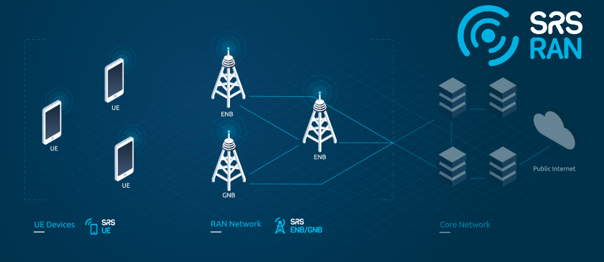

.. _app_notes:

.. srsRAN 4G documentation master file, created by
   sphinx-quickstart on Dec 13 2018.
   You can adapt this file completely to your liking, but it should at least
   contain the root `toctree` directive.

srsRAN 4G Application Notes
===========================

srsRAN 4G is a free and open-source 4G and 5G software radio suite. 

Featuring both UE and eNodeB/gNodeB applications, srsRAN 4G can be used with third-party core network solutions to build complete end-to-end mobile wireless networks. For more information, see `www.srsran.com <https://www.srsran.com>`_. 

These application notes provide guides for specific srsRAN 4G use-cases, using external applications, and guides on hardware choices and use.

| Set-up and test an end-to-end 5G SA network using srsRAN 4G and a third party 5G Core: 
|   - :ref:`5G SA Application Note<5g_sa_e2e_appnote>`

| Connect a 5G SA COTS UE to the srsRAN 4G eNodeB and a third party 5G Core: 
|   - :ref:`5G SA COTS UE Application Note<5g_sa_cots_appnote>`

| Connect the srsRAN 4G UE to a 5G SA network:
|   - :ref:`srsUE & 3rd Party gNB for 5G SA Application Note<5g_sa_amari_appnote>`

| Set-up and test an end-to-end 5G NSA network: 
|   - :ref:`5G NSA Application Note<5g_nsa_zmq_appnote>`

| Connect a 5G NSA COTS UE to the srsRAN 4G eNodeB: 
|   - :ref:`5G NSA COTS UE Application Note<5g_nsa_cots_appnote>`

| Connect the srsRAN 4G UE to a 5G NSA network:
|   - :ref:`srsUE & 3rd Party gNB for 5G NSA Application Note<5g_nsa_amari_appnote>`

| Create an end-to-end network using virtual radios:
|   - :ref:`srsRAN 4G with ZMQ Virtual Radios <zeromq_appnote>`

| Connect a COTS UE to the srsRAN 4G eNodeB:
|   - :ref:`COTS UE Application Note<cots_ue_appnote>`

| Run srsRAN 4G on the Raspberry Pi 4:
|   - :ref:`Raspberry Pi 4 Application Note <pi4_appnote>`

| Explore Intra-eNB & S1 Handover:
|   - :ref:`Handover Application Note<handover_appnote>`

| Carrier Aggregation:
|   - :ref:`Carrier Aggregation Application Note <2ca_appnote>`

| Use eMBMS to support multicast/broadcast traffic:
|   - :ref:`eMBMS Application Note <embms_appnote>`

| Explore NB-IoT signalling:
|   - :ref:`NB-IoT Application Note <nbiot_appnote>`

| Experiment with CV2X signalling:
|   - :ref:`CV2X Application Note <cv2x_appnote>`

| Hardware options for experimentation & development:
|   - :ref:`Suggested Hardware Packages<suggestedHW_appnote>`

.. toctree::
   :maxdepth: 1

   5g_sa_E2E/source/index.rst

   5g_sa_COTS/source/index.rst

   5g_sa_amari/source/index.rst

   5g_nsa_zmq/source/index.rst

   5g_nsa_cots/source/index.rst

   5g_nsa_amari/source/index.rst

   zeromq/source/index.rst

   cots_ue/source/index.rst

   pi4/source/index.rst

   handover/source/index.rst

   2ca/source/index.rst

   embms/source/index.rst

   nbiot/source/index.rst

   cv2x/source/index.rst

   hw_packs/source/index.rst

