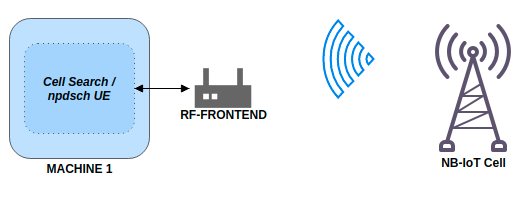
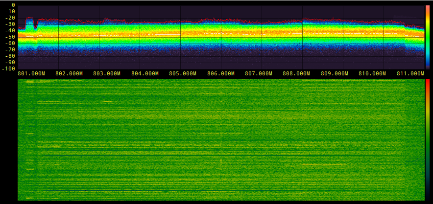
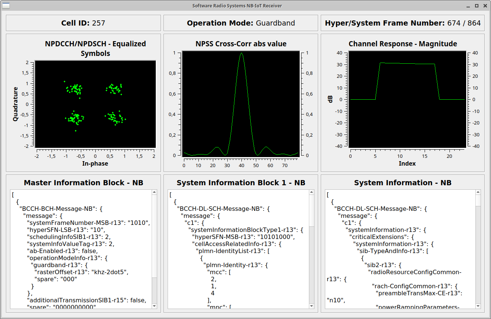
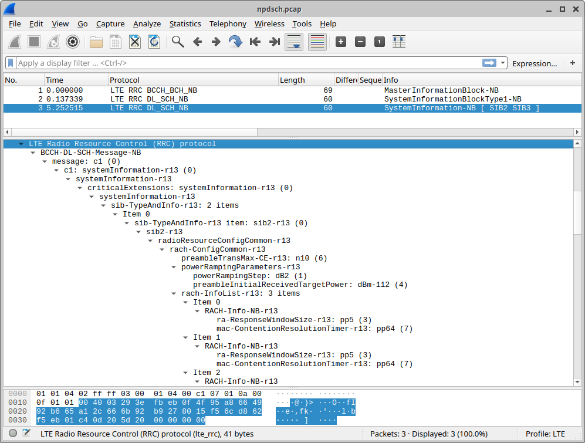
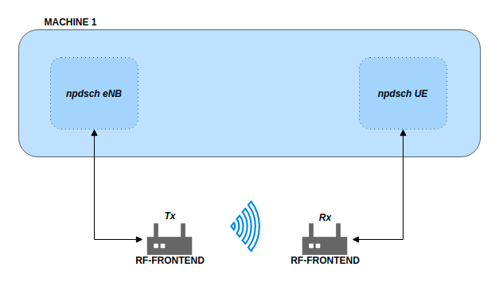

.. srsRAN NB-IoT Application Note

.. _nbiot_appnote:

NB-IoT Signalling
=================


Introduction
************
Narrowband Internet of Things (NB-IoT) is the 3GPP alternative to other Low Power Wide Area Network (LPWAN) technologies,
such as SigFox and LoRa. Technically it uses similar ideas and reuses some of the components of LTE.
But the bandwidth is significantly reduced to a single PRB (180 kHz) in order to achieve the low-complexity, low-cost,
long battery life requirements. It was first standardized in Release 13.

This application note shows how to spot and decode commercial NB-IoT transmissions in the first part.
The second part shows how to transmit and receive your own NB-IoT downlink signal.

.. _Requirements:

Requirements
************
The NB-IoT examples require a radio that can sample at 1.92 Msps.
Since the bandwidth of an NB-IoT carrier is very small, even very cheaply available devices are
sufficient to receive and decode the signal. For example, popular `RTL-SDR <https://www.rtl-sdr.com/about-rtl-sdr/>`_ USB dongles
available for around 15-20 Euro are fine for decoding the signal.

The eNB transmitter example requires a radio with transmitting capabilities.
For example, an Ettus B200mini can be used as the eNB transmitter and an RTL-SDR as UE receiver.
In principle, any device supported by either UHD or SoapySDR should work.

The following application also supports `srsGUI <https://github.com/srsRAN/srsGUI>`_ for real time visualization of data. 

All of the examples used here can be found in the following directory: ```./srsRAN/build/lib/examples```

Spotting local NB-IoT deployments
*********************************



    Basic system architecture required to perform a cell search and decode transmissions.

Most NB-IoT deployments can be found in the sub-GHz bands. In Europe especially band 20 (Downlink 791-821 MHz).
To run a NB-IoT cell search on band 20 one can simply run:

::

  $ ./lib/examples/cell_search_nbiot -b 20
  Opening RF device...
  [INFO] [UHD] linux; GNU C++ version 8.3.0; Boost_106700; UHD_3.13.1.0-3build1
  [INFO] [LOGGING] Fastpath logging disabled at runtime.
  Opening USRP channels=1, args: type=b200,master_clock_rate=23.04e6
  [INFO] [B200] Detected Device: B200mini
  [INFO] [B200] Operating over USB 3.
  [INFO] [B200] Initialize CODEC control...
  [INFO] [B200] Initialize Radio control...
  [INFO] [B200] Performing register loopback test...
  [INFO] [B200] Register loopback test passed
  [INFO] [B200] Asking for clock rate 23.040000 MHz...
  [INFO] [B200] Actually got clock rate 23.040000 MHz.
  [  0/299]: EARFCN 6150, 791.00 MHz looking for NPSS.
  [  1/299]: EARFCN 6151, 791.10 MHz looking for NPSS.
  [  2/299]: EARFCN 6152, 791.20 MHz looking for NPSS.
  ...
  [105/299]: EARFCN 6253, 801.30 MHz looking for NPSS.
  NSSS with peak=95.885849, cell-id: 257, partial SFN: 0
  Found CELL ID 257.
  ...
  [295/299]: EARFCN 6445, 820.50 MHz looking for NPSS.
  [296/299]: EARFCN 6446, 820.60 MHz looking for NPSS.
  [297/299]: EARFCN 6447, 820.70 MHz looking for NPSS.
  [298/299]: EARFCN 6448, 820.80 MHz looking for NPSS.

  Found 1 cells
  Found CELL 801.3 MHz, EARFCN=6253, PHYID=257, NPSS power=31.0 dBm

  Bye

In this example, we've found a NB-IoT carrier at 801.3 MHz. We can now use the `npdsch_ue` example (see next section)
to decode the transmission.

It's also possible to just have a look at the spectrum and check for an NB-IoT carrier there.
Most of the time the carrier is clearly visible, it's close to a LTE carrier in most cases
and usually even a bit stronger than the LTE signal itself.

The example below, shows a 10 MHz Downlink LTE signal at 806 MHz. One can spot the NB-IoT carrier on
the left hand side (the guardband) of the LTE spectrum.




The table below shows some examples of known NB-IoT deployments in Europe.

+-----------+------------+----------+-----------------+
| Country   | Operator   | EARFCN   | Frequency (MHz) |
+===========+============+==========+=================+
| Spain     | Vodafone   | 6253     | 801.3           |
+-----------+------------+----------+-----------------+
| Spain     | Telefonica | 6354     | 811.4           |
+-----------+------------+----------+-----------------+
| Spain     | Orange     | 6153     | 791.3           |
+-----------+------------+----------+-----------------+
| Germany   | Vodafone   | 6346     | 810.6           |
+-----------+------------+----------+-----------------+
| Ireland   | Vodafone   | 6354     | 811.4           |
+-----------+------------+----------+-----------------+


Decoding the NB-IoT transmission
********************************

Once we've found the downlink frequency of an NB-IoT carrier, we can use the `npdsch_ue` example to
decode the signal. The application should synchronize on the carrier, detect the cell ID and start to
decode MIB, SIB and SIB2.

::

  $ ./lib/examples/npdsch_ue -f 801.3e6
  Opening RF device...
  Soapy has found device #0: driver=rtlsdr, label=Generic RTL2832U OEM :: 00000001, manufacturer=Realtek, product=RTL2838UHIDIR, serial=00000001, tuner=Rafael Micro R820T,
  Selecting Soapy device: 0
  ..
  Set RX freq: 801.300000 MHz
  Setting sampling rate 1.92 MHz
  NSSS with peak=65.811836, cell-id: 257, partial SFN: 0
  *Found n_id_ncell: 257 DetectRatio= 0% PSR=10.57, Power=111.7 dBm
  MIB received (CFO:  -2,82 kHz) FrameCnt: 0, State: 10
  SIB1 received
  SIB2 received
  CFO:  -2,76 kHz, RSRP: 28,0 dBm SNR:  5,0 dB, RSRQ: -11,5 dB, NPDCCH detected: 0, NPDSCH-BLER:  0,00% (0 of total 2), NPDSCH-Rate:  0,10
  ..

If you've compiled srsRAN with GUI support you should see something like this on your screen.




You can stop the UE decoder with Ctrl+C. Upon exit, the application writes a PCAP file of the decoded
signal to `/tmp/npdsch.pcap`. This file can be inspected with Wireshark. The screenshot below shows
Wireshark decoding the received signal.




Transmit and Receive Downlink Signal
************************************



    Basic system architecture required to transmit and recieve downlink signal.

In this part of the tutorial we will show how we can use the provided example applications to
transmit and receive our own NB-IoT signal. Please note that you should only do that in a
cabled setup or Faraday cage in order to comply with emission rules of your country.

Please check that the RF-frontend hardware you are using meets the :ref:`requirements<Requirements>` 
previously outlined.

To start the eNB example, simply execute the command shown below. This will launch the eNB which
by default picks the first available RF device and transmits the signal. With the `-o` option
the signal can also be written to file for offline processing.

.. code::

  $ ./lib/examples/npdsch_enodeb -f 868e6
  Opening RF device...
  [INFO] [UHD] linux; GNU C++ version 8.3.0; Boost_106700; UHD_3.13.1.0-3build1
  [INFO] [LOGGING] Fastpath logging disabled at runtime.
  [INFO] [B200] Loading firmware image: /usr/share/uhd/images/usrp_b200_fw.hex...
  Opening USRP channels=1, args: type=b200,master_clock_rate=23.04e6
  [INFO] [B200] Detected Device: B200mini
  [INFO] [B200] Loading FPGA image: /usr/share/uhd/images/usrp_b200mini_fpga.bin...
  [INFO] [B200] Operating over USB 3.
  [INFO] [B200] Initialize CODEC control...
  [INFO] [B200] Initialize Radio control...
  [INFO] [B200] Performing register loopback test...
  [INFO] [B200] Register loopback test passed
  [INFO] [B200] Asking for clock rate 23.040000 MHz...
  [INFO] [B200] Actually got clock rate 23.040000 MHz.
  Setting sampling rate 1.92 MHz
  Set TX gain: 70.0 dB
  Set TX freq: 868.00 MHz
  NB-IoT DL DCI:
   - Format flag:                         1
     + FormatN1 DCI:                      Downlink
   - PDCCH Order:                         0
   - Scheduling delay:                    0 (0 subframes)
   - Resource assignment:                 0
     + Number of subframes:               1
   - Modulation and coding scheme index:  1
   - Repetition number:                   0
     + Number of repetitions:             1
   - New data indicator:                  0
   - HARQ-ACK resource:                   1
   - DCI subframe repetition number:      0
  DL grant config:
   - Number of subframes:                 1
   - Number of repetitions:               1
   - Total number of subframes:           1
   - Starting SFN:                        0
   - Starting SF index:                   6
   - Modulation type:                     QPSK
   - Transport block size:                24


The eNB example will transmit a standard-compliant downlink signal with MIB-NB and SIB1-NB.
It does not transmit SIB2 though. In all empty downlink subframes not used for MIB or SIB transmissions
it does transmit a NPDSCH signal for test purposes to RNTI 0x1234. One can modify the
transport block size of the test transmission by typing the MCS value (e.g. 20) on the eNB console
and hitting Enter.

This test transmission can be decoded with the UE example. For this, we need to run the
UE example by telling it to decode RNTI 0x1234 and skip SIB2 decoding (because it's not transmitted by eNB):

.. code::

  $ ./lib/examples/npdsch_ue -f 868e6 -r 0x1234 -s
  Opening RF device...
  Found Rafael Micro R820T tuner
  Soapy has found device #0: driver=rtlsdr, label=Generic RTL2832U OEM :: 00000001, manufacturer=Realtek, product=RTL2838UHIDIR, serial=00000001, tuner=Rafael Micro R820T,
  Selecting Soapy device: 0
  [INFO] Opening Generic RTL2832U OEM :: 00000001...
  Found Rafael Micro R820T tuner
  Setting up Rx stream with 1 channel(s)
  [INFO] Using format CF32.
  [R82XX] PLL not locked!
  Available device sensors:
  Available sensors for Rx channel 0:
  State of gain elements for Rx channel 0 (AGC supported):
   - TUNER: 0.00 dB
  State of gain elements for Tx channel 0 (AGC supported):
   - TUNER: 0.00 dB
  Rx antenna set to RX
  Tx antenna set to RX
  Set RX gain: 40.0 dB
  Set RX freq: 868.000000 MHz
  Setting sampling rate 1.92 MHz
  NSSS with peak=24.363365, cell-id: 0, partial SFN: 0
  *Found n_id_ncell:   0 DetectRatio= 0% PSR=8.66, Power=86.4 dBm
  MIB received (CFO:  -1,55 kHz) FrameCnt: 0, State: 10
  SIB1 received
  CFO:  -1,41 kHz, RSRP: 12,0 dBm SNR: 19,0 dB, RSRQ: -3,7 dB, NPDCCH detected: 510, NPDSCH-BLER:  0,20% (1 of total 511), NPDSCH-Rate: 10,36 kbit/s

The outlook should look similar except that no SIB2 is decoded. If you've compiled with GUI support
you should again see a similar application like above. Please note the constellation
diagram is updated a lot more frequently because now all NPDSCH transmissions to the test
user are also received.


Known issues
************

* Cell ID detection isn't reliable.

  In some cases the cell ID detection using the NSSS signal isn't working reliably. In case the `npdsch_ue` application
  clearly synchronizes to the downlink signal (you see a strong correlation peak in the middle graph in the GUI) but the MIB
  is never decoded, it is very likely that the cell ID wasn't detected correctly. In this case, try to restart the application
  again and see if the cell ID can be detected. If the problem still persists, one can also try to set the
  cell ID manually with the `-l` parameter. For this you need to first figure out the correct value, which sometimes
  can be done by decoding the default LTE carrier with `pdsch_ue` and use the same cell ID for the NB-IoT carrier.
