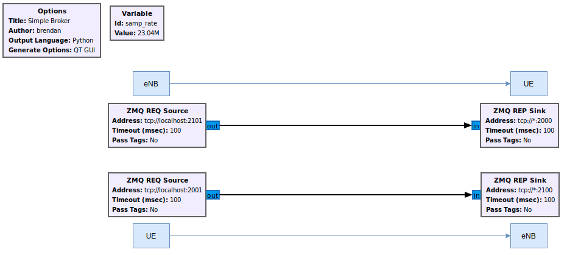
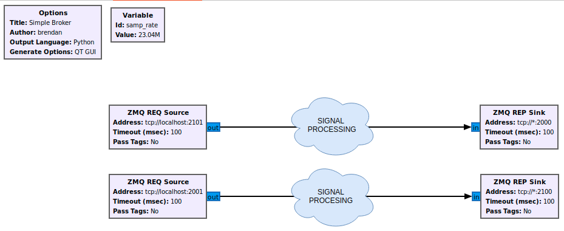

.. srsRAN 4G ZeroMQ Application Note

.. _zeromq_appnote:

srsRAN 4G with ZMQ Virtual Radios
===================================


Introduction
************

srsRAN 4G is a 4G and 5g software radio suite. The 4G network consists of a core network, an eNodeB, and a UE implementation. Usually eNodeB and UE
are used with physical radios for over-the-air transmissions. However, the srsRAN 4G software suite also includes a virtual radio which uses the ZeroMQ networking library to transfer radio samples between applications. This approach is very useful for development, testing, debugging, CI/CD or for teaching and demonstrating.

This application note shows how the srsRAN 4G virtual radio approach can be used to create an end-to-end network.


ZeroMQ Installation
*******************

First thing is to install ZeroMQ and build srsRAN 4G. On Ubuntu, ZeroMQ development libraries can be installed
with:

.. code::

  sudo apt-get install libzmq3-dev
  
Alternatively, installing from sources can also be done.

First, one needs to install libzmq:

.. code::

  git clone https://github.com/zeromq/libzmq.git
  cd libzmq
  ./autogen.sh
  ./configure
  make
  sudo make install
  sudo ldconfig

Second, install czmq:

.. code::

  git clone https://github.com/zeromq/czmq.git
  cd czmq
  ./autogen.sh
  ./configure
  make
  sudo make install
  sudo ldconfig

Finally, you need to compile srsRAN 4G (assuming you have already installed all the required dependencies). 
Note, if you have already built and installed srsRAN 4G prior to installing ZMQ and other dependencies you 
will have to re-run the make command to ensure srsRAN 4G recognizes the addition of ZMQ:

.. code::

  git clone https://github.com/srsRAN/srsRAN_4G.git
  cd srsRAN_4G
  mkdir build
  cd build
  cmake ../
  make

Put extra attention in the cmake console output. Make sure you read the following line:

.. code::

  ...
  -- FINDING ZEROMQ.
  -- Checking for module 'ZeroMQ'
  --   No package 'ZeroMQ' found
  -- Found libZEROMQ: /usr/local/include, /usr/local/lib/libzmq.so
  ...

Running a full end-to-end LTE network on a single computer
**********************************************************

Before launching the LTE network components on a single machine we need to make sure
that both UE and EPC are in different network namespaces.
This is because both EPC and UE will be sharing the same network configuration,
i.e. routing tables etc. Because the UE receives an IP address
from the EPC's subnet, the Linux kernel would bypass the TUN interfaces when
routing traffic between both ends. Therefore, we create a separate
network namespace (netns) that the UE uses to create its TUN interface in. 

We only require TUN interfaces for the UE and EPC as they are the only IP
endpoints in the network and need to communicate over the TCP/IP stack.

We will run each srsRAN 4G application in a seperate terminal instance.
Applications such as ping and iperf used to generate traffic will be run in separate terminals.

Note, the examples used here can be found in the following directory: ```./srsRAN_4G/build/```. 
With the UE, eNB and EPC then being called from their associated directory. 


Network Namespace Creation
--------------------------

Let's start with creating a new network namespace called "ue1" for the (first) UE:

.. code::

  sudo ip netns add ue1


To verify the new "ue1" netns exists, run:

.. code::
  
  sudo ip netns list


Running the EPC 
---------------

Now let's start the EPC. This will create a TUN device in the default
network namespace and therefore needs root permissions.

.. code::

  sudo ./srsepc/src/srsepc
  

Running the eNodeB 
------------------
  
Let's now launch the eNodeB. We use the default configuration in this example and pass
all parameters that need to be tweaked for ZMQ through as command line arguments. If you
want to make those persistent just add them to your local enb.conf. The eNB can be
launched without root permissions.

.. code::

  ./srsenb/src/srsenb --rf.device_name=zmq --rf.device_args="fail_on_disconnect=true,tx_port=tcp://*:2000,rx_port=tcp://localhost:2001,id=enb,base_srate=23.04e6"


Running the UE 
--------------

Lastly we can launch the UE, again with root permissions to create the TUN device.

.. code::

  sudo ./srsue/src/srsue --rf.device_name=zmq --rf.device_args="tx_port=tcp://*:2001,rx_port=tcp://localhost:2000,id=ue,base_srate=23.04e6" --gw.netns=ue1


The last command should start the UE and attach it to the core network.
The UE will be assigned an IP address in the configured range (e.g. 172.16.0.2).


Traffic Generation
-------------------

To exchange traffic in the downlink direction, i.e. from the the EPC, just run ping
or iperf as usual on the command line, e.g.:

.. code::
  
  ping 172.16.0.2
  
  
In order to generate traffic in the uplink direction it is important to run the ping command
in the UE's network namespace. 

.. code::

  sudo ip netns exec ue1 ping 172.16.0.1

Namespace Deletion
-------------------

After finishing, make sure to remove the netns again.

.. code::

  sudo ip netns delete ue1


GNU-Radio Companion Integration 
***********************************************

GNU-Radio Companion can be easily integrated with a ZMQ based instance of srsRAN 4G. This can be used to manipulate, and/ or visualize baseband I/Q data as it is sent between the UE and eNB. 
It does this by using the ZMQ-compatible blocks within GRC connected to the TCP ports used to transmit data between the two network elements. Data going both from the UE to the eNB, 
and from the eNB to the UE can be handled via a GRC Broker. 

The following figure shows a basic GRC Broker: 



The above figure shows how the broker acts as a man-in-the-middle between the UE and the eNB. The blue boxes and arrows show the direction of data between the network elements. 
The following ports are used in this example: 

.. list-table:: Ports Used
   :widths: 25 25 25
   :header-rows: 1
   :align: center

   * - Port Direction
     - srsUE
     - srsENB
   * - TX
     - 2001
     - 2101
   * - Rx
     - 2000
     - 2100

Building on this simple example, the I/Q data sent between elements can be processed, manipulated and/ or visualized as needed. This would lead to a GRC architecture similar to what is 
shown in the following figure. 



The signal processing clouds between elements here represent where any processing of the data would take place. 

When running an E2E Network with a Broker between elements the following steps must be taken when spinning up the network: 
	
  1. Start up the EPC
  2. Start the eNB using ZMQ
  3. Start the UE using ZMQ
  4. Run the GRC Flowgraph associated with the broker. 
	
Note, the UE will not connect to the eNB until the broker has been started, as the UL and DL channels are not directly connected between the UE and eNB. You will also need to restart the GRC 
Broker each time the network is restarted. 


Known issues
************

* For a clean tear down, the UE needs to be terminated first, then the eNB.
* eNB and UE can only run once, after the UE has been detached, the eNB needs to be restarted.
* We currently only support a single eNB and a single UE.
