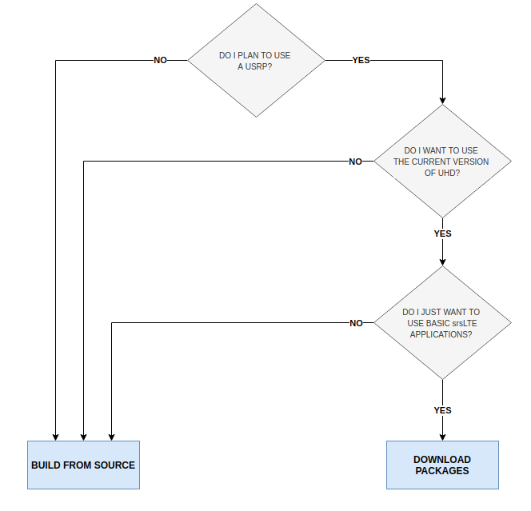

.. _gen_installation:

Installation Guide
==================

Which Installation Should I Use? 
**************************************

srsRAN 4G can be installed from packages or from source. The following decision tree should help users decide which is best for them: 

In short, users looking for a simple installation who only expect to run basic srsRAN 4G applications with USRP front-ends should use the package installation.
Users who wish to modify srsRAN 4G and/or use alternative RF front-ends such as limeSDR and BladeRF should install from source.

Package Installation
*********************

The srsRAN 4G software suite can be installed using packages on Ubuntu::

  sudo add-apt-repository ppa:softwareradiosystems/srsran_4g
  sudo apt-get update
  sudo apt-get install srsran_4g -y
  
Package installs are also available for other distributions.

 - `openSUSE <https://software.opensuse.org/package/srsRAN?search_term=srsran>`_
 - `Arch Linux <https://www.archlinux.org/packages/?q=srsRAN>`_
 - `Debian (Pop OS, Mint, etc) <https://packages.debian.org/search?suite=default&section=all&arch=any&searchon=names&keywords=srsRAN>`_ 
 
Note, only the Launchpad packages for Ubuntu are maintained by SRS. Different distributions will maintain their own packages for srsRAN 4G, which may or may not be up to date. Check the available version before installing 
to ensure you are using the desired version of srsRAN 4G. 

Fedora does not yet have support for a package installation of srsRAN 4G. 

Installation from Source
************************

* Mandatory requirements: 

  * Common:

    * `cmake <https://cmake.org/>`_
    * `libfftw <http://www.fftw.org/>`_
    * `mbedTLS <https://tls.mbed.org>`_

  * srsUE:

    * `Boost <http://www.boost.org>`_

  * srsENB:

    * `Boost <http://www.boost.org>`_
    * `lksctp <http://lksctp.sourceforge.net/>`_
    * `config <http://www.hyperrealm.com/libconfig/>`_

  * srsEPC:

    * `Boost <http://www.boost.org>`_
    * `lksctp <http://lksctp.sourceforge.net/>`_
    * `config <http://www.hyperrealm.com/libconfig/>`_

For example, on Ubuntu, one can install the required libraries with::

  sudo apt-get install build-essential cmake libfftw3-dev libmbedtls-dev libboost-program-options-dev libconfig++-dev libsctp-dev

or on Fedora::

  dnf install cmake fftw3-devel mbedtls-devel lksctp-tools-devel libconfig-devel boost-devel

For CentOS, use the Fedora packages but replace `libconfig-devel` with just `libconfig`.

Note that depending on your flavor and version of Linux, the actual package names may be different.

* Optional requirements: 

  * `srsGUI <https://github.com/srsran/srsgui>`_ - for real-time plotting.
  * `libpcsclite-dev <https://pcsclite.apdu.fr/>`_ - for accessing smart card readers
  * libdw-dev libdw - for truly informative backtraces using backward-cpp

.. _Drivers:

* RF front-end driver:

  * `UHD <https://github.com/EttusResearch/uhd>`_ 
  * `SoapySDR <https://github.com/pothosware/SoapySDR>`_
  * `BladeRF <https://github.com/Nuand/bladeRF>`_
  * `ZeroMQ <https://github.com/zeromq>`_

.. note::
	If using UHD we recommended the LTS version of UHD, i.e. either 3.9.7 or 3.15.

.. warning::
  All mandatory requirements, optional requirements, and RF front-end drivers must be installed **prior** to building srsRAN 4G. Failing to do this will result in
  errors at run-time or prevent srsRAN 4G from building correctly.  

Download and build srsRAN 4G::

  git clone https://github.com/srsRAN/srsRAN_4G.git
  cd srsRAN_4G
  mkdir build
  cd build
  cmake ../
  make
  make test

Install srsRAN 4G::

  sudo make install
  srsran_4g_install_configs.sh user

This installs srsRAN 4G and also copies the default srsRAN 4G config files to *~/.config/srsran_4g*.

Getting Support
***************

Join the community on the `srsRAN 4G users <https://lists.srsran.com/mailman/listinfo/srsran-users>`_ mailing list.
The mailing list is a great place to ask questions, get support from the community and learn more about the various projects 
users are working on.

