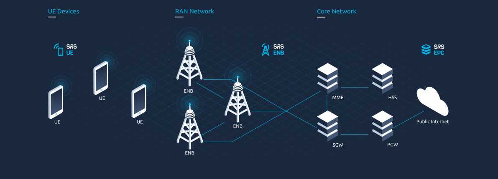

.. srsRAN 4G documentation master file, created by
   sphinx-quickstart on Dec 13 2018.
   You can adapt this file completely to your liking, but it should at least
   contain the root `toctree` directive.

srsRAN 4G |version| Documentation
=================================

.. meta::
    :description lang=en:
        Documentation for the srsRAN 4G open-source software suite. User manuals for the srsRAN 4G UE, 
        eNodeB, gNodeB and EPC applications. Up-to-date installation guides. Step-by-step 
        application notes for some of the most interesting srsRAN 4G use-cases.

srsRAN 4G is an open-source 4G software radio suite from `SRS <https://www.srs.io>`_. For 5G RAN, see our new O-RAN CU/DU solution - `srsRAN Project <https://docs.srsran.com/projects/project>`_.

Featuring UE, eNodeB and lightweight EPC applications, srsRAN 4G can be used to build a complete end-to-end LTE mobile wireless network. For more information, see `www.srsran.com <https://www.srsran.com>`_. 

The srsRAN 4G suite currently includes:

- **srsUE:** a full-stack 4G UE application with prototype 5G features
- **srsENB:** a full-stack 4G eNodeB 
- **srsEPC:** a light-weight 4G EPC implementation with MME, HSS and S/P-GW

All srsRAN 4G software runs in linux with off-the-shelf compute and radio hardware.

For our ORAN-native 5G CU/DU solution, see the **srsRAN Project** `documentation <https://docs.srsran.com/projects/project>`_.

-----

.. toctree::
   :maxdepth: 2
   :caption: General
   
   getting_started.rst
   feature_list.rst
   reporting_issues.rst
   dev_status.rst

.. toctree::
   :maxdepth: 2
   :caption: First Steps

   general/source/1_installation.rst
   general/source/2_release_notes.rst
   general/source/3_contributions.rst
   general/source/4_troubleshooting.rst

.. toctree::
   :maxdepth: 2
   :caption: User Manuals

   usermanuals/source/1_setup.rst
   usermanuals/source/srsue/source/index.rst
   usermanuals/source/srsenb/source/index.rst
   usermanuals/source/srsepc/source/index.rst

.. toctree::
   :maxdepth: 2
   :caption: Application Notes

   app_notes/source/zeromq/source/index.rst
   app_notes/source/cots_ue/source/index.rst
   app_notes/source/handover/source/index.rst
   app_notes/source/2ca/source/index.rst
   app_notes/source/cv2x/source/index.rst
   app_notes/source/embms/source/index.rst
   app_notes/source/nbiot/source/index
   app_notes/source/pi4/source/index.rst
   app_notes/source/hw_packs/source/index.rst

.. toctree::
   :maxdepth: 2
   :caption: 5G Prototyping

   app_notes/source/5g_sa_amari/source/index.rst
   app_notes/source/5g_nsa_amari/source/index.rst
