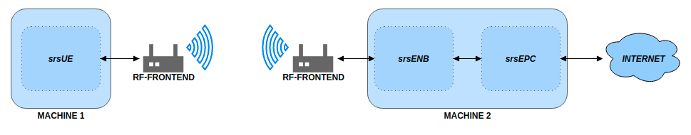

.. _gen_installation:

Installation Guide
==================

Package Installation on Ubuntu
*******************************

The srsLTE software suite can be installed using packages on Ubuntu::

  sudo add-apt-repository ppa:srslte/releases
  sudo apt-get update
  sudo apt-get install srslte -y

Installation from Source
************************

* Mandatory requirements: 

  * Common:

    * cmake              https://cmake.org/
    * libfftw            http://www.fftw.org/
    * PolarSSL/mbedTLS   https://tls.mbed.org

  * srsUE:

    * Boost:             http://www.boost.org

  * srsENB:

    * Boost:             http://www.boost.org
    * lksctp:            http://lksctp.sourceforge.net/
    * config:            http://www.hyperrealm.com/libconfig/

  * srsEPC:

    * Boost:             http://www.boost.org
    * lksctp:            http://lksctp.sourceforge.net/
    * config:            http://www.hyperrealm.com/libconfig/

For example, on Ubuntu 18.04, one can install the required libraries with::

  sudo apt-get install cmake libfftw3-dev libmbedtls-dev libboost-program-options-dev libconfig++-dev libsctp-dev

or on Fedora::

  dnf install cmake fftw3-devel polarssl-devel lksctp-tools-devel libconfig-devel boost-devel

Note that depending on your flavor and version of Linux, the actual package names may be different.

* Optional requirements: 

  * srsgui:              https://github.com/srslte/srsgui - for real-time plotting.
  * libpcsclite-dev:     https://pcsclite.apdu.fr/ - for accessing smart card readers

.. _Supported Drivers:

* RF front-end driver:

  * UHD:                 https://github.com/EttusResearch/uhd
  * SoapySDR:            https://github.com/pothosware/SoapySDR
  * BladeRF:             https://github.com/Nuand/bladeRF
  * ZeroMQ:              https://github.com/zeromq

Download and build srsLTE::

  git clone https://github.com/srsLTE/srsLTE.git
  cd srsLTE
  mkdir build
  cd build
  cmake ../
  make
  make test

Install srsLTE::

  sudo make install
  sudo srslte_install_configs.sh user

This installs srsLTE and also copies the default srsLTE config files to
the user's home directory (~/.srs).

The following execution instructions are for users that have the appropriate RF-hardware 
to simulate a network. If you would like to test the use of srsLTE without RF-hardware please 
see the `ZeroMQ application note <https://docs.srslte.com/en/latest/app_notes/source/>`_.

Baseline Hardware Requirements
*********************************
The overall system requires 2 x RF-frontends and 2 x PCs with a Linux based OS.  
This can be broken down as follows: 
 
.. list-table:: System Hardware Requirements
   :widths: 25 20 25
   :header-rows: 1

   * - Network Element
     - RF-Frontend
     - Linux based PC 
   * - srsUE
     - X
     - X
   * - srsENB
     - X
     - X
   * - srsEPC
     - 
     - X

The UE will be instatiated on machine 1 with an RF-frontend attached. The eNB will run on machine 2 with an RF-frontend attached 
to communicate over the air with the UE. The EPC will be insantiated on the same machine as the eNB. See the following figure which outlines 
the overall system architecture. 

A list of supported RF-hardware drivers is outlined :ref:`here<Supported Drivers>`.  



    Basic srsLTE System Architecture

Execution Instructions
**********************

The srsUE, srsENB and srsEPC applications include example configuration files
that should be copied (manually or by using the convenience script) and modified,
if needed, to meet the system configuration.
On many systems they should work out of the box.

By default, all applications will search for config files in the user's home
directory (~/.srs) upon startup.

Note that you have to execute the applications with root privileges to enable
real-time thread priorities and to permit creation of virtual network interfaces.

srsENB and srsEPC can run on the same machine as a network-in-the-box configuration.
srsUE needs to run on a separate machine.

If you have installed the software suite using ```sudo make install``` and
have installed the example config files using ```sudo srslte_install_configs.sh```,
you may just start all applications with their default parameters.

srsEPC
------

On machine 1, run srsEPC as follows::

  sudo srsepc

Using the default configuration, this creates a virtual network interface
named "srs_spgw_sgi" on machine 1 with IP 172.16.0.1. All connected UEs
will be assigned an IP in this network.

srsENB
------

Also on machine 1, but in another console, run srsENB as follows::

  sudo srsenb


srsUE
-----

On machine 2, run srsUE as follows::

  sudo srsue

Using the default configuration, this creates a virtual network interface
named "tun_srsue" on machine 2 with an IP in the network 172.16.0.x.
Assuming the UE has been assigned IP 172.16.0.2, you may now exchange
IP traffic with machine 1 over the LTE link. For example, run a ping to 
the default SGi IP address::

  ping 172.16.0.1
  


Examples
**********************
If srsLTE is build from source, then preconfigured example use-cases can be found in the following folder: ```./srsLTE/build/lib/examples``` 

The following list outlines some of the use-cases covered: 

 * Cell Search
 * NB-IoT Cell Search
 * A UE capable of decoding PDSCH packets
 * An eNB capable of creating and transmitting PDSCH packets

Note, the above examples require RF-hardware to run. These examples also support the use 
of `srsGUI <https://github.com/srsLTE/srsGUI>`_ for real time plotting of data. 


