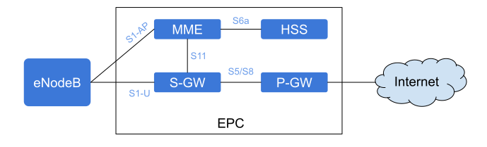

.. _epc_intro:

Introduction
============

Overview
********

SrsEPC is a lightweight implementation of a complete LTE core network (EPC). The srsEPC application runs as a single binary but provides the key EPC components of Home Subscriber Service (HSS), Mobility Management Entity (MME), Service Gateway (S-GW) and Packet Data Network Gateway (P-GW).

    EPC overall architecture

The figure above illustrates the main components of the EPC, along with the main interfaces between them.

* *HSS*: The Home Subscriber Service (HSS) is the user database. It stores information such as the user's id, key, usage limits, etc. It is responsible for authenticating an authorizing the user's access to the network.

* *MME*: Mobility Managment Entity (MME) is the main control element in the network. It handles mobility and attach control messages. It is also responsible for paging UEs in idle mode.

* *S-GW*: The S-GW is the main dataplane gateway for the users, as it provides the mobility anchor for the UEs. It works as an IP router and helps setting up GTP sessions between the eNB and the P-GW.

* *P-GW*: The Packet Gateway (P-GW) is the point of contact with external networks. It enforces the QoS parameters for subscriber sessions.

To provide a complete end-to-end LTE network, use srsEPC with srsENB and srsUE.

This User Guide provides all the information needed to get up and running with the srsEPC application, to become familiar with all of the key features and to achieve optimal performance. For information on extending or modifying the srsEPC source code, please see the srsEPC Developers Guide.

Features
********

The srsEPC LTE core network includes the following features:

- MME (Mobility Management Entity) with standard S1AP and GTP-U interface to eNB
- S/P-GW with standard SGi exposed as virtual network interface (TUN device)
- HSS (Home Subscriber Server) with configurable user database in CSV format
