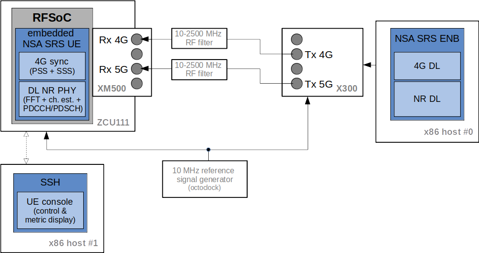
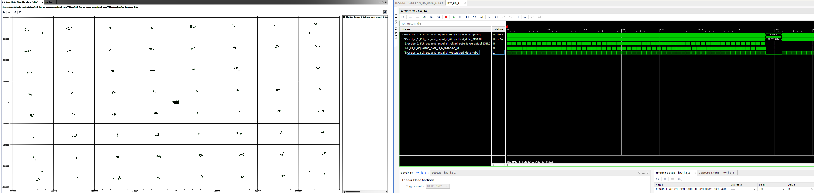

.. Embedded 5G NSA DL Demonstration System Application Note

.. _5g_nsa_emb_demo_appnote:

Embedded 5G NSA UE DL Demonstration System Application Note
===========================================================

Introduction
************

This appnote describes the main aspects of the Embedded NSA Demonstration system, consisting of a DL-only
NSA UE implementation (i.e., 4G sync + DL NR PHY) on the RFSoC platform.

First, an overview of both the utilized laboratory setup and main demonstration goals is provided. Then,
the required steps to implement the described laboratory setup are provided (i.e., from configuring the
ZCU111 prototyping board as required, to the list of console commands used to control the system).

DL Demonstration System Overview
********************************

Hardware Requirements
---------------------

As shown in the figure above, the main components of the Embedded NSA DL demonstration system are listed below:

  - **ZCU111 prototyping platform**: hosts the RFSoC device, which will implement the embedded NSA SRS UE demo system. The latter includes the 4G sync (PSS and SSS detection) and the DL NR PHY (FFT, channel estimation and PDCCH/PDSCH).
  - **XM500 daughterboard**: this FMC balun converter board is plugged onto the ZCU111 and provides external access to the ADCs/DACs in the RFSoC.
  - **X300 USRP**: high-performance FPGA-based SDR front-end, including two complete RF chains and 10GE connectivity for high-speed I/Q sample exchange. It will constitute the NSA SRS eNB front-end.
  - **x86 host #0**: will host the NSA SRS eNB transmitter to provide both 4G and 5G DL signals.
  - **x86 host #1**: will provide SSH access to the ZCU111 board, in order to control the embedded NSA SRS UE. Will also display run-time DL metrics.
  - **octoclock**: will provide a shared 10 MHz reference signal between the ZCU111 board and the x300 USRP device.

Hardware Setup
--------------

The connection between the different components comprising the demos system is as follows:

  * The X300 will be directly cabled with the XM500. Note that the latter does not include RF gain/filtering components, but enables a cabled setup via the onboard SMA connectors (comes equipped with suitable external filters). Additionally, a common 10 MHz reference signal will be shared between them (e.g., octoclock).
  * The x300 will be interfaced to the x86 host #0 via 10GE.
  * Both x86 host #1 and the ZCU111 will be connected to the same LAN (Ethernet), which will enable the host to access (SSH) the ZCU111 and interact with the embedded ARM (RFSoC).

DL Demonstration Goals and Reach
********************************

Features
--------

The demo aims at providing a proof-of-concept of the capacity of the RFSoC to host an SDR-based embedded
NR UE implementation. With this purpose in mind, PHY-layer test NSA NR UE and eNB applications have been
developed, enabling the user to modify the following DL signal parameters:

  * Set the DL bandwidth to either 5 or 10 MHz.
  * Modify the PRB allocation at run-time.
  * Modify the modulation and coding scheme at run-time.

Moreover, run-time metrics are provided through the console, enabling to observe the effects that the
different DL signal configuration parameters have in the performance of the UE.

Limitations
-----------

The most obvious limitation is that the UE and gNB applications, as well as the FPGA-accelerated PHY-layer
implementation, are not fully-featured, as their scope is limited to the DL functionality (i.e., no UL
processing will be implemented as part of the DL demonstration). Moreover, the NR frame format has been fixed
so that all slots are used for DL transmission.

The lack of a complete RF front-end also introduces the following limitations:

  * A cabled setup is required, as no gain and/or RF filtering components are included in the XM500 daughter-board (beyond those baseline features provided by the HF/LF baluns). Consequently, no AGC functionalities are implemented.
  * The center frequencies supported by the specific hardware setup being utilized are constrained to the 10-2500 MHz range (e.g., testing has used *2400 MHz* for the LTE carrier and *2457.6 MHz* for the NR one).
  * Regarding the Tx gain, it needs to be carefully fixed, for which we do recommend using the settings described in the eNB/gNB configuration files provided below.

The embedded 5G NSA UE implementation inherits those feature limitations of its x86 counterpart. Whereas
this is transparent to the user (i.e., both gNB and UE applications are provided by SRS), a list of key
feature limitations is provided below for the sake of thoroughness:

  * 4G and NR carrier need to use the same subcarrier-spacing (i.e. 15 kHz) and bandwidth (the current bitstream supports 5 and 10 MHz)
  * Only DCI format 1_0 (Downlink) is supported
  * No cell search and reference signal measurements (PCI for LTE and NR carriers needs to be known)

Building the applications
**************************

Both the eNB/gNB and embedded 5G NSA UE applications need to be built from the SRS FPGA repository,
as their features have been tailored to the goals of the DL demonstration system. Still, because each
has a different target host architecture, different steps need to be followed in the build process.

eNB/gNB (x86)
-------------

In command line, go to the path where the SRS FPGA repository is cloned locally. Then, run the following
commands, paying special attention to the *cmake* arguments::

  cd srsLTE_FPGA
  mkdir build_enb && cd build_enb
  cmake -DENABLE_RFDC=OFF -DENABLE_UHD=ON -DENABLE_SRSUE=ON -DENABLE_SRSENB=ON -DENABLE_SRSEPC=ON ../
  make -j12 srsenb

UE (RFSoC)
----------

First, you'll need to have a Petalinux build based on the exported hardware configuration files of the
implemented Vivado project for the DL demo UE (you can find the related *.xsa* file in the code
repository; under the *RFdc timestamping IP section in
/lib/src/phy/ue/fpga_ue/RFdc_timestamping/petalinux_files/nsa_ue_dl_demo*).

The first step towards building the embedded NSA UE DL application is to install the toolchain that
was built via *petalinux-tools*. This file is located at
*/PETALINUX_BUILD_PATH/xilinx-zcu111-2019.2/images/linux*. To install it, use the following command::

 ./sdk.sh

You will be prompted to specify the toolchain installation path (for instace, use */opt/plnx_sdk_rfsoc*).
When the installation finishes, set up the following environment variables::

  . /opt/plnx_sdk_rfsoc/environment-setup-aarch64-xilinx-linux

Then, go to the path where the SRS FPGA repository is cloned locally. Then, run the following
commands, paying special attention to the *cmake* argument (which points to the *toolchain.cmake*
file linked below and for which you will need a local copy)::

  cd srsLTE_FPGA
  mkdir build && cd build
  cmake -DCMAKE_TOOLCHAIN_FILE=~/toolchain.cmake ..
  make -j12

When the build finishes, you will find the application at *lib/examples/fpga_pdsch_ue_nr*
within your local repository.

  - :download:`toolchain.cmake file to build the UE <toolchain.cmake>`

Configuration
*************

srsUE (ZCU111 setup)
--------------------

*Use of an external reference signal in the ZCU111*

The use of an external 10 MHz reference signal ensures the accuracy of the system clock, which will
also be shared with the gNB. In order to enable the use of an external reference in the ZCU111 board,
the following actions are required:

  1. Disconnect the jumper in *J110* to power-off the 12.8 MHz TCXO that is connected by default to *CLKin0* of the LMK04208 PLL used to generate the ADC/DAC reference clocks in the ZCU111.
  2. Connect a 10 MHz clock reference to the *J109* SMA port in the ZCU111 (e.g., cabled output from octoclock).

.. image:: .imgs/zcu111_J109_J100_config.png
		:align: center

Note, that some modifications are also required in the software end. Nevertheless, the srsUE DL Demo
application is already including them. The full details are provided in the code repository (see the
*RFdc timestamping IP section in /lib/src/phy/ue/fpga_ue/RFdc_timestamping*).

*XM500 port usage*

As per FPGA design (i.e., fixed in the demonstration bistream), a specific set of connectors needs
to be used in the XM500 daughter-board, as indicated below:

  * The 4G DL signal shall be received from ADC Tile 224, channel 1 (labelled as **ADC224_T0_CH1** in the board).
  * The NR DL signal shall be received from ADC Tile 224, channel 0 (labelled as **ADC224_T0_CH0** in the board).

Moreover, the external DC-2500 MHz low-pass filters (**VLFX-2500+**) shipped alongisde the XM500 needs to be
placed between the cables coming from the gNB and the SMA connectors in the XM500, as shown below.

.. image:: .imgs/zcu111_external_filter_detail.png
  :align: center

*SD card*

The bitstream and binaries implementing the embedded NSA DL UE are hosted in an SD card, which is
organized as detailed below:

  - **BOOT partition**: includes the demonstration boot image (*BOOT.BIN*), which groups the FPGA bistream and boot binaries, the Petalinux Kernel image and the device tree.
  - **rootfs partition**: includes the root file system, which contains the user applications (e.g., srsUE).

A ready to use image of the SD card used by the Demonstration System is available and will provide
all required files to replicate the embedded NSA DL UE. In order to write the contents of the image
to a new SD card, simply run the following command ::

  sudo pv -tpreb emb_nsa_ue_dl_demo.img | sudo dd of=/dev/sdb bs=32M conv=fsync

In any case, the instructions to build an SD card from scratch are fully covered in the code repository
(see *lib/src/phy/ue/fpga_ue/srsRAN_RFSoC.md*).

srsENB (X300 & host #0 setup)
-----------------------------

*Shared reference signal with the ZCU111*

Connect the same 10 MHz reference signal source (e.g., octoclock) used with the ZCU111 in the *REF IN*
port. The use of the counterpart PPS input remains optional.

*X300 port usage*

As in the FPGA case, the utilization of the two RF ports in the X300 is predefined in the srsENB
application, as indicated below:

  * The 4G DL signal will be transmitted from RF channel A, TX/RX port.
  * The NR DL signal will be transmitted form RF channel B, TX/RX port.

Accordingly, each DL signal will be connected to the other end of the external RF filter of the
counterpart receive ADC channel in the XM500 daugther-board.

*UHD version*

The Embedded NSA UE demonstration system has been tested by using version *3.15.0.0-62-g7a3f1516*
of the UHD driver. The following script (or a customized variation) might prove quite helpful to
automate the x300 initialization procedure::

  #!/bin/sh
  # Setup parameters
  export UHD_INSTALL_PATH=/usr/local/
  #export UHD_VERSION=3.15
  export VIVADO=/opt/Xilinx/Vivado_Lab/2019.2/bin/vivado_lab

  # Setup network interface
  sudo ifconfig enp3s0f0 192.168.40.1 mtu 9000

  # Export UHD RFNOC paths (available versions 4.0, 3.15.LTS)
  export UHD_RFNOC_DIR=$UHD_INSTALL_PATH/share/uhd/rfnoc/
  export LD_LIBRARY_PATH=$UHD_INSTALL_PATH/lib

  # Setup kernel parameters for best X300 performance
  sudo sysctl -w net.core.wmem_max=24862979
  sudo sysctl -w net.core.rmem_max=24862979

  # Load FPGA with VIVADO
  cat << EOM >/tmp/load-x300.tcl
  open_hw_manager
  connect_hw_server -allow_non_jtag
  open_hw_target {localhost:3121/xilinx_tcf/Digilent/2516351B0A87A}
  current_hw_device [get_hw_devices xc7k325t_0]
  refresh_hw_device -update_hw_probes false [lindex [get_hw_devices xc7k325t_0] 0]
  set_property PROGRAM.FILE {$UHD_INSTALL_PATH/share/uhd/images/usrp_x300_fpga_XG.bit} [get_hw_devices xc7k325t_0]
  set_property PROBES.FILE {} [get_hw_devices xc7k325t_0]
  set_property FULL_PROBES.FILE {} [get_hw_devices xc7k325t_0]
  program_hw_devices [get_hw_devices xc7k325t_0]
  refresh_hw_device [lindex [get_hw_devices xc7k325t_0] 0]
  close_hw_manager
  EOM
  $VIVADO -mode batch -source /tmp/load-x300.tcl

  echo "Done!"

*eNB/gNB configuration file*

To set-up the 5G NSA DL signal, the configuration file for both the srsENB application must be
changed. In more detail, all NR parameters of interest to the demonstration system will be set
through the configuration file.

A few example configuration files have been included as attachments to this App Note. It is
recommended you use these files to avoid errors while changing configs manually.

eNB/gNB configuration files:

  - :download:`eNB/gNB 25 PRB configuration file <enb_25rb.conf>`
  - :download:`eNB/gNB 52 PRB configuration file <enb_50rb.conf>`
  - :download:`radio resources configuration file <nr_rr.conf>`

A short description of the required changes follows. Firstly the following parameters need to
be changed under the **[rf]** options in the eNB configuration file, so that the X310 is configured
optimally (the example provided below is for a 25 PRB DL configuration)::

  [rf]
  tx_gain = 10
  srate=7.68e6
  device_name = uhd
  device_args=type=x300,clock=external,lo_freq_offset_hz=7.68e6,sampling_rate=7.68e6,send_frame_size=8000,recv_frame_size=8000,num_send_frames=64,num_recv_frames=64

Likewise, the NR carrier will be active from start (i.e., no SSB is implemented), hence it needs
to be included in the **cell_list** as part of the radio resources configuration file::

  cell_list =
  (
    {
      rf_port = 0;
      cell_id = 1;
      tac = 7;
      pci = 0;
      root_seq_idx = 204;
      dl_earfcn = 2850;
      type = "lte";
      dl_freq=2400e6;
    }
    ,
    {
      rf_port = 1;
      cell_id = 2;
      tac = 7;
      pci = 1;
      root_seq_idx = 204;
      dl_earfcn = 2850;
      type = "nr";
      dl_freq=2457.6e6;
    }
  );

In the example above, two carriers are defined: first the LTE one at 2.4 GHz and with a PHY cell ID of 0
(**pci = 0**), then the NR carrier is added at 2.4576 GHz and using a PHY cell ID of 1 (**pci = 1**). When
launching the UE, make sure to pass the same parameter values used in the radio resources configuration
file (not needed if no modifications are made to the file provided here).

Usage
*****

Following configuration, we can run the UE and gNB. The following order should
be used when running the DL demo system:

  1. eNB/ gNB
  2. UE

eNB/ gNB
----------

*The commands listed below are to be run on host #0.*

To facilitate the execution of the eNB/gNB application, while ensuring that the correct configuration
file is used when modifying the target DL signal bandwidth, a launch script has been also included as
attachment to this App Note.

  - :download:`eNB/gNB launch script <run_gnb.sh>`

Make sure that **SRSRAN_PATH** points to the correct eNB/gNB binary path. Then, use the command below::

  ./run_gnb.sh [4g_nprb]
    [4g_nprb] nof_prb of the 4G carrier {25, 50}

It is important to note that the eNB call fixes both the 4G and NR DL signal bandwidth (and available
PRBs), as detailed in the table below.

+---------+-------------+---------+
| 4G_nprb | 4G/NR DL BW | NR_nprb |
+=========+=============+=========+
| 25      | 5 MHz       |  25     |
+---------+-------------+---------+
| 50      | 10 MHz      |  52     |
+---------+-------------+---------+

Once the eNB application is running, the DL bandwidth of the signals will be kept fixed. Nevertheless,
the application supports changing the PRB allocation of the NR carrier within this bandwidth, as well
as the modulation and coding scheme that it uses, on-the-fly. This can be done by using the command
below in the console::

  nr_dci [rb_start] [rb_length] [mcs]
    [rb_start] index of the first allocated PRB {0-4g_nprb-1} [Default 0]
    [rb_length] PRB allocation length {0-4g_nprb} [Default 25]
    [mcs] modullation and conding scheme {0-28} [Default 16]

The onsole output should be similar to::

  ---  Software Radio Systems LTE eNodeB  ---

  Reading configuration file enb_50rb.conf...

  Built in RelWithDebInfo mode using commit e5e929bdd on branch fpga_demo.

  PARSER ERROR: Field "ul_freq" doesn't exist.
  PARSER ERROR: Field "ul_freq" doesn't exist.

  Opening 2 channels in RF device=uhd with args=type=x300,clock=external,lo_freq_offset_hz=15.36e6,sampling_rate=15.36e6,send_frame_size=8000,recv_frame_size=8000,num_send_frames=64,num_recv_frames=64
  [INFO] [UHD] linux; GNU C++ version 9.3.0; Boost_107100; UHD_3.15.0.0-62-g7a3f1516
  [INFO] [LOGGING] Fastpath logging disabled at runtime.
  Opening USRP channels=2, args: type=x300,lo_freq_offset_hz=15.36e6,send_frame_size=8000,recv_frame_size=8000,num_send_frames=64,num_recv_frames=64,master_clock_rate=184.32e6
  [INFO] [UHD RF] RF UHD Generic instance constructed
  [INFO] [X300] X300 initialization sequence...
  [INFO] [X300] Maximum frame size: 8000 bytes.
  [INFO] [X300] Radio 1x clock: 184.32 MHz
  [INFO] [0/DmaFIFO_0] Initializing block control (NOC ID: 0xF1F0D00000000000)
  [INFO] [0/DmaFIFO_0] BIST passed (Throughput: 1317 MB/s)
  [INFO] [0/DmaFIFO_0] BIST passed (Throughput: 1307 MB/s)
  [INFO] [0/Radio_0] Initializing block control (NOC ID: 0x12AD100000000001)
  [INFO] [0/Radio_1] Initializing block control (NOC ID: 0x12AD100000000001)
  [INFO] [0/DDC_0] Initializing block control (NOC ID: 0xDDC0000000000000)
  [INFO] [0/DDC_1] Initializing block control (NOC ID: 0xDDC0000000000000)
  [INFO] [0/DUC_0] Initializing block control (NOC ID: 0xD0C0000000000000)
  [INFO] [0/DUC_1] Initializing block control (NOC ID: 0xD0C0000000000000)
  [INFO] [MULTI_USRP]     1) catch time transition at pps edge
  [INFO] [MULTI_USRP]     2) set times next pps (synchronously)
  Setting frequency: DL=2400.0 Mhz, UL=2510.0 MHz for cc_idx=0 nof_prb=50
  Setting frequency: DL=2457.6 Mhz, UL=2510.0 MHz for cc_idx=1 nof_prb=0

  ==== eNodeB started ===
  Type <t> to view trace

Once the eNB/gNB is started, the user can enter the desired PRB allocation and modulation and
coding scheme configuration in the console, trhough the *nr_dci* command.

UE
----

*The commands listed below are to be run on the zcu111 (i.e., through SSH via host #1). Note that
in the provided SD card image, you will find the application and related scripts at home/root.*

To run the UE, first we'll need to load the custom srsUE DMA drivers for the ZCU111. This can
be conveniently done through a script that handles the required *insmod* calls, which has also
been included as attachment to this App Note.

  - :download:`srsUE DL demo DMA drivers installation script <install_srsue_drivers.sh>`

To load the srsUE drivers use the following command::

  ./install_srsue_drivers.sh

Later the embedded srsUE will be executed using the following command::

  ./fpga_pdsch_ue_nr [-afFpcCv] -f 4g_carrier_frequency (in Hz) -F nr_carrier_frequency (in Hz) -c 4g_pci -C nr_pci
    -a RF args [Default "clock=external"]
    -f frequency in Hz of the 4G carrier {10000000.000000-2500000000.000000} [Default 2400000000.000000]
    -F frequency in Hz of the NR carrier {10000000.000000-2500000000.000000} [Default 2457600000.000000]
    -p nof_prb of the NR carrier (NR_nprb) {25, 52} [Default 52]
    -c LTE physical cell ID {0-503} [Default 0]
    -C NR physical cell ID {0-503} [Default 1]
    -v srsran_verbose [Default None]

It is important to note that the UE call fixes both the 4G and NR DL signal bandwidth	(and available
PRBs), as detailed in the table below.

	+---------+-------------+---------+
	| NR_nprb | 4G/NR DL BW | 4G nprb |
	+=========+=============+=========+
	| 25      | 5 MHz       |  25     |
	+---------+-------------+---------+
	| 52      | 10 MHz      |  50     |
	+---------+-------------+---------+

Once the UE has been initialised you should see the following::

  Opening RF device
  metal: info:      Registered shmem provider linux_shm.
  metal: info:      Registered shmem provider ion.reserved.
  metal: info:      Registered shmem provider ion.ion_system_contig_heap.
  metal: info:      Registered shmem provider ion.ion_system_heap.
  Configuring LMK04208 to use external clock source
  LMX configured
  Setting sampling rate 15.36 MHz
  Tuning receiver to 2400.000MHz (LTE) and 2457.600MHz (NR)
  Initializing FPGA
  FPGA bitstream built on 0000/00/00 00:00:00:00 using commit 00000000
  Synchronizing to the cell [pci=0] ...

Once the FPGA has correctly synchronized to the selected cell you should see the following::

  Found cell:
   - Type:            FDD
   - PCI:             0
   - Nof ports:       1
   - CP:              Normal
   - PRB:             50
   - PHICH Length:    Normal
   - PHICH Resources: 1/6
   - SFN:             572
  Decoded MIB. SFN: 572, offset: 3
  FPGA synchronized to the LTE cell [pci=0]

Finally, the NR DL metrics will be periodically updated as shown below::

           Rb:  18.43 /  18.43 /  37.75 Mbps (net/maximum/processing)
   PDCCH-Miss:  0.00%
   PDSCH-BLER:  0.00%
           TB: mcs=20; tbs=18432

Understanding the console Trace
--------------------------------

The console trace output from the UE, as shown above, contains useful metrics by which performance
of the UE can be measured. A brief description of the output metrics follows:

  - **Rb:** Indicates the data-rate (Mbits/sec) as follows; *net* represents the mean data-rate over the measure time (actual UE data-rate), *maximum* represents the mean data-rate per GRANT (i.e., over 1 ms; ideal UE data-rate) and *processing* represents the mean data-rate over the processing time (from first FFT outputs in slot to decoded TB returned by FPGA)
  - **PDCCH-Miss:** Indicates the number of DCI decoding errors over time (i.e., per slot)
  - **PDSCH-BLER:** Block error rate of the DL (NR PDSCH)
  - **TB:** Provides metrics for the decoded TB in the PDSCH (modulation and coding scheme {0-28} and TB size (bits))

Run-time observation of equalized data in the FPGA
--------------------------------------------------

The default bitstream (as provided in the SD card image) does include an integrated logic analyser (ILA)
IP core that enables observing at run-time the equalized data that is being forwarded to the NR channel
decoding stage, as well as plotting it (shown below a captured 64-QAM constellation).

Troubleshooting
***************

The embedded 5G NSA UE DL demonstration system is built on top of a fixed hardware setup with the
limitations described above. Hence, it is essential to the correct behaviour of the system, that the
utilized laboratory setup is as described in this App Note. Moreover, being a DL demonstration system
only, the UE currently doesn't support cell search and cell measurements. For these reasons, a number
of configuration parameters need to be known a priory (e.g., DL bandwidth, PHY cell IDs and center
frequencies of both carriers). Thus, it is also very important to validate that the configuration
parameters described by the configuration files do match those passed as arguments to the UE application.
In more detail, the following pairs of values must coincide:

  - **4g_nprb** parameter in the *run_gnb.sh* call has to match **nof_prb** (-p) parameter in *fpga_pdsch_ue_nr* call.
  - **pci** field in the **first cell** defined in *nr_rr.conf* has to match the **LTE physical cell ID** (-c) parameter in *fpga_pdsch_ue_nr* call.
  - **dl_freq** field in the **first cell** defined in *nr_rr.conf* has to match the **frequency in Hz of the 4G carrier** (-f) parameter in *fpga_pdsch_ue_nr* call.
  - **pci** field in the **second cell** defined in *nr_rr.conf* has to match the **NR physical cell ID** (-C) parameter in *fpga_pdsch_ue_nr* call.
  - **dl_freq** field in the **second cell** defined in *nr_rr.conf* has to match the **frequency in Hz of the NR carrier** (-F) parameter in *fpga_pdsch_ue_nr* call.

Even though the embedded NSA DL UE application has the means to recover itself in case that upon
a relaunch it starts from an unknown state (e.g., wrongful termination of the aplication), it is known
that in some rare cases the application won't be able to properly initialize either the ADC-DMA channel
shared with the FPGA or the RFdc block (e.g., after multiple relaunches with different DL bandwidth
configurations, some IP cores might not be properly reset). In that case, a similar error message to the
one below will appear::

  Error writing to buffer in rx thread, ret is 0 but should be 30720
  /SRS_RAN_PATH/lib/src/phy/utils/ringbuffer.c.133: Buffer overrun: lost 24 bytes
  /SRS_RAN_PATH/lib/src/phy/utils/ringbuffer.c.133: Buffer overrun: lost 30720 bytes

In such rare occurrences where the UE cannot resume normal operation on its own, (re)synchronization
to the 4G cell won't be possible. To overcome this situation, a system-reset can be forced with the
command below (while rebooting the board remains as the last resort)::

  devmem 0xa004039c w 1 && devmem 0xa0040010 w [FFT_size]
    [FFT_size] size of the FFT that was used when the UE crashed {512, 1024}
