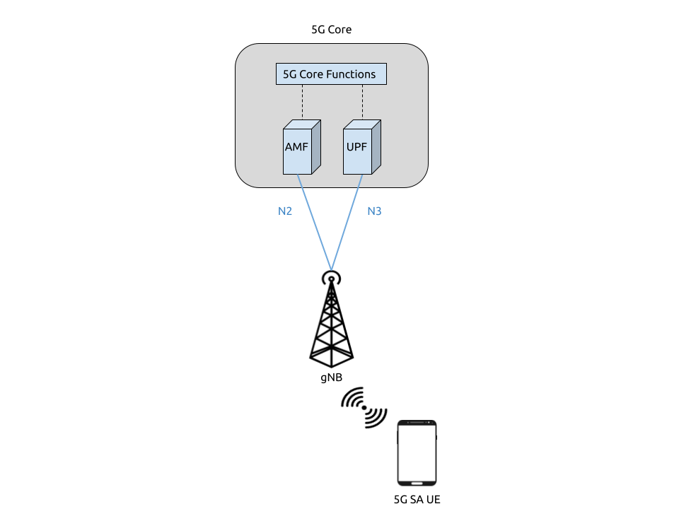

.. srsRAN 5G SA COTS UE Application Note

.. _5g_sa_cots_appnote:

5G SA COTS UE
##############

.. tip::
   Operating a private 5G SA network on cellular frequency bands may be tightly regulated in your jurisdiction. Seek the approval 
   of your telecommunications regulator before doing so.

srsRAN 22.04 brings 5G SA support to both srsUE and srsENB. 5G SA features can be enabled via the 
configuration files of both srsUE and srsENB. 

This application note demonstrates how to configure and connect a 5G capable COTS UE to a 5G SA network 
using srsRAN and a 3rd-party core (Open5GS in this example).

Network & Hardware Overview
***************************

Setting up a 5G SA network and connecting a 5G COTS UE requires the following: 

 - PC with a Linux based OS, with srsRAN 22.04 (or later) installed and built
 - Third Party 5G Core
 - A compatible SDR (USRP, LimeSDR, BladeRF, etc.)
 - A 5G SA-capable UE 
 - USIM/ SIM card (This must be a test card or a programmable card, with known keys)

For this implementation the following equipment is used: 
	
	- Dell XPS13 with Ubuntu 20.04 LTS
	- srsRAN 22.04 & Open5GS
	- B200-mini USRP running over USB3
	- OnePlus Nord 5G with a Sysmocom USIM 

UE Considerations
=================

One of the current limitations of srsRAN is that only 15 kHz sub-carrier spacing is supported. As a result, only devices that are capable of operating in bands that support FDD (e.g. band 3) can be used. 
Many commercial COTS UEs require 30 kHz SCS for TDD bands, which we do not currently support. 

Besides the restrictions originating from the baseband hardware there are a few other pitfalls that may or may not allow a phone to connect to a 5G network: 

  - On some handsets, when using a test USIM, you may need to activate 5G NR using ``*#*#4636#*#*``.
  - If your handset supports "Smart 5G", disable this option as it may force the handset to 4G and activate roaming.
  - Many 5G handsets may contain a carrier policy file that may limit 5G capabilities of the phone based on the PLMN of the USIM (first 6 digits of IMSI). Carrier policy files typically don't include test network PLMNs, so setting a test PLMN may result in 5G being disabled. If possible, using a shielded box and configuring the network with a commercial carrier PLMN may avoid policy file issues. 

Dependencies
************

RF Driver
=========

To check that your RF driver has been picked up when running ``cmake ..`` during the build process, you can run: 

``grep <driver> srsRAN/build/CMakeCache.txt``

If you are using UHD as your driver, you should see the following output if srsRAN has successfully detected it when ``cmake ..`` was run:: 

   $ grep UHD -m 4 CMakeCache.txt 

   //Enable UHD
   ENABLE_UHD:BOOL=ON
   UHD_INCLUDE_DIRS:PATH=/usr/local/include
   UHD_LIBRARIES:FILEPATH=/usr/local/lib/libuhd.so

We've only tested SA mode with Ettus Research devices using `UHD <https://github.com/EttusResearch/uhd>`_. For this appnote we use the USRP B200-mini with UHD version v4.2.

To check that your RF driver has been picked up when running ``cmake ..`` during the build process, you can run: 

``grep <driver> srsRAN/build/CMakeCache.txt``

If you are using UHD as your driver, you should see the following output if srsRAN has successfully detected it when ``cmake ..`` was run:: 

   $ grep UHD -m 4 CMakeCache.txt 

   //Enable UHD
   ENABLE_UHD:BOOL=ON
   UHD_INCLUDE_DIRS:PATH=/usr/local/include
   UHD_LIBRARIES:FILEPATH=/usr/local/lib/libuhd.so

srsRAN
======

If you have not already done so, install the latest version of srsRAN and all of its dependencies. This is outlined in the :ref:`installation guide <gen_installation>`. 

.. note::
   If you install or update your driver **after** installing srsRAN, you will have to re-build srsRAN.

3rd Party Core - Open5GS
========================

For this example we are using Open5GS as the 5G Core. 

Open5GS is a C-language Open Source implementation for 5G Core and EPC. The following links will provide you 
with the information needed to download and set-up Open5GS so that it is ready to use with srsRAN: 

    - `GitHub <https://github.com/open5gs/open5gs>`_ 
    - `Quickstart Guide <https://open5gs.org/open5gs/docs/guide/01-quickstart/>`_

srsENB will connect to the AMF and UPF via the *mme_addr* config option in the srsENB config file. 

Configuration
**************

The following config files were modified for this app note: 

  * :download:`enb.conf<.configs/enb.conf>`
  * :download:`rr.conf <.configs/rr.conf>`
  * :download:`amf.yaml<.configs/amf.yaml>`
  * :download:`upf.yaml<.configs/upf.yaml>`

Details of the modifications made will be outlined in following sections. 

srsENB
======

To configure srsENB to connect to both the 5GC and COTS UE, changes need to be made to:

   - enb.conf
   - rr.conf 

enb.conf
--------

Firstly, the MCC and MNC need to be changed to match those being used by Open5GS, the mme_addr also needs 
to be set to allow the RAN to connect to the AMF and UPF. 

The following shows these modifications:: 

   [enb]
   enb_id = 0x19B
   mcc = 901
   mnc = 70
   mme_addr = 127.0.0.2
   gtp_bind_addr = 127.0.1.1
   s1c_bind_addr = 127.0.1.1
   s1c_bind_port = 0
   n_prb = 50
   #tm = 4
   #nof_ports = 2

srsENB will automatically select the SDR that is connected, in this example it is the B200-mini USRP. Further 
configuration with specific device arguments is possible. For this example the following config was used:: 

   [rf]
   #dl_earfcn = 3350
   tx_gain = 30
   rx_gain = 40

   device_name = auto

The tx and rx gain values can be adjusted here if the UE is unable to see or connect to the network. RF signal strength 
is subjective to various physical conditions associated with each use case and set up. As a result, the above config may not work perfectly 
for all users. Thus, their configuration should be modified as needed.  

rr.conf 
--------

The rr.conf file needs to be modified to add the NR Cell to the cell list. The default LTE cells also need to be either 
commented out, or removed completely from the list. The NR Cell is configured in the following way:: 

   nr_cell_list =
   (
     {
       rf_port = 0;
       cell_id = 1;
       root_seq_idx = 1;
       tac = 7;
       pci = 500;
       dl_arfcn = 368500;
       band = 3;	
     }
   );

In the attached example config the LTE cell list has simply been commented out. Although the list can also be removed, or left empty. 

Core 
====

As highlighted above, the Open5GS `5G Core Quickstart Guide <https://open5gs.org/open5gs/docs/guide/01-quickstart/#:~:text=restart%20open5gs%2Dsgwud-,Setup%20a%205G%20Core,-You%20will%20need>`_ provides a comprehensive overview of how to configure Open5GS to run as a 5G Core. 

The main modifications needed are: 

    - Change the TAC in the AMF config to 7
    - Check that the NGAP, and GTPU addresses are all correct. This is done in the AMF and UPF config files.  
    - It is also a good idea to make sure the PLMN values are consistent across all of the above files and the UE config file. 

The final step is to register the UE to the list of subscribers through the Open5GS WebUI. The values for each field should match the values associated with the USIM being used. 
These are typically provided by the USIM manufacturer. 

.. note::
   Make sure to correctly configure the APN, if this is not done correctly the UE will not connect.

Add APN to COTS UE
==================

An APN must be added to the COTS UE to allow it to connect to the internet. This APN must be the same as is defined in the subscriber entry in the Core. 

By default when a subscriber is registered with the Open5GS Core via the WebUI, it is given an APN with the following details: 

   - **APN:** internet
   - **APN Protocol:** IPv4

This is done from the Network Settings of the UE. Usually found via the following path (or similar):

   - *WiFi & Network > SIM & network settings > SIM > Access Point Names*

An APN with the above credentials should then be added to the list. 

Connecting to the Network
*************************

Core
==== 

Once the Core has been configured by following the above steps and the Open5Gs Quickstart Guide, it is important to restart the AMF and UPF daemons. 
This should be done any time a modification is made to either of the associated config files so that any changes made can take affect. 

The core does not need to be started directly, as it will run in the background by default. srsENB will automatically connect to it on start-up.

srsENB
======

First run srsENB. In this example srsENB is being run directly from the build folder, with the config files also located there:: 

    sudo ./srsenb enb.conf

If srsENB connects to the core successfully the following (or similar) will be displayed on the console:: 

   ---  Software Radio Systems LTE eNodeB  ---

   Reading configuration file enb.conf...

   Opening 1 channels in RF device=default with args=default
   Supported RF device list: UHD bladeRF zmq file
   Trying to open RF device 'UHD'
   NG connection successful
   [INFO] [UHD] linux; GNU C++ version 9.4.0; Boost_107100; UHD_4.2.0.HEAD-0-g197cdc4f
   [INFO] [LOGGING] Fastpath logging disabled at runtime.
   Opening USRP channels=1, args: type=b200,master_clock_rate=23.04e6
   [INFO] [UHD RF] RF UHD Generic instance constructed
   [INFO] [B200] Detected Device: B200mini
   [INFO] [B200] Operating over USB 3.
   [INFO] [B200] Initialize CODEC control...
   [INFO] [B200] Initialize Radio control...
   [INFO] [B200] Performing register loopback test... 
   [INFO] [B200] Register loopback test passed
   [INFO] [B200] Asking for clock rate 23.040000 MHz... 
   [INFO] [B200] Actually got clock rate 23.040000 MHz.
   RF device 'UHD' successfully opened

   ==== eNodeB started ===
   Type <t> to view trace
   Setting frequency: DL=1842.5 Mhz, UL=1747.5 MHz for cc_idx=0 nof_prb=52

The ``NG connection successful`` message confirms that srsENB has connected to the core. 

UE
===

You can now begin to search for the network from the UE. The option to do this is found via the following (or similar) menu path: 

   - *WiFi & Network > SIM & network settings > SIM > Network operators*

The UE should then begin search for any available networks.

You should see an entry with the networks PLMN followed by 5G if the UE can successfully see the network. You can then select this network from 
the list and the UE will automatically register and connect to the network. 

Confirming connection
=====================

If the UE successfully connects to the network, you should see an update to the srsENB console output. This will look like the following:: 

   ==== eNodeB started ===
   Type <t> to view trace
   Setting frequency: DL=1842.5 Mhz, UL=1747.5 MHz for cc_idx=0 nof_prb=52

   RACH:  slot=3051, cc=0, preamble=6, offset=10, temp_crnti=0x4601
   User 0x46 connected

The attached is confirmed once the console displays ``User 0x46 connected``. 

Internet Connectivity
=====================

The UE should now be able to send and receive data over the network. By default Open5GS is configured to allow connected UEs access to the internet. If your 
connected device is unable to connect to the internet, please follow the documentation found `here <https://open5gs.org/open5gs/docs/guide/01-quickstart/#:~:text=Adding%20a%20route%20for%20the%20UE%20to%20have%20WAN%20connectivity>`_.

srsENB Trace
************

The following example console output shows the srsENB trace of a COTS UE sending and receiving data over the network:: 

                  -----------------DL----------------|-------------------------UL-------------------------
   rat  pci rnti  cqi  ri  mcs  brate   ok  nok  (%) | pusch  pucch  phr  mcs  brate   ok  nok  (%)    bsr
    nr    0 4601   15   0   25   1.2M   40    0   0% |  15.6   12.0    0    8    81k   10    0   0%    0.0
    nr    0 4601   12   0   25    25M  837    0   0% |  15.4   16.6    0    8   548k   68    0   0%    0.0
    nr    0 4601   11   0   25    27M  879    0   0% |  15.4   16.6    0    8   202k   25    0   0%    0.0
    nr    0 4601    9   0   25    27M  900    0   0% |  15.4   16.5    0    8   202k   25    0   0%    0.0
    nr    0 4601   10   0   25    25M  827    0   0% |  15.5   16.4    0    8   194k   24    0   0%    0.0
    nr    0 4601   10   0   25    26M  851    0   0% |  15.5   16.4    0    8   202k   25    0   0%    0.0
    nr    0 4601   10   0   25    27M  879    0   0% |  15.3   16.3    0    8   202k   25    0   0%    0.0
    nr    0 4601   11   0   25    27M  892    0   0% |  15.3   16.3    0    8   202k   25    0   0%    0.0
    nr    0 4601   12   0   25    27M  900    0   0% |  15.4   16.2    0    8   202k   25    0   0%    0.0
    nr    0 4601   10   0   25    27M  900    0   0% |  15.4   16.3    0    8   202k   25    0   0%    0.0
    nr    0 4601   11   0   25    25M  811    0   0% |  15.5   16.2    0    8   202k   25    0   0%    0.0

Troubleshooting
*************** 

One of the current limitations of the NR scheduler is missing dynamic MCS adaptation. Therefore, a fixed MCS is used for both downlink (PDSCH) and uplink (PUSCH) transmissions.
By default we use the maximum value of MCS 28 for maximum rate. Depending on the RF conditions this, however, may be too high. In this case, try to use a lower MCS, e.g.:: 

	[scheduler]
	nr_pdsch_mcs = 10
	nr_pusch_mcs = 10

Limitations
***********

   - Currently srsENB only supports a bandwidth of 10 MHz when operating in 5G SA mode. 

FDD Bands
=========

Currently, srsRAN only supports the use of FDD bands for 5G SA. This is due to srsRAN only supporting 15 kHz SCS. In addition, there is a static relationship between 
some configuration values affecting the CoreSet positioning. Therefore not all possible ARFCNs in a given band can be used. Below is a list of some example ARFCNs for 
three popular FDD bands that match the configuration: 

+-------+----------------------------------------+
| Band  | ARFCN                                  |
+=======+========================================+
| n3    | 363500, 368500, 369500, 374500, 375000 |
+-------+----------------------------------------+
| n7    | 525000, 526200, 531000                 |
+-------+----------------------------------------+
| n20   | 159000, 160200                         |
+-------+----------------------------------------+

