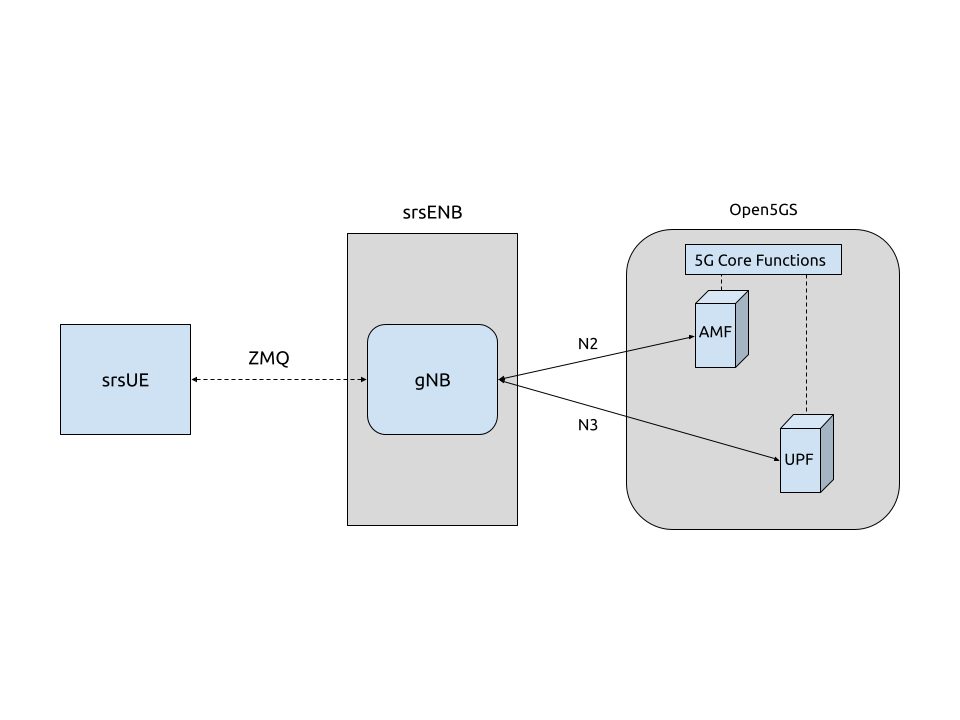

.. srsRAN 5G NSA Application Note

.. _5g_sa_e2e_appnote: 

5G SA End-to-End
#################
srsRAN 22.04 brings 5G SA support to both srsUE and srsENB. 5G SA features can be enabled via the 
configuration files of both srsUE and srsENB. This application note demonstrates how to configure a 5G SA network 
using srsRAN, a 3rd-party core (Open5GS) and ZeroMQ (ZMQ). Using ZMQ means there is no need for physical RF-hardware. 

Network & Hardware Overview
***************************

For this application note, the following hardware and software will be used: 

    - Dell XPS13 with Ubuntu 20.04.4 
    - srsRAN 22.04 (or later)
    - ZeroMQ 
    - Open5GS 5G Core

For information on installing ZMQ and using it with srsRAN, see our :ref:`ZMQ App Note <zeromq_appnote>`. 

Open5GS
=======

Open5GS is a C-language Open Source implementation for 5G Core and EPC. The following links will provide you 
with the information needed to download and set-up Open5GS so that it is ready to use with srsRAN: 

    - `GitHub <https://github.com/open5gs/open5gs>`_ 
    - `Quickstart Guide <https://open5gs.org/open5gs/docs/guide/01-quickstart/>`_
    
Configuration
=============

To enable 5G SA features, changes need to be made to both the UE and eNB configuration files. This section will outline these. 

Example configs are attached here: 

  * :download:`ue.conf<.configs/ue.conf>` 
  * :download:`rr.conf <.configs/rr.conf>`
  * :download:`enb.conf<.configs/enb.conf>`
  * :download:`amf.yaml<.configs/amf.yaml>`
  * :download:`upf.yaml<.configs/upf.yaml>`

These config files have been modified to remove certain options that are not essential to this use-case. 

srsUE
=====

The Following steps need to be taken to modify the srsUE config file to enable 5G SA features: 

    - Enable ZMQ
    - Enable NR features
    - Configure USIM credentials & APN

ZMQ
---

To enable ZMQ the following is added to the UE config file:: 

    [rf]
    freq_offset = 0
    tx_gain = 80    
    srate = 11.52e6

    device_name = zmq
    device_args = tx_port=tcp://*:2001,rx_port=tcp://localhost:2000,id=ue,base_srate=11.52e6

.. note::
   A fixed sample rate must be used for 5G SA

The network namespace must also be configured:: 

    [gw]
    netns = ue1

NR Features
-----------

Firstly disable the LTE carrier(s):: 

    [rat.eutra]
    dl_earfcn = 2850
    nof_carriers = 0

Enable the NR band(s) and carrier(s):: 

    [rat.nr]
    bands = 3,78
    nof_carriers = 1

Lastly, set the release to release-15:: 

    [rrc]
    release = 15

USIM Credentials & APN
----------------------

The following USIM Credentials are used:: 

    [usim]
    mode = soft
    algo = milenage
    opc  = 63BFA50EE6523365FF14C1F45F88737D
    k    = 00112233445566778899aabbccddeeff
    imsi = 901700123456789
    imei = 353490069873319

The main change here is adjusting the IMSI, so that the correct PLMN is used. 

The APN is enabled with the following configuration:: 

    [nas]
    apn = srsapn
    apn_protocol = ipv4  

Network Namespace
=================

It is important to create to appropriate network namespace for the UE when using ZMQ. 

To create the network  namespace, use:: 

    sudo ip netns add ue1

To verify the new "ue1" netns exists, run::   
    
    sudo ip netns list

More information on why this is needed can be found in the :ref:`ZMQ App Note<zeromq_appnote>`. 

srsENB
======

The Following steps need to be taken to modify the srsENB config and associated config files to enable 5G SA features: 

    - enb.conf

        - Set correct PLMN 
        - Change MME Address to match Open5GS GTPU and NGAP address'. 
        - Enable ZMQ

    - rr.conf 

         - Add 5G cell to cell list, and remove LTE cells

enb.conf
--------

PLMN & MME
^^^^^^^^^^
Setting the PLMN (MCC & MNC) and MME address is done in the following way:: 

    [enb]
    enb_id = 0x19B
    mcc = 901
    mnc = 70
    mme_addr = 127.0.0.2
    gtp_bind_addr = 127.0.1.1
    s1c_bind_addr = 127.0.1.1
    s1c_bind_port = 0
    n_prb = 50

The MMC and MNC are set to match the UE and Core. The MME address is configured to allow the eNB to communicate correctly with the AMF and UPF. If this is not changed srsENB and the Core will not connect.  

ZMQ
^^^^^

ZMQ is enabled with the following changes to the config file:: 

    [rf]
    rx_gain = 40
    tx_gain = 80

    # Example for ZMQ-based operation with TCP transport for I/Q samples
    device_name = zmq
    device_args = fail_on_disconnect=true,tx_port=tcp://*:2000,rx_port=tcp://localhost:2001,id=enb,base_srate=11.52e6

rr.conf
-------

The 5G NR cell must be added to the rr.conf when operating in 5G SA mode, the existing LTE cells must be removed. This can be done by either commenting them out, or deleting them entirely. In the attached rr.conf file they have 
been commented out. 

The following 5G NR cell configuration is used:: 

    nr_cell_list =
    (
      {
        rf_port = 0;
        cell_id = 1;
        root_seq_idx = 1;
        tac = 7;
        pci = 500;
        dl_arfcn = 368500;
        band = 3;	
      }
    );

Core
=====

As highlighted above, the Open5GS `Quickstart Guide <https://open5gs.org/open5gs/docs/guide/01-quickstart/>`_ provides a comprehensive overview of how to configure Open5GS to run as a 5G Core. 

The main modifications needed are: 

    - Change the TAC in the AMF config to 7
    - Check that the NGAP, and GTPU addresses are all correct. This is done in the AMF and UPF config files.  
    - It is also a good idea to make sure the PLMN values are consistent across all of the above files and the UE config file. 

The final step is to register the UE to the list of subscribers through the Open5GS WebUI. The values for each field should match what is in the UE config file, under the [USIM] section. 

.. note::
   Make sure to correctly configure the APN, if this is not done correctly the UE will not connect to the internet.

 

Set-up The Network
******************

Core
====
Once the steps from the Open5GS Quickstart Guide are followed you do not need to do any more to bring the core online. It will run in the background. Make sure to restart the relevant daemons after 
making any changes to the config files. 

eNB
===

First run srsENB. In this example srsENB is being run directly from the build folder, with the config files also located there:: 

    sudo ./srsenb enb.conf

If srsENB connects to the core successfully the following (or similar) will be displayed on the console:: 

    ---  Software Radio Systems LTE eNodeB  ---

    Reading configuration file enb.conf...

    Opening 1 channels in RF device=zmq with args=fail_on_disconnect=true,tx_port=tcp://*:2000,rx_port=tcp://localhost:2001,id=enb,base_srate=11.52e6
    Supported RF device list: bladeRF zmq file
    CHx base_srate=11.52e6
    CHx id=enb
    Current sample rate is 1.92 MHz with a base rate of 11.52 MHz (x6 decimation)
    NG connection successful
    CH0 rx_port=tcp://localhost:2001
    CH0 tx_port=tcp://*:2000
    CH0 fail_on_disconnect=true

    ==== eNodeB started ===
    Type <t> to view trace
    Current sample rate is 11.52 MHz with a base rate of 11.52 MHz (x1 decimation)
    Current sample rate is 11.52 MHz with a base rate of 11.52 MHz (x1 decimation)
    Setting frequency: DL=1842.5 Mhz, UL=1747.5 MHz for cc_idx=0 nof_prb=52

The ``NG connection successful`` message confirms that srsENB has connected to the core. 

UE
==

srsUE can now be run. This is also done directly from within the build folder, with the config file in the same location:: 

    sudo ./srsue ue.conf 

If srsUE connects successfully to the network, the following (or similar) should be displayed on the console:: 

    Reading configuration file ue.conf...

    Opening 1 channels in RF device=zmq with args=tx_port=tcp://*:2001,rx_port=tcp://localhost:2000,id=ue,base_srate=11.52e6
    Supported RF device list: bladeRF zmq file
    CHx base_srate=11.52e6
    CHx id=ue
    Current sample rate is 1.92 MHz with a base rate of 11.52 MHz (x6 decimation)
    CH0 rx_port=tcp://localhost:2000
    CH0 tx_port=tcp://*:2001
    Current sample rate is 11.52 MHz with a base rate of 11.52 MHz (x1 decimation)
    Current sample rate is 11.52 MHz with a base rate of 11.52 MHz (x1 decimation)
    Waiting PHY to initialize... done!
    
    Attaching UE...
   
    Random Access Transmission: prach_occasion=0, preamble_index=0, ra-rnti=0xf, tti=171
    Random Access Complete.     c-rnti=0x4601, ta=0
    RRC Connected
    RRC NR reconfiguration successful.
    PDU Session Establishment successful. IP: 10.45.0.2
    RRC NR reconfiguration successful.

It is clear that the connection has been made successfully once the UE has been assigned an IP, this is seen in ``PDU Session Establishment successful. IP: 10.45.0.2``. The NR connection is then confirmed 
with the ``RRC NR reconfiguration successful.`` message. 

Testing the Network
*******************

PING
=====

This is the simplest way to test the network. This will test whether or not the UE and core can successfully communicate. 

Uplink
------

To test the connection in the uplink direction, use the following:: 

    sudo ip netns exec ue1 ping 10.45.0.1

Downlink
--------

To run traffic in the downlink direction use:: 

    ping 10.45.0.2

The IP for the UE can be taken from the UE console output. This will change each time a UE reconnects to the network, so it is best practice to always double check the latest IP assigned by reading it 
from the console before running the downlink traffic. 

iPerf3 
======

In this setup the client will run on the UE side with the server on the network side. UDP traffic will be generated at 10Mbps for 60 seconds. When running the iPerf client, we use the UE 
network namespace and specify the network-side IP address. It is important to start the server first, and then the client.

Network-side 
-------------

Start the iPerf server:: 

	iperf3 -s -i 1 

This will then listen for traffic coming from the UE. 

UE-side
-------

With the network and the iPerf server up and running, the client can be run from the UE's network namespace with following command:: 

	sudo ip netns exec ue1 iperf3 -c 10.45.0.1 -b 10M -i 1 -t 60 

Traffic will now be sent from the UE to the eNB. This will be shown in both the server and client consoles, and also in the trace for both the UE and the eNB. 

Example Output
--------------

Example **client** iPerf output:: 

    Connecting to host 10.45.0.1, port 5201
    [  5] local 10.45.0.3 port 34894 connected to 10.45.0.1 port 5201
    [ ID] Interval           Transfer     Bitrate         Retr  Cwnd
    [  5]   0.00-1.00   sec  1.30 MBytes  10.9 Mbits/sec    0   90.5 KBytes       
    [  5]   1.00-2.00   sec  1.12 MBytes  9.44 Mbits/sec    8   55.1 KBytes       
    [  5]   2.00-3.00   sec  1.25 MBytes  10.5 Mbits/sec    4   50.9 KBytes       
    [  5]   3.00-4.00   sec  1.00 MBytes  8.39 Mbits/sec    4   43.8 KBytes       
    [  5]   4.00-5.00   sec  1.00 MBytes  8.39 Mbits/sec    0   58.0 KBytes       
    [  5]   5.00-6.00   sec  1.25 MBytes  10.5 Mbits/sec    5   53.7 KBytes 

Example **server** iPerf output:: 

    -----------------------------------------------------------
    Server listening on 5201
    -----------------------------------------------------------
    Accepted connection from 10.45.0.3, port 34892
    [  5] local 10.45.0.1 port 5201 connected to 10.45.0.3 port 34894
    [ ID] Interval           Transfer     Bitrate
    [  5]   0.00-1.00   sec  1.13 MBytes  9.44 Mbits/sec                  
    [  5]   1.00-2.00   sec  1.16 MBytes  9.69 Mbits/sec                  
    [  5]   2.00-3.00   sec  1.06 MBytes  8.88 Mbits/sec                  
    [  5]   3.00-4.00   sec  1.05 MBytes  8.78 Mbits/sec                  
    [  5]   4.00-5.00   sec  1.05 MBytes  8.78 Mbits/sec                  
    [  5]   5.00-6.00   sec  1.16 MBytes  9.75 Mbits/sec     	
 

UE Trace 
=========

The following example trace was taken from the srsUE console while running the above iPerf3 test:: 

    ---------Signal-----------|-----------------DL-----------------|-----------UL-----------
    rat  pci  rsrp   pl   cfo | mcs  snr  iter  brate  bler  ta_us | mcs   buff  brate  bler
     nr  500    29    0  -16u |  28  n/a   1.1   9.9M    0%    0.0 |  28    48k   9.5M    0%
     nr  500    25    0  -18u |  27   70   1.1    13M    0%    0.0 |  28    61k    13M    0%
     nr  500    28    0  -16u |  27   70   1.1    11M    0%    0.0 |  28   6.7k    12M    0%
     nr  500    30    0  -14u |  28   70   1.1   9.2M    0%    0.0 |  28    48k   9.6M    0%
     nr  500    26    0  -13u |  27   71   1.1    12M    0%    0.0 |  28    30k    12M    0%
     nr  500    31    0  -17u |  27  n/a   1.1   8.8M    0%    0.0 |  28    43k   8.8M    0%
     nr  500    29    0  -14u |  27   70   1.1   9.9M    0%    0.0 |  28    52k    10M    0%
     nr  500    27    0 -7.0u |  27   70   1.1    11M    0%    0.0 |  28    47k    11M    0%
     nr  500    26    0  -14u |  27   71   1.1    11M    0%    0.0 |  28    57k    12M    0%
     nr  500    27    0  -16u |  27   70   1.1    11M    0%    0.0 |  28    49k    12M    0%
     nr  500    28    0  -10u |  27   71   1.1    11M    0%    0.0 |  28    41k    11M    0%

eNB/ gNB Trace
==============

The following example trace was taken from the srsENB console at the same time period as the srsUE trace shown above:: 

               -----------------DL----------------|-------------------------UL-------------------------
    rat  pci rnti  cqi  ri  mcs  brate   ok  nok  (%) | pusch  pucch  phr  mcs  brate   ok  nok  (%)    bsr
     nr    0 4601   15   0   27    11M  296    0   0% |  66.2   99.9    0   28    10M  268    0   0%    0.0
     nr    0 4601   15   0   27    10M  289    0   0% |  65.7   99.9    0   28    10M  264    0   0%    0.0
     nr    0 4601   15   0   28   9.4M  262    0   0% |  65.0   99.9    0   28   9.5M  242    0   0%    0.0
     nr    0 4601   15   0   27    11M  305    0   0% |  66.3   99.9    0   28    11M  278    0   0%    0.0
     nr    0 4601   15   0   27    12M  339    0   0% |  66.4   99.9    0   28    13M  340    0   0%    0.0
     nr    0 4601   15   0   28   9.6M  265    0   0% |  66.0   99.9    0   28    10M  263    0   0%    0.0
     nr    0 4601   15   0   27    11M  310    0   0% |  65.6   99.9    0   28    11M  278    0   0%    0.0
     nr    0 4601   15   0   27   9.7M  272    0   0% |  65.9   99.9    0   28   9.6M  245    0   0%    0.0
     nr    0 4601   15   0   27   9.3M  260    0   0% |  65.8   99.9    0   28   9.5M  243    0   0%    0.0
     nr    0 4601   15   0   27    11M  322    0   0% |  66.1   99.9    0   28    12M  302    0   0%    0.0
     nr    0 4601   15   0   27   9.8M  274    0   0% |  65.8   99.9    0   28    10M  267    0   0%    0.0

