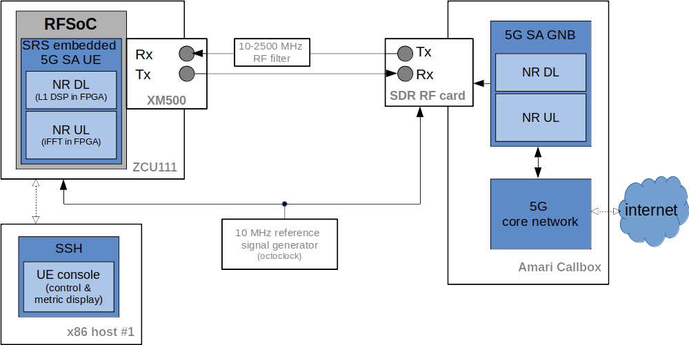

.. Embedded 5G SA UE Application Note

.. _5g_sa_emb_ue_appnote:

Embedded 5G SA UE Application Note
==================================

Introduction
************

This application note shows how the embedded 5G SA UE can be used with a third-party 5G SA network.
In this example, we use the Amari Callbox Classic from Amarisoft to provide the 5G SA network.

The application note starts with a quick overview of the main features of the embedded 5G SA UE
implementation on the RFSoC platform. Moreover, the utilized laboratory setup and the steps to
reproduce it are provided as well (i.e., from configuring the ZCU111 prototyping board as
required, to the list of console commands used to control the system).

Embedded 5G SA UE Overview
**************************

|

Hardware Requirements
---------------------

The figure above shows the utilized laboratory setup, which comprises the following components:

  - **ZCU111 prototyping platform**: hosts the RFSoC device, which will implement the embedded
    5G SA SRS UE. The latter includes a partially FPGA-accelerated PHY.
  - **XM500 daughterboard**: this FMC balun converter board is plugged onto the ZCU111 and
    provides external access to the ADCs/DACs in the RFSoC.
  - **Amari Callbox**: NR SDR-based UE test solution from Amarisoft. It contains both the SA mode
    gNodeb and the 5GC, colocated in the same machine. Furthermore, high-performance PCIe SDR
    cards are implementing the RF front-end of the Callbox.
  - **x86 host #1**: will provide SSH access to the ZCU111 board, in order to control the
    embedded SA SRS UE. Will also display run-time performance metrics.
  - **octoclock**: will provide a shared 10 MHz reference signal between the ZCU111 board and the
    Callbox's RF front-end.

The specific elements utilized in the laboratory setup were chosen as they are widely available,
easily configurable, and user-friendly.

Hardware Setup
--------------

The connection between the different components comprising the laboratory setup is as follows:

  * The RF front-end of the Callbox will be directly cabled with the XM500. Note that the latter
    does not include RF gain/filtering components, but enables a cabled setup via the onboard SMA
    connectors (comes equipped with suitable external filters). Additionally, a common 10 MHz
    reference signal will be shared between them (e.g., octoclock).
  * Both x86 host #1 and the ZCU111 will be connected to the same LAN (Ethernet), which will
    enable the host to access (SSH) the ZCU111 and interact with the embedded ARM (RFSoC).

Embedded 5G SA UE Features and Limitations
******************************************

.. _Features
Features
--------

The current implementation provides a functional NR SA UE (that is, able to establish a
bidirectional communication link with a NR SA gNB). Hence, the embedded implementation includes
the following features:

  * DL bandwidth up to 10 MHz.
  * Partially FPGA-accelerated L1:

     - Bulk of L1 DL DSP (PSS detection, FFT, channel estimation and PBCH/PDCCH/PDSCH).
     - OFDM stage of L1 UL (iFFT).
  * Run-time performance metrics provided through the console.

Limitations
-----------

The limited embedded CPU performance is constraining the maximum attainable performance of the
current UE implementation (e.g., the bulk of the UL processing is currently implemented in software).

The lack of a complete RF front-end also introduces the following limitations:

  * A cabled setup is required, as no gain and/or RF filtering components are included in the
    XM500 daughter-board (beyond those baseline features provided by the HF/LF baluns).
    Consequently, no AGC functionalities are implemented.
  * The center frequencies supported by the specific hardware setup being utilized are
    constrained to the 10-2500 MHz range (e.g., testing has used band *n3* - ARFCN *368500: 1842.5
    MHz DL, 1747.5 MHz UL* - for the NR carrier).
  * Regarding the Tx gains, they need to be carefully fixed, for which we do recommend using the
    settings described in the configuration files provided below.

The embedded 5G SA UE implementation inherits those feature limitations of its x86 counterpart.
That is, while interoperability with a third party gNB is supported, only certain bands (i.e.,
NR configuration parameters) can actually be used. A list of key feature limitations is provided
below for the sake of thoroughness:

  * Only the 15 kHz subcarrier-spacing (SCS) is supported (including the SSB).
  * Signal bandwidth limited to 10 MHz.
  * Only DCI formats 0_0, 1_0, 0_1 and 1_1 are supported.
  * No cell search and reference signal measurements (PCI for NR carrier needs to be known).

Building the embedded SA UE
***************************

The embedded 5G SA UE application can be built from the SRS FPGA repository, following the steps
described in the following.

ARM binary
----------

First, you'll need to have a Petalinux build based on the exported hardware configuration files
of the implemented Vivado project for the embedded 5G SA mode UE (you can find the related *.xsa*
file in the code repository; under the *RFdc timestamping IP section in
/lib/src/phy/ue/fpga_ue/RFdc_timestamping/petalinux_files/sa_ue_impl_files*).

The first step towards building the embedded SA UE application is to install the toolchain that
was built via *petalinux-tools*. This file is located at
*/PETALINUX_BUILD_PATH/xilinx-zcu111-2019.2/images/linux*. To install it, use the following
command::

  ./sdk.sh

You will be prompted to specify the toolchain installation path (for instace, use
*/opt/plnx_sdk_rfsoc*). When the installation finishes, set up the following environment
variables::

  . /opt/plnx_sdk_rfsoc/environment-setup-aarch64-xilinx-linux

Then, go to the path where the SRS FPGA repository is cloned locally. Then, run the following
commands, paying special attention to the *cmake* argument (which points to the *toolchain.cmake*
file linked below and for which you will need a local copy)::

  cd srsLTE_FPGA
  mkdir build && cd build
  cmake -DCMAKE_BUILD_TYPE=Release -DUSE_LTE_RATES=ON -DCMAKE_TOOLCHAIN_FILE=~/toolchain.cmake ..
  make -j12 srsue

When the build finishes, you will find the application at */srsue/src* within your local
repository.

  - :download:`toolchain.cmake file to build the UE <toolchain.cmake>`

FPGA bitstream
--------------

The latest implemented bitstream for the embedded 5G SA mode UE can be found in the same location
as the exported hardware configuration files used to build Petalinux (you can find the *.bit*
file in the code repository; under the *RFdc timestamping IP section in
/lib/src/phy/ue/fpga_ue/RFdc_timestamping/petalinux_files/sa_ue_impl_files*).

Configuration
*************

In this example, we are using the following configuration parameters:
  * Band n3:

     - FDD
     - 15 kHz
     - DL ARFCN: 368500 (1842.5 MHz)
     - UL ARFCN: 349500 (1747.5 MHz),
  * 10 MHz signal bandwidth (52 PRB, for both DL and UL)
  * PCI 500
  * Two CORESETs:

     - CORESET0 (interleaved PDCCH, RB offset = 1)
     - UE-specific CORESET (non-interleaved, RB offset = 0)

The next sections will detail how to apply such configuration to both UE and gNB.

Configuration files
-------------------

To reproduce the described laboratory setup, with the described features and limitations, both the
UE and the Amari Callbox need to be properly configured. Specifically, changes must be made to the
*ue.conf* file in the UE side and to the *mme.cfg* and *gnb_nsa.cfg* files in the Callbox side.

All of the modified configuration files have been included as attachments to this App Note. It is
recommended you use these files to avoid errors while changing configs manually. Any configuration
files not included here do not require modification from the default settings.

*UE configuraion file*

  - :download:`embedded 5G SA SRS UE configuration file <ue.conf>`

*Amari Callbox configuration files*

  - :download:`gNB configuration file <gnb-sa-fpga.cfg>`
  - :download:`MME configuration file <mme.cfg>`

srsUE (ZCU111 board)
--------------------

*Use of an external reference signal in the ZCU111*

The use of an external 10 MHz reference signal ensures the accuracy of the system clock, which
will also be shared with the gNB. In order to enable the use of an external reference in the
ZCU111 board, the following actions are required:

  1. Disconnect the jumper in *J110* to power-off the 12.8 MHz TCXO that is connected by default to
     *CLKin0* of the LMK04208 PLL used to generate the ADC/DAC reference clocks in the ZCU111.
  2. Connect a 10 MHz clock reference to the *J109* SMA port in the ZCU111 (e.g., cabled output
     from octoclock).

.. image:: .imgs/zcu111_J109_J100_config.png
  :align: center
|

Note, that some modifications are also required in the software end. Nevertheless, the embedded
SRS UE application is already including them. The full details are provided in the code repository
(see the *RFdc timestamping IP section in /lib/src/phy/ue/fpga_ue/RFdc_timestamping*).

*XM500 port usage*

As per FPGA design (i.e., fixed in the demonstration bistream), a specific set of connectors
needs to be used in the XM500 daughter-board, as indicated below:

  - The NR DL signal shall be received from ADC Tile 224, channel 1 (labelled as
    **ADC224_T0_CH1** in the board).
  - The NR UL signal shall be transmitted from DAC Tile 229, channel 3 (labelled as
    **ADC224_T1_CH3** in the board).

Moreover, one of the external DC-2500 MHz low-pass filters (**VLFX-2500+**) shipped alongisde the
XM500 needs to be placed between the Tx cable coming from the gNB and the SMA connector of the ADC
channel used in the XM500, as shown below.

.. image:: .imgs/zcu111_external_filter_detail.png
  :align: center
|

*SD card*

The bitstream and binaries implementing the embedded 5G SA mode UE are hosted in an SD card, which
is organized as detailed below:

  - **BOOT partition**: includes the embedded UE boot image (*BOOT.BIN*), which groups the FPGA
    bistream and boot binaries, the Petalinux Kernel image and the device tree.
  - **rootfs partition**: includes the root file system, which contains the user applications
    (i.e., the embedded SRS UE binary must be copied in this partition).

Build of a customized SD card is out of the scope of this application note. Nevertheless, detailed
instructions on how to do so can be found in the FPGA code repository
(see *lib/src/phy/ue/fpga_ue/srsRAN_RFSoC.md*).

In case of not having physical access to the SD card in the ZCU111 used in your laboratory setup,
you can copy the the embedded SRS UE files over the network. First, run the following commands in
the ZCU111 console (i.e., the one *SSHing* the board) ::

  mkdir BOOT_mnt
  mount /dev/mmcblk0p1 BOOT_mnt

Then run the following commands in the folder containing your local copy of the embedded SRS UE
*BOOT.BIN* and device tree files (you can find them in the code repository; under the *RFdc
timestamping IP section in
/lib/src/phy/ue/fpga_ue/RFdc_timestamping/petalinux_files/sa_ue_impl_files/BOOT_BIN_files*) ::

  scp BOOT.BIN root@ZCU111_IP_ADDRESS:/home/root/BOOT_mnt/BOOT.BIN
  scp system.dtb root@ZCU111_IP_ADDRESS:/home/root/BOOT_mnt/system.dtb

Finally, run the following commands in the ZCU111 console ::

  sync
  umount BOOT_mnt
  reboot

In the *rootfs* partition we'll need to copy both the embedded SRS UE binary, the UE configuration
file and the *run* script file provided below. You can also do it over the network.

gNB and 5GC (Amari Callbox)
---------------------------

*Shared reference signal with the ZCU111*

Provide a PPS input to the Amari Callbox generated from the same reference signal source (e.g.,
octoclock) used with the ZCU111 (use of *external* sync in the gNB configuration file).

*SDR card and ports usage*

In the utilized laboratory setup (and in accordance to the attached configuration files) it was
employed the SDR card on the third slot (labelled *sdr2* in the gNB configuration file). Moreover,
a single RX RF port and a single TX RF port were used. In the case of the TX port (i.e., DL signal)
the connection passed through the external RF filter of the counterpart receive ADC channel in the
XM500 daugther-board.

Usage
*****

Following configuration, we can run the UE, gNB and 5GC. The following order should be used when
reproducing the described laboratory setup:

1. MME
2. gNB
3. UE
4. ping

MME
---

*The commands listed below are to be run on the Amari Callbox. In our setup, the LTE MME
version 2020-09-14 was used. Likewise, the TRX SDR Linux kernel module version 2021-03-17
was used.*

First, make sure that the kernel module managing the SDR cards is properly loaded. To do so,
run the following command in the *trx_sdr-linux-2021-03-17* path::

  sudo ./trx_sdr-linux-2021-03-17/kernel/init.sh

Then make sure that the *mme.cfg* file is copied in the appropriate config folder and run the
following command in the *ltemme-linux-2020-09-14* path::

  sudo ./ltemme config/mme.cfg

The onsole output should be similar to::

  LTE MME version 2020-09-14, Copyright (C) 2012-2020 Amarisoft
  This software is licensed to Software Radio Systems (SRS).
  Support and software update available until 2021-10-29.

gNB
---

*The commands listed below are to be run on the Amari Callbox. In our setup, the LTE eNB/gNB
version 2021-03-17 was used.*

Make sure that the *gnb-sa-fpga.cfg* file is copied in the appropriate config folder. Then, run the
following commands in the * lteenb-linux-2021-03-17* path::

  sudo ./lteenb config/gnb-sa-fpga.cfg

The onsole output should be similar to::

  LTE Base Station version 2021-03-17, Copyright (C) 2012-2021 Amarisoft
  This software is licensed to Software Radio Systems (SRS).
  Support and software update available until 2021-10-29.

  RF0: sample_rate=15.360 MHz dl_freq=1842.500 MHz ul_freq=1747.500 MHz (band n3) dl_ant=1 ul_ant=1
  (enb)

UE and ping
-----------

*The commands listed below are to be run on the zcu111 (i.e., through SSH via host #1). Recall that
besides the binary, you also need to copy in the SD card the *ue.conf*, *install_srsue_drivers.sh*
and *run_ue.sh* files attached in this App Note.*

To run the UE, first we'll need to load the custom srsUE DMA drivers for the ZCU111. This can
be conveniently done through a script that handles the required *insmod* calls, which has been
included attached to this App Note. Likewise, a script handling the execution of the embedded
5G SA UE has also been attached.

  - :download:`embedded srsUE DMA drivers installation script <install_srsue_drivers.sh>`
  - :download:`embedded 5G SA UE execution script <run_ue.sh>`

To load the srsUE drivers use the following command::

  ./install_srsue_drivers.sh

Later the embedded srsUE will be executed using the following command::

  ./run_ue

Once the UE has been initialised you should see an output similar to the following::

  Reading configuration file ue_debug.conf...
  WARNING: cpu0 scaling governor is not set to performance mode. Realtime processing could be compromised. Consider setting it to performance mode before running the application.

  Built in Release mode using commit 2a0d3b1ff on branch experimental_sa_amari_attach.

  Opening 1 channels in RF device=default with args=clock=external
  Supported RF device list: RFdc file
  Trying to open RF device 'RFdc'
  metal: info:      Registered shmem provider linux_shm.
  metal: info:      Registered shmem provider ion.reserved.
  metal: info:      Registered shmem provider ion.ion_system_contig_heap.
  metal: info:      Registered shmem provider ion.ion_system_heap.
  Configuring LMK04208 to use external clock source
  LMX configured
  RF device 'RFdc' successfully opened

  FPGA bitstream built on 0000/00/00 00:00:00:00 using commit 00000000
  Setting manual TX/RX offset to 60 samples
  Waiting PHY to initialize ... done!

Once the FPGA has correctly synchronized to the selected cell you should see a similar console
output during the attach procedure::

  Attaching UE...
  Random Access Transmission: prach_occasion=0, preamble_index=0, ra-rnti=0xf, tti=651
  Random Access Complete.     c-rnti=0x0, ta=2
  RRC Connected
  RRC NR reconfiguration successful.
  PDU Session Establishment successful. IP: 192.168.3.2
  RRC NR reconfiguration successful.

Note that an IP address is provided once the PDU session establishment is succesfully completed.
From another session simply run the ping command::

  ping 192.168.3.1

Similar console outputs should then be produced::

  PING 192.168.3.1 (192.168.3.1): 56 data bytes
  64 bytes from 192.168.3.1: seq=0 ttl=64 time=33.942 ms
  64 bytes from 192.168.3.1: seq=1 ttl=64 time=113.814 ms
  64 bytes from 192.168.3.1: seq=2 ttl=64 time=33.654 ms
  64 bytes from 192.168.3.1: seq=3 ttl=64 time=33.607 ms

Finally, it is worth mentioning that follwing the RRC NR reconfiguration messages a set of metrics
will be periodically displayed as part of the console outputs::

  Enter t to stop trace.
  ---------Signal-----------|-----------------DL-----------------|-----------UL-----------
  rat  pci  rsrp   pl   cfo | mcs  snr  iter  brate  bler  ta_us | mcs   buff  brate  bler
   nr  500     0    0   0.0 |  10    0   0.0   1.3k   20%    0.0 |  10    0.0   3.3k    0%
   nr  500     0    0   0.0 |  10    0   0.0   1.3k   20%    0.0 |   8    0.0   3.2k    0%
   nr  500     0    0   0.0 |  10    0   0.0   1.3k   20%    0.0 |   8    0.0   3.0k    0%
   nr  500     0    0   0.0 |  10    0   0.0   1.3k   20%    0.0 |   8    0.0   3.0k    0%
   nr  500     0    0   0.0 |  10    0   0.0   1.3k   20%    0.0 |  10    0.0   3.1k    0%
   nr  500     0    0   0.0 |  10    0   0.0   1.3k   20%    0.0 |  10    0.0   3.2k    0%
   nr  500     0    0   0.0 |  10    0   0.0   1.3k   20%    0.0 |   8    0.0   3.0k    0%
   nr  500     0    0   0.0 |  10    0   0.0   1.3k   33%    0.0 |  10    0.0   3.1k    0%
   nr  500     0    0   0.0 |  10    0   0.0   1.3k   20%    0.0 |   9    0.0   3.2k    0%
   nr  500     0    0   0.0 |  10    0   0.0   1.3k   20%    0.0 |  10    0.0   3.5k   20%
   nr  500     0    0   0.0 |  10    0   0.0   1.3k   20%    0.0 |  10    0.0   3.1k    0%
  ---------Signal-----------|-----------------DL-----------------|-----------UL-----------
  rat  pci  rsrp   pl   cfo | mcs  snr  iter  brate  bler  ta_us | mcs   buff  brate  bler
   nr  500     0    0   0.0 |  10    0   0.0   4.5k   11%    0.0 |  11    0.0   3.9k   20%
