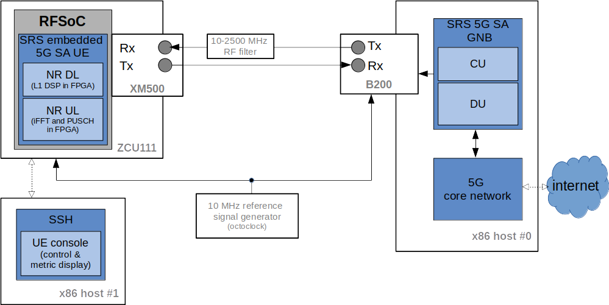
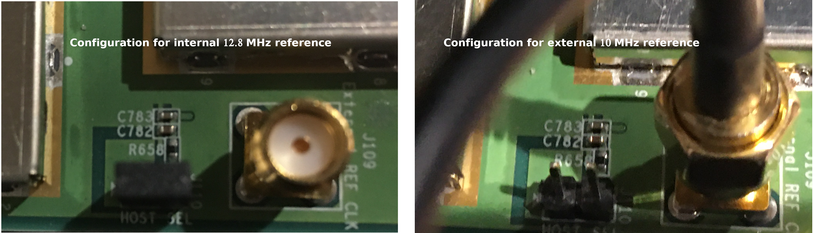
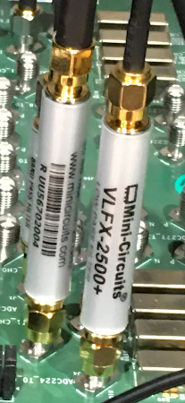

.. Embedded 5G SA SRS UE and gNB Application Note

.. _5g_sa_emb_ue_appnote:

Embedded 5G SA SRS UE and gNB Application Note
==============================================

Introduction
************

This application note shows how the embedded 5G SA UE and gNB can be set up to work together,
jointly with a third-party 5G core network. In this example, we use Open5GS.

The application note starts with a quick overview of the main features of the embedded 5G SA UE
implementation on the RFSoC platform. Moreover, the utilized laboratory setup and the steps to
reproduce it are provided as well (i.e., from configuring the ZCU111 prototyping board as
required, to the list of console commands used to control the system).

Embedded 5G SA UE Overview
**************************

|

Hardware Requirements
---------------------

The figure above shows the utilized laboratory setup, which comprises the following components:

  - **ZCU111 prototyping platform**: hosts the RFSoC device, which will implement the embedded
    5G SA SRS UE. Most PHY-layer functions of the embedded SA UE are FPGA-accelerated.
  - **XM500 daughterboard**: this FMC balun converter board is plugged onto the ZCU111 and
    provides external access to the ADCs/DACs in the RFSoC.
  - **x86 host #0**: executes SRS O-RAN native gNB, as well as the 5GC in a colocated setup.
  - **B200 USRP**: COTS SDR RF front-end used by SRS gNB.
  - **x86 host #1**: will provide SSH access to the ZCU111 board, in order to control the
    embedded SA SRS UE. Will also display run-time performance metrics.
  - **octoclock**: will provide a shared 10 MHz reference signal between the ZCU111 board and the
    gNB RF front-end.

The specific elements utilized in the laboratory setup were chosen as they are widely available,
easily configurable, and user-friendly.

Hardware Setup
--------------

The connection between the different components comprising the laboratory setup is as follows:

  * The B200 will be directly cabled with the XM500. Note that the latter does not include RF
    gain/filtering components, but enables a cabled setup via the onboard SMA connectors
    (comes equipped with suitable external filters). Additionally, a common 10 MHz reference
    signal will be shared between them (e.g., octoclock).
  * Both x86 host #1 and the ZCU111 will be connected to the same LAN (Ethernet), which will
    enable the host to access (SSH) the ZCU111 and interact with the embedded ARM (RFSoC).

Embedded 5G SA UE Features and Limitations
******************************************

.. _Features
Features
--------

The current NR SA UE implementation includes the following features:

  * DL bandwidth up to 20 MHz.
  * FPGA-accelerated L1 DSP:

     - Bulk of L1 DL DSP (PSS detection, FFT, channel estimation and PBCH/PDCCH/PDSCH).
     - L1 UL shared channel and OFDM stage (PUSCH, iFFT).
  * Run-time performance metrics provided through the console.

Limitations
-----------

The lack of a complete RF front-end introduces the following limitations:

  * A cabled setup is required, as no gain and/or RF filtering components are included in the
    XM500 daughter-board (beyond those baseline features provided by the HF/LF baluns).
    Consequently, no AGC functionalities are implemented.
  * The center frequencies supported by the specific hardware setup being utilized are
    constrained to the 10-2500 MHz range (e.g., testing has used band *n3* - ARFCN *368500: 1842.5
    MHz DL, 1747.5 MHz UL* - for the NR carrier).
  * Regarding the Tx gains, they need to be carefully fixed, for which we do recommend using the
    settings described in the configuration files provided below.

The embedded 5G SA UE implementation shares a few feature limitations with its x86 counterpart.
That is, while interoperability with a third party gNB is supported, only certain bands (i.e.,
NR configuration parameters) can actually be used. A list of key feature limitations is provided
below for the sake of thoroughness:

  * Only the 15 kHz subcarrier-spacing (SCS) is supported (including the SSB).
  * Signal bandwidth limited to 20 MHz.
  * Only DCI formats 0_0, 1_0, 0_1 and 1_1 are supported.
  * No reference signal measurements.
  * Cell search is skipped by default, although not for this example. When skipped, fixed PCI
    and SSB ARFCN values are used for the NR carrier instead (skipping is mandatory for 106 PRB).
  * PRACH is precomputed for the 106 PRB configuration (*f_idx* is fixed to *0*).

Building the embedded SA UE
***************************

The embedded 5G SA UE application can be built from the SRS FPGA repository, following the steps
described in the following.

ARM binary
----------

First, you'll need to have a Petalinux build based on the exported hardware configuration files
of the implemented Vivado project for the embedded 5G SA mode UE (you can find the related *.xsa*
file in the code repository; under the *RFdc timestamping IP section in
/lib/src/phy/ue/fpga_ue/RFdc_timestamping/petalinux_files/sa_ue_gnb_impl_files*).

The first step towards building the embedded SA UE application is to install the toolchain that
was built via *petalinux-tools*. This file is located at
*/PETALINUX_BUILD_PATH/xilinx-zcu111-2019.2/images/linux*. To install it, use the following
command::

  ./sdk.sh

You will be prompted to specify the toolchain installation path (for instace, use
*/opt/plnx_sdk_rfsoc*). When the installation finishes, set up the following environment
variables::

  . /opt/plnx_sdk_rfsoc/environment-setup-aarch64-xilinx-linux

Then, go to the path where the SRS FPGA repository is cloned locally. Then, run the following
commands, paying special attention to the *cmake* argument (which points to the *toolchain.cmake*
file linked below and for which you will need a local copy)::

  cd srsLTE_FPGA
  mkdir build && cd build
  cmake -DCMAKE_BUILD_TYPE=Release -DUSE_LTE_RATES=ON -DCMAKE_TOOLCHAIN_FILE=~/toolchain.cmake ..
  make -j12 srsue

When the build finishes, you will find the application at */srsue/src* within your local
repository.

  - :download:`toolchain.cmake file to build the UE <toolchain.cmake>`

FPGA bitstream
--------------

The latest implemented bitstream for the embedded 5G SA mode UE can be found in the same location
as the exported hardware configuration files used to build Petalinux (you can find the *.bit*
file in the code repository; under the *RFdc timestamping IP section in
/lib/src/phy/ue/fpga_ue/RFdc_timestamping/petalinux_files/sa_ue_gnb_impl_files*).

Configuration
*************

In this example, we are using the following configuration parameters:
  * Band n3:

     - FDD
     - 15 kHz
     - DL ARFCN: 368500 (1842.5 MHz)
     - UL ARFCN: 349500 (1747.5 MHz),
  * 10 MHz signal bandwidth (52 PRB, for both DL and UL)
  * PCI 1
  * Two CORESETs:

     - CORESET0 (interleaved PDCCH, 48 PRB allocation, RB offset = 1 (52 PRB)/28 (106 PRB))
     - UE-specific CORESET (non-interleaved, RB offset = 0, frequency-resource allocation skips the
       first frequency-resource)

The next sections will detail how to apply such configuration to both UE and gNB.

Configuration files
-------------------

To reproduce the described laboratory setup, with the described features and limitations, both the
UE and the gNB need to be properly configured. Specifically, changes must be made to both the
*ue.conf* file in the UE side and to the *gnb.yaml files in the gNB side.

All of the modified configuration files have been included as attachments to this App Note. It is
recommended you use these files to avoid errors while changing configs manually. Any configuration
files not included here do not require modification from the default settings.

*UE configuraion file*

  - :download:`embedded 5G SA SRS UE configuration file <ue.conf>`

*gNB configuration file*

  - :download:`SRS gNB configuration file <gnb.yaml>`

srsUE (ZCU111 board)
--------------------

*Use of an external reference signal in the ZCU111*

The use of an external 10 MHz reference signal ensures the accuracy of the system clock, which
will also be shared with the gNB. In order to enable the use of an external reference in the
ZCU111 board, the following actions are required:

  1. Disconnect the jumper in *J110* to power-off the 12.8 MHz TCXO that is connected by default to
     *CLKin0* of the LMK04208 PLL used to generate the ADC/DAC reference clocks in the ZCU111.
  2. Connect a 10 MHz clock reference to the *J109* SMA port in the ZCU111 (e.g., cabled output
     from octoclock).

|

Note that some modifications are also required in the software end. Nevertheless, the embedded
SRS UE application is already including them. The full details are provided in the code repository
(see the *RFdc timestamping IP section in /lib/src/phy/ue/fpga_ue/RFdc_timestamping*).

*XM500 port usage*

As per FPGA design (i.e., fixed in the NR SA UE bistream), a specific set of connectors needs to
be used in the XM500 daughter-board, as indicated below:

  - The NR DL signal shall be received from ADC Tile 224, channel 1 (labelled as
    **ADC224_T0_CH1** in the board).
  - The NR UL signal shall be transmitted from DAC Tile 229, channel 3 (labelled as
    **ADC224_T1_CH3** in the board).

Moreover, one of the external DC-2500 MHz low-pass filters (**VLFX-2500+**) shipped alongisde the
XM500 needs to be placed between the Tx cable coming from the gNB and the SMA connector of the ADC
channel used in the XM500, as shown below.

|

*SD card*

The bitstream and binaries implementing the embedded 5G SA mode UE are hosted in an SD card, which
is organized as detailed below:

  - **BOOT partition**: includes the embedded UE boot image (*BOOT.BIN*), which groups the FPGA
    bistream and boot binaries, the Petalinux Kernel image and the device tree.
  - **rootfs partition**: includes the root file system, which contains the user applications
    (i.e., the embedded SRS UE binary must be copied in this partition).

Build of a customized SD card is out of the scope of this application note. Nevertheless, detailed
instructions on how to do so can be found in the FPGA code repository
(see *lib/src/phy/ue/fpga_ue/srsRAN_RFSoC.md*).

In case of not having physical access to the SD card in the ZCU111 used in your laboratory setup,
you can copy the the embedded SRS UE files over the network. First, run the following commands in
the ZCU111 console (i.e., the one *SSHing* the board) ::

  mkdir BOOT_mnt
  mount /dev/mmcblk0p1 BOOT_mnt

Then run the following commands in the folder containing your local copy of the embedded SRS UE
*BOOT.BIN* and device tree files (you can find them in the code repository; under the *RFdc
timestamping IP section in
/lib/src/phy/ue/fpga_ue/RFdc_timestamping/petalinux_files/sa_ue_gnb_impl_files/BOOT_BIN_files*) ::

  scp BOOT.BIN root@ZCU111_IP_ADDRESS:/home/root/BOOT_mnt/BOOT.BIN
  scp system.dtb root@ZCU111_IP_ADDRESS:/home/root/BOOT_mnt/system.dtb

Finally, run the following commands in the ZCU111 console ::

  sync
  umount BOOT_mnt
  reboot

In the *rootfs* partition we'll need to copy both the embedded SRS UE binary, the UE configuration
file and the *run* script file provided below. You can also do it over the network.

gNB
---

*Shared reference signal with the ZCU111*

Provide a PPS input to the B200 generated from the same reference signal source (e.g., octoclock)
used with the ZCU111 (use of *external* sync in the gNB configuration file).

*SDR RF front-end*

In the utilized laboratory setup (and in accordance to the attached configuration files) it was
employed a B200 USRP device. Moreover, a single RX RF port and a single TX RF port were used.
In the case of the TX port (i.e., DL signal) the connection passed through the external RF filter
of the counterpart receive ADC channel in the XM500 daugther-board.

Usage
*****

Following configuration, we can run the UE, gNB and 5GC. The following order should be used when
reproducing the described laboratory setup:

1. Open5GS
2. gNB
3. UE
4. ping

Open5GS
-------

Regarding the configuration of Open5GS, abundant information is provided in
`the srsRAN gNB with srsUE tutorial <https://docs.srsran.com/projects/project/en/latest/tutorials/source/srsUE/source/index.html>`_
. We recommend the user to read it thoroughly as, beyond the use of Open5GS, it also provides
the basic guidelines to use the SRS gNB and (x86) UE together.

gNB
---

To execute the gNB run the following command::

  sudo ./apps/gnb/gnb -c ~/gnb.yaml

The console output should be similar to::

  Lower PHY in dual executor mode.
  Available radio types: uhd.

  --== srsRAN gNB (commit 49a07c710) ==--

  Connecting to AMF on 10.53.1.2:38412
  [INFO] [UHD] linux; GNU C++ version 11.3.0; Boost_107400; UHD_4.4.0.0-0ubuntu1~jammy1
  [INFO] [LOGGING] Fastpath logging disabled at runtime.
  Making USRP object with args 'type=b200,serial=3218D15'
  [INFO] [B200] Detected Device: B210
  [INFO] [B200] Operating over USB 3.
  [INFO] [B200] Initialize CODEC control...
  [INFO] [B200] Initialize Radio control...
  [INFO] [B200] Performing register loopback test...
  [INFO] [B200] Register loopback test passed
  [INFO] [B200] Performing register loopback test...
  [INFO] [B200] Register loopback test passed
  [INFO] [B200] Setting master clock rate selection to 'automatic'.
  [INFO] [B200] Asking for clock rate 16.000000 MHz...
  [INFO] [B200] Actually got clock rate 16.000000 MHz.
  [INFO] [MULTI_USRP] Setting master clock rate selection to 'manual'.
  [INFO] [B200] Asking for clock rate 15.360000 MHz...
  [INFO] [B200] Actually got clock rate 15.360000 MHz.
  Cell pci=1, bw=10 MHz, dl_arfcn=368500 (n3), dl_freq=1842.5 MHz, dl_ssb_arfcn=368410, ul_freq=1747.5 MHz

  ==== gNodeB started ===

UE and ping
-----------

*The commands listed below are to be run on the zcu111 (i.e., through SSH via host #1). Recall that
besides the binary, you also need to copy in the SD card the *ue.conf*, *install_srsue_drivers.sh*
and *run_ue.sh* files attached in this App Note.*

To run the UE, first we'll need to load the custom srsUE DMA drivers for the ZCU111. This can
be conveniently done through a script that handles the required *insmod* calls, which has been
included attached to this App Note, as well as the drivers per se. Likewise, a script handling
the execution of the embedded 5G SA UE has also been attached.

  - :download:`embedded srsUE DMA drivers installation script <install_srsue_drivers.sh>`
  - :download:`srsUE DMA drivers <srsue_dma_kernel_drivers.tar.xz>`
  - :download:`embedded 5G SA UE execution script <run_ue.sh>`

To load the srsUE drivers use the following command::

  ./install_srsue_drivers.sh

Later the embedded srsUE will be executed using the following command::

  ./run_ue.sh

Once the UE has been initialised you should see an output similar to the following::

  Reading configuration file ue.conf...
  WARNING: cpu0 scaling governor is not set to performance mode. Realtime processing could be compromised. Consider setting it to performance mode before running the application.

  Built in Release mode using commit 1867516cc on branch rebase_for_gNB_support.

  Opening 1 channels in RF device=default with args=clock=external
  Supported RF device list: RFdc file
  Trying to open RF device 'RFdc'
  metal: info:      Registered shmem provider linux_shm.
  metal: info:      Registered shmem provider ion.reserved.
  metal: info:      Registered shmem provider ion.ion_system_contig_heap.
  metal: info:      Registered shmem provider ion.ion_system_heap.
  Configuring LMK04208 to use external clock source
  LMX configured
  RF device 'RFdc' successfully opened

  FPGA bitstream built on 2023/07/05 05:16:10:00 using commit add7cc41
  Setting manual TX/RX offset to 200 samples
  Waiting PHY to initialize ... done!

Once the FPGA has correctly synchronized to the selected cell you should see a similar console
output during the attach procedure::

  Attaching UE...
  Random Access Transmission: prach_occasion=0, preamble_index=0, ra-rnti=0x39, tti=2574
  Random Access Complete.     c-rnti=0x4601, ta=4
  RRC Connected
  PDU Session Establishment successful. IP: 10.45.1.2
  RRC NR reconfiguration successful.

Note that an IP address is provided once the PDU session establishment is succesfully completed.
You can now start a ping from the core netxowrk from another
session::

  ping 10.45.1.2

Similar console outputs should then be produced::

  PING 10.45.1.2 (10.45.1.2) 56(84) bytes of data.
  64 bytes from 10.45.1.2: icmp_seq=1 ttl=64 time=60.4 ms
  64 bytes from 10.45.1.2: icmp_seq=2 ttl=64 time=59.5 ms
  64 bytes from 10.45.1.2: icmp_seq=3 ttl=64 time=57.8 ms
  64 bytes from 10.45.1.2: icmp_seq=4 ttl=64 time=34.0 ms
  64 bytes from 10.45.1.2: icmp_seq=5 ttl=64 time=55.2 ms
  64 bytes from 10.45.1.2: icmp_seq=6 ttl=64 time=54.2 ms
  64 bytes from 10.45.1.2: icmp_seq=7 ttl=64 time=52.8 ms
  64 bytes from 10.45.1.2: icmp_seq=8 ttl=64 time=51.1 ms
  64 bytes from 10.45.1.2: icmp_seq=9 ttl=64 time=49.9 ms
  64 bytes from 10.45.1.2: icmp_seq=10 ttl=64 time=48.1 ms
  64 bytes from 10.45.1.2: icmp_seq=11 ttl=64 time=47.1 ms

Troubleshooting and known issues
********************************

To ensure the correct behaviour of the system it is recommended that the utilized laboratory setup
is as described in this App Note. It is also very important to validate that matching configuration
parameters and files are used when executing both the gNB and UE applications.

It is a known issue that under heavy DL traffic conditions the DMA might enter into a deadlock from
which it cannot recover. In more detail, there seems to be a bug in either the Xilinx DMA IP core,
its related driver or the AXI interconnect management, which fails to clear a *complete bit* in the
scatter-gather descriptor memory (meant to flag a finished transaction). Therefore, the DMA IP core
will be lead to an invalid state when a new operation is requiring to use the same descriptor
memory position. From the user perspective, on-screen metrics will display *NaN* (in the *dmesg*
log there will be a message similar to *xilinx-vdma a0090000.dma: Channel 00000000eb67672b has
errors 100, cdr 77cc3200 tdr 77cc3200*). In such occurrences, it is required to stop the UE and then
unload and reload back both Xilinx DMA and SRS UE kernel drivers. A script automating the latter has
been included as attachment to this App Note.

- :download:`driver reloading script <reload_dma_drivers.sh>`

The script can be executed through the following command::

./reload_dma_drivers.sh
