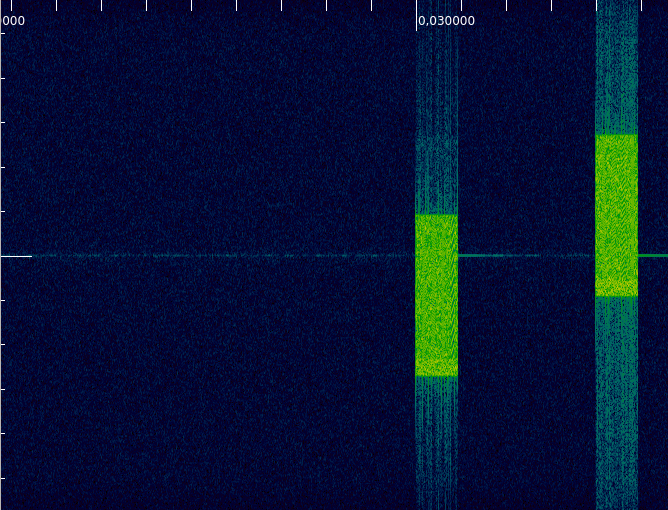
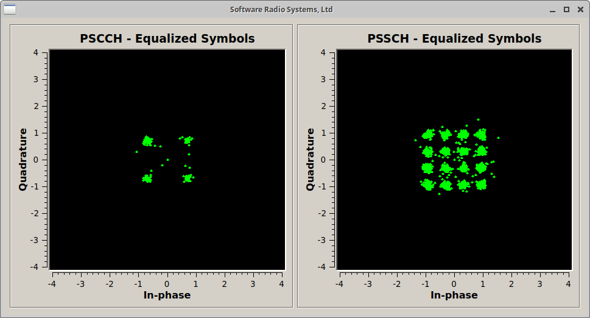

.. srsRAN C-V2X Application Note

.. _cv2x_appnote:

C-V2X with srsRAN & USRP
########################

Introduction
============

Cellular-V2X (C-V2X), or Cellular Vehicle to Everything, is a 3GPP standard to facilitate automated and (cooperative) intelligent transportation systems (C-ITS).
With C-V2X, vehicles or other devices will be able to directly communicate with each other without having to go through
the cellular infrastructure. This so called **Sidelink** communication, has a couple of advantages such as reducing communication delay when peers are
in close vicinity, but may also increase network capacity when communication resources can be reused in different locations.
The vehicular extensions have first been introduced in 3GPP Release 14 but are in fact based on earlier attempts to support direct device to device (D2D)
communication within cellular networks.
Although C-V2X is considered a key enabler for future transportation systems and the key market players, chip manufactures, operators and infrastructure
providers, are heavily pushing the technology, only few devices are available. But even if they are officially announced it is extremely difficult to
purchase them for developers or researchers, especially in small quantities.

As of version 20.04, srsRAN includes a complete implementation of the 3GPP Sidelink physical layer standardized in Release 14 licensed under AGPL v3.
This includes all control and data channels and signals for all transmission modes for both receive and transmit operation.
This allows to build complete and fully compatible C-V2X modems using software radios.

This application note shows how to use the receive-only example provided in srsRAN 20.04 to decode transmissions from a third-party commercial C-V2X
device.

Requirements
============
The C-V2X example requires a radio that can process 10 or 20 MHz wide channels. Furthermore, the device needs to be capable of
deriving timing information from GNSS signals, e.g. a GPS signal. We have tested with a Ettus Research B210 with GPSDO module.

Anatomy of a C-V2X Signal
=========================
Let's first have a look at a typical signal as it will be transmitted and received by C-V2X devices. The image below shows
a signal captures from a commercial C-V2X modem. This signal has been captured at 5.92 GHz (channel 184) with a sample
rate of 11.52 MHz.

Two identical subframes are transmitted one after each other with a gap of three empty subframes.
The second transmission is a actually a retransmission of the first subframe. Retransmissions occur
with a fixed time offset but may occupy different frequency resources. Note that there are no acknowledgments
to provide the sender feedback as to whether the transmission has been received or not.

It's also noteworthy to say that no dedicated synchronization signals are transmitted as timing
is solely derived from the GNSS signal.

For more information about the Sidelink signal structure have a look at this excellent (albeit not focusing on C-V2X)
`white paper <https://www.rohde-schwarz.com/uk/applications/device-to-device-communication-in-lte-white-paper_230854-142855.html?change_c=true>`_
from Rohde+Schwarz.

Decoding C-V2X Signals
======================

The COTS C-V2X device used in this app note by default uses channel 184 centered at 5.92 GHz for transmission.
Also it uses the default channel bandwidth of 10 MHz (or 50 PRB). In preparation for this, make sure to turn
the device on and assure it has good GPS reception. Then, enable the transmit example. Make sure that you can observe the transmissions using a spectrum
analyzer for example.

We have to options to decode the signal, we either capture the signal first and save it into a file and process the
file, or we capture a live and decode it real-time. Let's start with the second option
and decode the live signal, which is also the default case for `pssch_ue`.

Capture and Decode in Real-time
*******************************

For this, we can simply run the `pssch_ue` example. It uses 5.92 GHz by default,
but the frequency can be changed using the `-f` parameter.
We have to make sure we use the device in GPS-sync mode via parameter though.

::

  $ ./lib/examples/pssch_ue -a clock=gpsdo
  open file to write
  Opening RF device...
  [INFO] [UHD] linux; GNU C++ version 7.4.0; Boost_106501; UHD_3.14.1.1-release
  [INFO] [LOGGING] Fastpath logging disabled at runtime.
  Using GPSDO clock
  Opening USRP channels=1, args: type=b200,master_clock_rate=23.04e6
  [INFO] [B200] Detected Device: B210
  [INFO] [B200] Operating over USB 3.
  [INFO] [B200] Detecting internal GPSDO....
  [INFO] [GPS] Found an internal GPSDO: GPSTCXO , Firmware Rev 0.929a
  [INFO] [B200] Initialize CODEC control...
  [INFO] [B200] Initialize Radio control...
  [INFO] [B200] Performing register loopback test...
  [INFO] [B200] Register loopback test passed
  [INFO] [B200] Performing register loopback test...
  [INFO] [B200] Register loopback test passed
  [INFO] [B200] Asking for clock rate 23.040000 MHz...
  [INFO] [B200] Actually got clock rate 23.040000 MHz.
  Setting USRP time to 1588858638s
  [INFO] [MULTI_USRP]     1) catch time transition at pps edge
  [INFO] [MULTI_USRP]     2) set times next pps (synchronously)
  Setting sampling rate 11.52 MHz
  Set RX freq: 5920.00 MHz
  Set RX gain: 50.0 dB
  Using a SF len of 11520 samples
  OOSCI1: riv=4, mcs=5, priority=2, res_rsrv=0, t_gap=3, rtx=1, txformat=0
  SCI1: riv=1, mcs=5, priority=2, res_rsrv=0, t_gap=11, rtx=1, txformat=0
  SCI1: riv=1, mcs=5, priority=2, res_rsrv=0, t_gap=8, rtx=0, txformat=0
  SCI1: riv=0, mcs=5, priority=2, res_rsrv=0, t_gap=8, rtx=1, txformat=0
  ^CSIGINT received. Exiting...
  num_decoded_sci=4 num_decoded_tb=4
  Saving PCAP file to /tmp/pssch.pcap

If you've compiled srsRAN with GUI support you should see something like this on your screen.
In this particular examples we can see the QPSK constellation of the control channel (PSCCH)
and the 16-QAM constellation of the data channel (PSSCH).

You can stop the decoder with Ctrl+C. Upon exit, the application writes a PCAP file of the decoded
signal to `/tmp/pssch.pcap`. This file can be inspected with Wireshark. The screenshot below shows
Wireshark decoding the received signal. In this examples just random data is being transmitted
but if you're device transmits actual ITS traffic, you should be able to see that there too.

.. image:: .imgs/slsch_wireshark.png

Capture Signal to File and Post-Process
***************************************

As a second option, we can also capture the signal first, save it into file and then post-process
the capture. For example, the command below writes 200 subframes to `/tmp/usrp.dat`.

::

  $ ./lib/examples/usrp_capture_sync -l 0 -f 5.92e9 -o /tmp/usrp.dat -a clock=gpsdo -p 50 -m -n 200
  Opening RF device...
  [INFO] [UHD] linux; GNU C++ version 7.4.0; Boost_106501; UHD_3.14.1.1-release
  [INFO] [LOGGING] Fastpath logging disabled at runtime.
  Using GPSDO clock
  Opening USRP channels=1, args: type=b200,master_clock_rate=23.04e6
  [INFO] [B200] Detected Device: B210
  [INFO] [B200] Operating over USB 3.
  [INFO] [B200] Detecting internal GPSDO....
  [INFO] [GPS] Found an internal GPSDO: GPSTCXO , Firmware Rev 0.929a
  [INFO] [B200] Initialize CODEC control...
  [INFO] [B200] Initialize Radio control...
  [INFO] [B200] Performing register loopback test...
  [INFO] [B200] Register loopback test passed
  [INFO] [B200] Performing register loopback test...
  [INFO] [B200] Register loopback test passed
  [INFO] [B200] Asking for clock rate 23.040000 MHz...
  [INFO] [B200] Actually got clock rate 23.040000 MHz.
  Setting USRP time to 1588858960s
  [INFO] [MULTI_USRP]     1) catch time transition at pps edge
  [INFO] [MULTI_USRP]     2) set times next pps (synchronously)
  Set RX freq: 5920.000000 MHz
  Set RX gain: 60.0 dB
  Setting sampling rate 11.52 MHz
  Writing to file    199 subframes...
  Ok - wrote 200 subframes
  Start of capture at 1588858963+0.010. TTI=108.6

Similar to the above shown example, those subframes can now be decoded with `pssch_ue` by specifying
the input file name with parameter `-i`.

::

  $ ./lib/examples/pssch_ue -i /tmp/usrp.dat
  ...

We can also use the example to decode one of the test vectors:

::

  $./lib/examples/pssch_ue -i ../lib/src/phy/phch/test/signal_sidelink_cmw500_f5.92e9_s11.52e6_50prb_0offset_1ms.dat
  Using a SF len of 11520 samples
  SCI1: riv=0, mcs=5, priority=0, res_rsrv=1, t_gap=0, rtx=0, txformat=0
  num_decoded_sci=1 num_decoded_tb=1
  Saving PCAP file to /tmp/pssch.pcap

In this example, we can see that both PSCCH and PSSCH use QPSK as modulation scheme.

.. image:: .imgs/pssch_ue2.jpg
