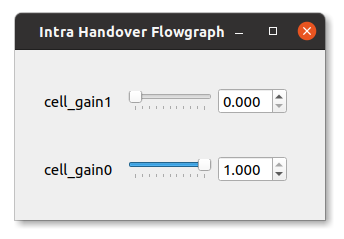

.. Handover Application Note

.. _handover_appnote:

Intra-eNB & S1 Handover
=======================

**srsRAN Release 20.10 or later is required to run the following applications**

Introduction
************
This application note focuses on mobility and handover. Specifically, we show how to configure an end-to-end network to support user-controlled handover. We address both intra-eNB and S1 handover using srsRAN with ZeroMQ-based RF emulation and we use the GNURadio Companion as a broker for controlling cell gains to trigger handover. Creating an E2E network using ZMQ and adding GRC functionality is demonstrated in our :ref:`ZMQ App Note <zeromq_appnote>`.

Hardware & Software Required
----------------------------
Both Intra-eNB and S1  handover have the following hardware and software requirements: 
  
	- A PC/ Laptop running a Linux based OS with the latest version of srsRAN installed and built.
	- ZMQ installed and working with srsRAN.
	- GNU-Radio Companion, which can be downloaded `from this link <https://wiki.gnuradio.org/index.php/InstallingGR>`_. 
	- Fully up to date drivers & dependencies.

The following command will ensure the correct dependencies are installed (Ubuntu only)::

	sudo apt-get install cmake libfftw3-dev libmbedtls-dev libboost-program-options-dev libconfig++-dev libsctp-dev

For a full guide on installing srsRAN see the :ref:`installation guide <gen_installation>`. The :ref:`ZMQ app note <zeromq_appnote>` shows how to correctly install and run ZMQ. 

If you have had to install or update your drivers and/or dependencies without having re-built srsRAN, then you will need to do so to ensure srsRAN picks up on the new/ updated drivers. 

To make a clean build execute the following commands in your terminal:: 
	
	cd ./srsran/build
	rm CMakeCache.txt
	make clean
	cmake ..
	make
		
Your hardware and drivers should now be working correctly and be ready to use correctly with srsRAN. 

Intra-eNB Handover
******************
Intra-eNB Handover describes the handover between cells when a UE moves from one sector to another sector which are managed by the same eNB. The following steps 
show how ZMQ and GRC can be used with srsRAN to demonstrate such a handover. 

The following figure shows the overall architecture used: 

.. figure:: .imgs/intra_arch.png
    :align: center

This set-up will allow intra-frequency intra-enb handover.

Note, ZMQ elements have not been included here so as to simplify the diagram, although they do form a key aspect of this implementation. 

srsRAN Set-Up
---------------------
To enable the successful execution of intra-eNB handover the configuration files of the eNB, radio resources and the UE must be modified. 

**eNB:**

In the eNB the RF Device and Args should be set so that ZMQ is used and two Tx/Rx TCP port pairings are created for the UL & DL of each cell. 

The following example shows how this is done::

	#####################################################################
	[rf]
	tx_gain = 80
	rx_gain = 40
	
	device_name = zmq
	device_args = fail_on_disconnect=true,id=enb,tx_port0=tcp://*:2101,tx_port1=tcp://*:2201,rx_port0=tcp://localhost:2100,rx_port1=tcp://localhost:2200,id=enb,base_srate=23.04e6
	#####################################################################
	
The following table should make clear how the TCP ports are allocated across the cells: 

.. list-table:: Cell Ports Used
   :widths: 25 25 25
   :header-rows: 1
   :stub-columns: 1

   * - Port Direction
     - cell1 Port #
     - cell2 Port #
   * - Rx
     - 2100
     - 2200
   * - Tx
     - 2101
     - 2201
	
The use of a clear labelling system for the ports is employed to allow for easier implementation of the GRC broker. By having the least significant unit of each Rx port be 0 and Tx port be 1 the flowgraph 
becomes easier to debug. The second most significant unit is used to indicate which cell the port belongs to. 
	
**Radio Resource (RR):**

The rr.conf is where the cells (sectors) are added to the eNB, this is also where the handover flags are enabled. The following shows how this is done:: 

	cell_list =
	( 
	 {
	 	rf_port = 0;
	 	cell_id = 0x01;
	 	tac = 0x0007;
	 	pci = 1;
	 	root_seq_idx = 204;
	 	dl_earfcn = 2850;
	 	ho_active = true;
	 	
	 	// Cells available for handover
	 	meas_cell_list =
	 	(
	 	);
	 	
	 	// ReportCfg (only A3 supported)
	 	meas_report_desc = {
	 	a3_report_type = "RSRP";
	 	a3_offset = 6;
	 	a3_hysteresis = 0;
	 	a3_time_to_trigger = 480;
	 	rsrq_config = 4;
	 	rsrp_config = 4;
	 	};
	 },
	 {
	 	rf_port = 1;
	 	cell_id = 0x02;
	 	tac = 0x0007;
	 	pci = 6;
	 	root_seq_idx = 268;
	 	dl_earfcn = 2850;
	 	ho_active = true;
	 	
	 	// Cells available for handover
	 	meas_cell_list =
	 	(
	 	);
	 	
	 	// ReportCfg (only A3 supported)
	 	meas_report_desc = {
	 	a3_report_type = "RSRP";
	 	a3_offset = 6;
	 	a3_hysteresis = 0;
	 	a3_time_to_trigger = 480;
	 	rsrq_config = 4;
	 	rsrp_config = 4;
			};
	 }
	);

Note, the TAC of the cells must match that of the MME, and the EARFCN must be the same across both cells and the UE. The PCI of each cell with the same EARFCN must be different, such that *PCI%3* for the cells is not equal. 

**UE:**

For the UE configuration, ZMQ must be set as the default device and the appropriate TCP ports set for Tx & Rx. As well as this the EARFCN value must be checked to ensure it is the same as that set for the cells in rr.conf. The following 
example shows how the ue.conf file must be modified:: 

	#####################################################################
	[rf]
	dl_earfcn = 2850
	freq_offset = 0
	tx_gain = 80
	#rx_gain = 40
	
	device_name = zmq
	device_args = tx_port=tcp://*:2001,rx_port=tcp://localhost:2000,id=ue,base_srate=23.04e6
	#####################################################################
	
The default USIM configuration can be used, as it is already present in the user_db.csv file used by the EPC to authenticate the UE. If you want to use a custom USIM set up this will need to be added to the relevant section in the ue.conf file 
and reflected in the user_db.csv to ensure the UE is authenticated correctly. 

.. list-table:: UE Ports Used
   :widths: 25 25
   :header-rows: 1
   :stub-columns: 1

   * - Port Direction
     - Port #
   * - Rx
     - 2000
   * - Tx
     - 2001

Again for these ports the least significant unit is used to indicate whether the port is being used for Tx or Rx. 

In short, the EARFCN values must be the same across the eNB, both cells and the UE, handover must be enabled in the RR config file and ZMQ made 
the default device for both the eNB and UE. 

GNU-Radio Companion
----------------------

The GRC file can be downloaded :download:`here <handover_broker.grc>`. Download and/ or save the file as a *.grc* file. Run with GNU-Radio Companion when needed. 

The GRC Broker will be used to force handover between cells. This will be done by manually controlling the gain of each cell using variables and a slider. ZMQ REQ Source and REP Sink blocks will be used to link the flowgraph to the ZMQ instances 
of srsENB and srsUE. The following figure illustrated how this is done: 

.. figure:: .imgs/grc_intra.png
    :align: center
	
The following table again shows the clear breakdown of how the ports are assigned to each of the network elements: 
	
.. list-table:: Ports Used
    :widths: 20 20 20 20
    :header-rows: 1
    :stub-columns: 1

    * - Port Direction
      - cell1 Port #
      - cell2 Port #
      - UE Port #
    * - Rx
      - 2100
      - 2200
      - 2000
    * - Tx
      - 2101
      - 2201
      - 2001

The gain of cell2 is first set to 0, and cell1 to 1. These are then controlled via sliders and increased in steps of 0.1 to force handover once a connection has been established. Handover should occur once the gain of a cell is higher than the other, i.e. when the signal is stronger. 

Running the Network
----------------------
To instantiate the network correctly srsEPC is first run, then srsENB and finally srsUE. Once all three are running the GRC Broker should be run from GNU-Radio. The UE should then connect to the network, with the UL & DL passing through the broker. 
You should have already set up a network namespace for the UE, as described in the :ref:`ZMQ App Note <zeromq_appnote>`.

**EPC:**

To initiate the EPC, simply run the following command:: 
	
	sudo srsepc 
	
The EPC should display the following:: 
 
	Built in Release mode using commit 7e60d8aae on branch next.
	
	
	---  Software Radio Systems EPC  ---
	
	Reading configuration file /etc/srsran/epc.conf...
	HSS Initialized.
	MME S11 Initialized
	MME GTP-C Initialized
	MME Initialized. MCC: 0xf901, MNC: 0xff70
	SPGW GTP-U Initialized.
	SPGW S11 Initialized.
	SP-GW Initialized.
	
**eNB:**

Once the EPC is running, the eNB can by run using this command::
	
	sudo srsenb 
	
You should then see the following in the console:: 

	---  Software Radio Systems LTE eNodeB  ---
	
	Reading configuration file /etc/srsran/enb.conf...
	
	Built in Release mode using commit 7e60d8aae on branch next.
	
	Opening 2 channels in RF device=zmq with args=fail_on_disconnect=true,id=enb,tx_port0=tcp://*:2101,tx_port1=tcp://*:2201,rx_port0=tcp://localhost:2100,rx_port1=tcp://localhost:2200,id=enb,base_srate=23.04e6
	CHx base_srate=23.04e6
	CHx id=enb
	Current sample rate is 1.92 MHz with a base rate of 23.04 MHz (x12 decimation)
	CH0 rx_port=tcp://localhost:2100
	CH0 tx_port=tcp://*:2101
	CH0 fail_on_disconnect=true
	CH1 rx_port=tcp://localhost:2200
	CH1 tx_port=tcp://*:2201
	Current sample rate is 11.52 MHz with a base rate of 23.04 MHz (x2 decimation)
	Current sample rate is 11.52 MHz with a base rate of 23.04 MHz (x2 decimation)
	Setting frequency: DL=2630.0 Mhz, UL=2510.0 MHz for cc_idx=0
	Setting frequency: DL=2630.0 Mhz, UL=2510.0 MHz for cc_idx=1
	
	==== eNodeB started ===
	Type <t> to view trace

The EPC console should then display a confirmation that the eNB cas connected:: 

	Received S1 Setup Request.
	S1 Setup Request - eNB Name: srsenb01, eNB id: 0x19b
	S1 Setup Request - MCC:901, MNC:70
	S1 Setup Request - TAC 7, B-PLMN 0x9f107
	S1 Setup Request - Paging DRX v128
	Sending S1 Setup Response

**UE:**

The UE now needs to be run, this can be done with the following command:: 
	
	sudo srsue --gw.netns=ue1
	
The UE console should then display this:: 

	Reading configuration file /etc/srsran/ue.conf...
	
	Built in Release mode using commit 7e60d8aae on branch next.
	
	Opening 1 channels in RF device=zmq with args=tx_port=tcp://*:2001,rx_port=tcp://localhost:2000,id=ue,base_srate=23.04e6
	CHx base_srate=23.04e6
	CHx id=ue
	Current sample rate is 1.92 MHz with a base rate of 23.04 MHz (x12 decimation)
	CH0 rx_port=tcp://localhost:2000
	CH0 tx_port=tcp://*:2001
	Waiting PHY to initialize ... done!
	Attaching UE...
	Current sample rate is 1.92 MHz with a base rate of 23.04 MHz (x12 decimation)
	Current sample rate is 1.92 MHz with a base rate of 23.04 MHz (x12 decimation)
	
	
**GRC:**

Once all three network elements have been successfully initiated, the Broker can be run. This is done in the same way as any other GRC Flowgraph. Once successful, a pop up window 
should display the interactive slider for controlling the gain of the two cells.

Confirming Connection
----------------------

Once the broker has been run, a successful attach should be made and the network should be up and running fully. To confirm this, check the appropriate messages are displayed in the console. 

**EPC Attach:**

If the attach is successful the EPC should give the following readout:: 

	Initial UE message: LIBLTE_MME_MSG_TYPE_ATTACH_REQUEST
	Received Initial UE message -- Attach Request
	Attach request -- M-TMSI: 0xd1006989
	Attach request -- eNB-UE S1AP Id: 1
	Attach request -- Attach type: 1
	Attach Request -- UE Network Capabilities EEA: 11110000
	Attach Request -- UE Network Capabilities EIA: 01110000
	Attach Request -- MS Network Capabilities Present: false
	PDN Connectivity Request -- EPS Bearer Identity requested: 0
	PDN Connectivity Request -- Procedure Transaction Id: 1
	PDN Connectivity Request -- ESM Information Transfer requested: false
	UL NAS: Received Identity Response
	ID Response -- IMSI: 901700123456789
	Downlink NAS: Sent Authentication Request
	UL NAS: Received Authentication Response
	Authentication Response -- IMSI 901700123456789
	UE Authentication Accepted.
	Generating KeNB with UL NAS COUNT: 0
	Downlink NAS: Sending NAS Security Mode Command.
	UL NAS: Received Security Mode Complete
	Security Mode Command Complete -- IMSI: 901700123456789
	Getting subscription information -- QCI 7
	Sending Create Session Request.
	Creating Session Response -- IMSI: 901700123456789
	Creating Session Response -- MME control TEID: 1
	Received GTP-C PDU. Message type: GTPC_MSG_TYPE_CREATE_SESSION_REQUEST
	SPGW: Allocated Ctrl TEID 1
	SPGW: Allocated User TEID 1
	SPGW: Allocate UE IP 172.16.0.2
	Received Create Session Response
	Create Session Response -- SPGW control TEID 1
	Create Session Response -- SPGW S1-U Address: 127.0.1.100
	SPGW Allocated IP 172.16.0.2 to IMSI 901700123456789
	Adding attach accept to Initial Context Setup Request
	Sent Initial Context Setup Request. E-RAB id 5 
	Received Initial Context Setup Response
	E-RAB Context Setup. E-RAB id 5
	E-RAB Context -- eNB TEID 0x1; eNB GTP-U Address 127.0.1.1
	UL NAS: Received Attach Complete
	Unpacked Attached Complete Message. IMSI 901700123456789
	Unpacked Activate Default EPS Bearer message. EPS Bearer id 5
	Received GTP-C PDU. Message type: GTPC_MSG_TYPE_MODIFY_BEARER_REQUEST
	Sending EMM Information

**eNB Attach:**

You will see the RACH and connection message on the eNB::

	RACH:  tti=341, cc=0, preamble=14, offset=0, temp_crnti=0x46
	User 0x46 connected

**UE Attach:**

The UE console will display the following:: 

	Found Cell:  Mode=FDD, PCI=1, PRB=50, Ports=1, CFO=-0.2 KHz
	Current sample rate is 11.52 MHz with a base rate of 23.04 MHz (x2 decimation)
	Current sample rate is 11.52 MHz with a base rate of 23.04 MHz (x2 decimation)
	Found PLMN:  Id=90170, TAC=7
	Random Access Transmission: seq=14, ra-rnti=0x2
	Random Access Complete.     c-rnti=0x46, ta=0
	RRC Connected
	Network attach successful. IP: 172.16.0.2
	Software Radio Systems LTE (srsRAN) 21/10/2020 12:47:43 TZ:0

The network is now ready for handover to be initiated and tested. To keep the UE from entering idle, you should send traffic between the UE and the eNB. 
This can be done with the following command:: 

	sudo ip netns exec ue1 ping 172.16.0.1

Forcing Handover
---------------------------------------

Handover is simply forced by using the slider to change the gain variables within GRC. Once the handover is successful a message should be displayed by the UE acknowledging a successful handover. 

**GRC:**

The Following steps outline how handover can be forced with GRC. Aagain, this is done using the sliders for the gain variables: 

	1. Set the gain of *cell1* to 0.5
	2. Slowly increase the gain of *cell2* to above 0.5 and on to 1. 
	3. Wait for handover to be acknowledged.
	4. Move the gain of *cell1* to 0. 
	
**UE Console:**

If handover is successful you should see the following read out in the UE console::

	Received HO command to target PCell=6, NCC=0
	Random Access Transmission: seq=3, ra-rnti=0x2
	Random Access Complete.     c-rnti=0x47, ta=0
	HO successful

Handover can now be repeated as many times as needed by repeating the above steps. 

S1 Handover
***************
 
**Note, srsEPC does not support handover via the S1 interface, as it is designed to be a lightweight core 
for network-in-a-box type deployments. To support S1 handover, a third party EPC must be used. We will use 
Open5GS for the purposes of this note, however any third-party EPC supporting S1 handover can be used.**

S1 handover takes place over the S1-interface as a UE transitions from the coverage of one eNB to the next. 
This differs from intra-enb handover as the UE is leaving the coverage of all sectors in an eNBs coverage, 
it is a handover to a new eNB. 
The following steps outline how this can be demonstrated using srsUE, srsENB and a third-party open source core. 
In this case the EPC from Open5GS is used. Other third party options would also work in this case, so long as they support S1 handover. 

The following diagram outlines the network architecture: 

.. figure:: .imgs/s1_handover.png
    :align: center

Open5GS EPC
---------------------

The Open5GS EPC is an open source core network solution which is inter-operable with srsRAN. The software can be installed 
from packages if using Ubuntu, as shown via the `open5GS docs <https://open5gs.org/open5gs/docs/guide/01-quickstart/>`_. 
The EPC, and the rest of the Open5GS applications, run out of the box and only require minor configuration for use with srsRAN. 

EPC Set-Up
------------------

The EPC needs to be configured for use with srsRAN. The only changes required are to the MME configuration and adding the UE to the user database. 

**MME Config:**

In the file mme.yaml, the TAC must be changed to 7, this is the standard configuration for srsRAN. You could also leave 
these settings as they are and configure the srsRAN elements instead. 

The following shows the MME configuration used::

	mme:
		freeDiameter: /etc/freeDiameter/mme.conf
		s1ap:
		  - addr: 127.0.0.2
		gtpc:
		  - addr: 127.0.0.2
		gummei: 
		  plmn_id:
			mcc: 901
			mnc: 70
		  mme_gid: 2
		  mme_code: 1
		tai:
		  plmn_id:
			mcc: 901
			mnc: 70
		  tac: 7
		security:
		  integrity_order : [ EIA2, EIA1, EIA0 ]
		  ciphering_order : [ EEA0, EEA1, EEA2 ]
		network_name:
		  full: Open5GS
		mme_name: open5gs-mme0

For reference, this configuration can be found from line 204 to 226. 

**Subscriber List:**

Adding subscribers to the network is done via the web-UI provided by open5GS. Their documentation outlines 
how this is done `here <https://open5gs.org/open5gs/docs/guide/01-quickstart/>`_, under the section *Register Subscriber Information*.

First open the UI, found at http://localhost:3000, and enter the credentials found in the UE configuration file (ue.conf). The following credentials are used: 

.. figure:: .imgs/ue_creds.png
    :align: center

Note, the first five digits (PLMN) in the IMSI to 90170, and OPc (Milenage Authentication) is being used. 
This differs from the USIM configuration found in ue.conf, the changes made here will later be reflected in the ue.conf file. The IMSI is edited to reflect 
the values used for the MCC and MNC. Milenage is used here to show how the sim credentials can be changed to suit certain use-cases. 

srsRAN Set-Up
----------------------

To ensure srsRAN is correctly configured to implement S1 Handover, changes must be made to the UE and eNB configurations. 

**UE:**

As previously outlined, the USIM credentials in the configuration file must be modified. The following sections taken from the config file show the sections that need to be modified:: 

	[rf]
	dl_earfcn = 2850
	freq_offset = 0
	tx_gain = 80
	#rx_gain = 40
	
	[usim]
	mode = soft
	algo = milenage
	opc  = 63BFA50EE6523365FF14C1F45F88737D
	k    = 00112233445566778899aabbccddeeff
	imsi = 901700123456789
	imei = 353490069873319
	#reader = 
	#pin  = 1234

The downlink EARFCN is set to 2850 for this application, this is matched across the rest of the network. This sets the LTE Band and carrier frequency for the UE and eNB(s), they must match so that a connection can be successfully established and held. 
The changes made when adding the UE to the subscriber list in the EPC are also shown here, the IMSI now leads with the correct PLMN code, and the authentication algorithm is set to milenage; the opc is uncommented to enable this. 

**eNB:**

For the eNB config the PLMN must be changed, the MME address must also be changed to that of the MME associated with the Open5GS EPC. The following are the changes made to the enb.conf file:: 

	[enb]
	enb_id = 0x19B
	mcc = 901
	mnc = 70
	mme_addr = 127.0.0.2
	gtp_bind_addr = 127.0.1.1
	s1c_bind_addr = 127.0.1.1
	n_prb = 50
	#tm = 4
	#nof_ports = 2
	
**eNB RR:**

The rr.conf file must also be edited to allow for S1 Handover. To do this, two new rr.conf files are created, 
named rr1.conf and rr2.conf. As there will be two eNBs, there is an rr.conf associated with each. It is recommend that the 
existing rr.conf is simply copied into two new files, and only the *cell_list* changed for each of the new filles. This should help to avoid misconfiguration. 

**rr1.conf:**

After the rr.conf has been copied to a new file (in the same location as the existing configuration files), the cell list must be edited. The following snippet shows this:: 
	
	cell_list =
	(
	  {
		// rf_port = 0;
		cell_id = 0x01;
		tac = 0x0007;
		pci = 1;
		root_seq_idx = 204;
		dl_earfcn = 2850;
		//ul_earfcn = 21400;
		ho_active = true;
		//meas_gap_period = 0; // 0 (inactive), 40 or 80
		//meas_gap_offset_subframe = [6, 12, 18, 24, 30];
		// target_pusch_sinr = -1;
		// target_pucch_sinr = -1;
		// enable_phr_handling = false;
		// min_phr_thres = 0;
		// allowed_meas_bw = 6;
		// t304 = 2000; // in msec. possible values: 50, 100, 150, 200, 500, 1000, 2000

		// CA cells
		scell_list = (
		// {cell_id = 0x02; cross_carrier_scheduling = false; scheduling_cell_id = 0x02; ul_allowed = true}
		)

		// Cells available for handover
		meas_cell_list =
		(
		  {
		    eci = 0x19B01;
		    dl_earfcn = 2850;
		    pci = 1;
		    //direct_forward_path_available = false;
		    //allowed_meas_bw = 6;
		    //cell_individual_offset = 0;
		  },
		  {
		    eci = 0x19C01;
		    dl_earfcn = 2850;
		    pci = 6;
		  }
		);

		// Select measurement report configuration (all reports are combined with all measurement objects)
		meas_report_desc =
		(
		  {
		    eventA = 3
		    a3_offset = 6;
		    hysteresis = 0;
		    time_to_trigger = 480;
		    trigger_quant = "RSRP";
		    max_report_cells = 1;
		    report_interv = 120;
		    report_amount = 1;
		  }
		);

		meas_quant_desc = {
		  // averaging filter coefficient
		  rsrq_config = 4;
		  rsrp_config = 4;
		};
	  }
	  // Add here more cells
	);
	
Here the TAC is set to 7, and the DL EARFCN is set to 2850. To ensure S1 Handover is successful the cell(s) 
associated with the second eNB must be added to the *meas_cell_list*. This can be seen here where a cell with *eci = 0x19C01* is included, this is the cell 
associated with the second eNB. The cell with *eci = 0x19B01* is the cell active on the current eNB. The DL EARFCN is the same across both. 

**rr2.conf:**

Similarly to rr1.conf, a file rr2.conf must be created where the other configuration files are found and the *cell_list* updated:: 

	cell_list =
	(
	  {
		// rf_port = 0;
		cell_id = 0x01;
		tac = 0x0007;
		pci = 6;
		root_seq_idx = 264;
		dl_earfcn = 2850;
		//ul_earfcn = 21400;
		ho_active = true;
		//meas_gap_period = 0; // 0 (inactive), 40 or 80
		//meas_gap_offset_subframe = [6, 12, 18, 24, 30];
		// target_pusch_sinr = -1;
		// target_pucch_sinr = -1;
		// enable_phr_handling = false;
		// min_phr_thres = 0;
		// allowed_meas_bw = 6;
		// t304 = 2000; // in msec. possible values: 50, 100, 150, 200, 500, 1000, 2000

		// CA cells
		scell_list = (
		// {cell_id = 0x02; cross_carrier_scheduling = false; scheduling_cell_id = 0x02; ul_allowed = true}
		)

		// Cells available for handover
		meas_cell_list =
		(
		  {
		    eci = 0x19B01;
		    dl_earfcn = 2850;
		    pci = 1;
		    //direct_forward_path_available = false;
		    //allowed_meas_bw = 6;
		    //cell_individual_offset = 0;
		  },
		  {
		    eci = 0x19C01;
		    dl_earfcn = 2850;
		    pci = 6;
		  }
		);

		// Select measurement report configuration (all reports are combined with all measurement objects)
		meas_report_desc =
		(
		  {
		    eventA = 3
		    a3_offset = 6;
		    hysteresis = 0;
		    time_to_trigger = 480;
		    trigger_quant = "RSRP";
		    max_report_cells = 1;
		    report_interv = 120;
		    report_amount = 1;
		  }
		);

		meas_quant_desc = {
		  // averaging filter coefficient
		  rsrq_config = 4;
		  rsrp_config = 4;
		};
	  }
	  // Add here more cells
	);
	
It is possible to enable both intra-eNB and S1 handover at the same time by combining the rr configuration used 
for intra-enb HO with those shown above. Although, that will not be covered in this application note. 

Using Scripts
--------------------

To efficiently instantiate and run the network for S1 HO, Bash scripts will be employed. Scripts will be used 
to run the two eNBs and the UE. The scripts should be created in the same folder as the other configuration files to avoid any 
errors when passing file names and when running them. 

**eNB 1:**

The first eNB will need to have ZMQ set as the RF device, and the ports assigned. As well as this, the new rr1.conf 
file must be set as the radio resource configuration to be used:: 

	#!/bin/bash
	
	LOG_ARGS="--log.all_level=debug"
	
	PORT_ARGS="tx_port=tcp://*:2101,rx_port=tcp://localhost:2100"
	ZMQ_ARGS="--rf.device_name=zmq --rf.device_args=\"${PORT_ARGS},id=enb,base_srate=23.04e6\""
	
	OTHER_ARGS="--enb_files.rr_config=rr1.conf"
	
	sudo srsenb enb.conf ${LOG_ARGS} ${ZMQ_ARGS} ${OTHER_ARGS} $@

Note how the logging level is also set here using the script. Every argument in the configuration file can be changed via 
the command line when the eNB is instantiated, this shows how it is done when using a script with the logging as the example. 

**eNB 2:**

For the second eNB we will need to set the ZMQ device, with the correct ports as above. The rr2.conf file must 
also be given as the rr configuration file to be used. Additional steps must be taken with this eNB so as to allow it to be 
instantiated correctly. The eNB ID must be changed, and the GTP and S1C bind addresses must be modified. This is done with the following script:: 

	#!/bin/bash
	
	LOG_ARGS="--log.all_level=info"
	
	PORT_ARGS="tx_port=tcp://*:2201,rx_port=tcp://localhost:2200"
	ZMQ_ARGS="--rf.device_name=zmq --rf.device_args=\"${PORT_ARGS},id=enb,base_srate=23.04e6\""
	
	OTHER_ARGS="--enb_files.rr_config=rr2.conf --enb.enb_id=0x19C --enb.gtp_bind_addr=127.0.1.2 --enb.s1c_bind_addr=127.0.1.2"
	
	sudo srsenb enb.conf ${LOG_ARGS} ${ZMQ_ARGS} ${OTHER_ARGS} $@

**UE:**

The script for the UE will be used to set the ZMQ device and ports, while also being used to set-up the network namespace used for the UE:: 

	#!/bin/bash
	
	LOG_PARAMS="--log.all_level=debug"
	
	PORT_ARGS="tx_port=tcp://*:2001,rx_port=tcp://localhost:2000"
	ZMQ_ARGS="--rf.device_name=zmq --rf.device_args=\"${PORT_ARGS},id=ue,base_srate=23.04e6\" --gw.netns=ue1"
	
	
	## Create netns for UE
	ip netns list | grep "ue1" > /dev/null
	if [ $? -eq 1 ]; then
	  echo creating netspace ue1...
	  sudo ip netns add ue1
	  if [ $? -ne 0 ]; then
	   echo failed to create netns ue1
	   exit 1
	  fi
	fi
	
	sudo srsue ue.conf ${LOG_PARAMS} ${ZMQ_ARGS} "$@"
	
The UE does not require any other parameters to be passed when it is instantiated. 

GNU-Radio
-----------------

The GRC file can be downloaded :download:`here <handover_broker.grc>`. Download and/ or save the file as a *.grc* file. Run with GNU-Radio Companion when needed.

The GRC Broker used here is the same as that used for intra-eNB HO. The following figure shows the flowgraph used: 

.. figure:: .imgs/grc_intra.png
    :align: center
	
The following outlines which ports belong to which network element: 

.. list-table:: Ports Used
    :widths: 20 20 20 20
    :header-rows: 1
    :stub-columns: 1

    * - Port Direction
      - eNB 1 Port #
      - eNB 2 Port #
      - UE Port #
    * - Rx
      - 2100
      - 2200
      - 2000
    * - Tx
      - 2101
      - 2201
      - 2001

Running the Network
------------------------------

To run the network the following steps must be taken: 

	1. Run the scripts to start each of the network elements
	2. Run the GRC Broker to connect the UE to the eNB(s) 
	
The eNB that the UE connects to first is known as the Source eNB, in this case it will be eNB 1. The Target eNB will be eNB 2, i.e. the eNB that the UE will be transferred to. 
	
Confirming Connection
---------------------------------

To confirm the initial connection has been successful look for the following readouts on the relevant consoles. 

Source eNB::

	---  Software Radio Systems LTE eNodeB  ---                                                                                                                                                                        
																																																					
	Reading configuration file enb.conf...                                                                                                                                                                             
																																																					
	Built in Release mode using commit 7e60d8aae on branch next.                                                                                                                                                       
																																																					
	Opening 1 channels in RF device=zmq with args="tx_port=tcp://*:2101,rx_port=tcp://localhost:2100,id=enb,base_srate=23.04e6"                                                                                        
	CHx base_srate=23.04e6"                                                                                                                                                                                            
	CHx id=enb                                                                                                                                                                                                         
	Current sample rate is 1.92 MHz with a base rate of 23.04 MHz (x12 decimation)                                                                                                                                     
	CH0 rx_port=tcp://localhost:2100                                                                                                                                                                                   
	CH0 tx_port=tcp://*:2101                                                                                                                                                                                           
	Current sample rate is 11.52 MHz with a base rate of 23.04 MHz (x2 decimation)                                                                                                                                     
	Current sample rate is 11.52 MHz with a base rate of 23.04 MHz (x2 decimation)                                                                                                                                     
	Setting frequency: DL=2630.0 Mhz, UL=2510.0 MHz for cc_idx=0                                                                                                                                                       
																																																					
	==== eNodeB started ===                                                                                                                                                                                            
	Type <t> to view trace                                                                                                                                                                                             
	RACH:  tti=341, cc=0, preamble=38, offset=0, temp_crnti=0x46                                                                                                                                                       
	User 0x46 connected

Target eNB::

	---  Software Radio Systems LTE eNodeB  ---                                                                                                                                                                        
																																																					
	Reading configuration file enb.conf...                                                                                                                                                                             
																																																					
	Built in Release mode using commit 7e60d8aae on branch next.                                                                                                                                                       
																																																					
	Opening 1 channels in RF device=zmq with args="tx_port=tcp://*:2201,rx_port=tcp://localhost:2200,id=enb,base_srate=23.04e6"                                                                                        
	CHx base_srate=23.04e6"                                                                                                                                                                                            
	CHx id=enb                                                                                                                                                                                                         
	Current sample rate is 1.92 MHz with a base rate of 23.04 MHz (x12 decimation)                                                                                                                                     
	CH0 rx_port=tcp://localhost:2200                                                                                                                                                                                   
	CH0 tx_port=tcp://*:2201                                                                                                                                                                                           
	Current sample rate is 11.52 MHz with a base rate of 23.04 MHz (x2 decimation)                                                                                                                                     
	Current sample rate is 11.52 MHz with a base rate of 23.04 MHz (x2 decimation)                                                                                                                                     
	Setting frequency: DL=2630.0 Mhz, UL=2510.0 MHz for cc_idx=0                                                                                                                                                       
																																																					
	==== eNodeB started ===                                                                                                                                                                                            
	Type <t> to view trace 
	
Note, you wont see anything on this eNB console until handover has successfully been made between the eNBs. 

UE::

	Reading configuration file ue.conf...                                                                                                                                                                              
																																																					
	Built in Release mode using commit 7e60d8aae on branch next. 
	
	Opening 1 channels in RF device=zmq with args="tx_port=tcp://*:2001,rx_port=tcp://localhost:2000,id=ue,base_srate=23.04e6"                                                                                   
	CHx base_srate=23.04e6"                                                                                                                                                                                            
	CHx id=ue                                                                                                                                                                                                          
	Current sample rate is 1.92 MHz with a base rate of 23.04 MHz (x12 decimation)                                                                                                                                     
	CH0 rx_port=tcp://localhost:2000                                                                                                                                                                                   
	CH0 tx_port=tcp://*:2001                                                                                                                                                                                           
	Waiting PHY to initialize ... done!                                                                                                                                                                                
	Attaching UE...                                                                                                                                                                                                    
	Current sample rate is 1.92 MHz with a base rate of 23.04 MHz (x12 decimation)                                                                                                                                     
	Current sample rate is 1.92 MHz with a base rate of 23.04 MHz (x12 decimation)                                                                                                                                     
	.                                                                                                                                                                                                                  
	Found Cell:  Mode=FDD, PCI=1, PRB=50, Ports=1, CFO=-0.2 KHz                                                                                                                                                        
	Current sample rate is 11.52 MHz with a base rate of 23.04 MHz (x2 decimation)                                                                                                                                     
	Current sample rate is 11.52 MHz with a base rate of 23.04 MHz (x2 decimation)                                                                                                                                     
	Found PLMN:  Id=90170, TAC=7                                                                                                                                                                                       
	Random Access Transmission: seq=38, ra-rnti=0x2                                                                                                                                                                    
	Random Access Complete.     c-rnti=0x46, ta=0                                                                                                                                                                      
	RRC Connected                                                                                                                                                                                                      
	
	Network attach successful. IP: 10.45.0.7                                                                                                                                                                           
	nTp) 6/11/2020 15:36:1 TZ:0
	
You should now start to send traffic between the UE and the EPC, this is done via the following command::

	sudo ip netns exec ue1 ping 10.45.0.1
	
This will stop the UE from timing out and keep the connection to the core open. 
	
Forcing Handover
-------------------------

The network is now ready for handover to be forced, this is done in the same way as before using the GRC Broker:

	1. Set the gain of the *Source eNB* from 1 to 0.5
	2. Slowly increase the gain of the *Target eNB* from 0, to above 0.5, and on to 1. 
	3. Wait for handover to be acknowledged. 
	4. Move the gain of the *Source eNB* to 0. 

If HO is successful the following will be seen on the relevant console outputs: 

Source eNB::

	Starting S1 Handover of rnti=0x46 to cellid=0x19c01.
	Encoded varShortMAC: cellId=0x19b01, PCI=1, rnti=0x46 (7 bytes)
	Disconnecting rnti=0x46.
	
Target eNB::

	Received S1 HO Request
	Received S1 MMEStatusTransfer
	RACH:  tti=3421, cc=0, preamble=20, offset=0, temp_crnti=0x47
	Disconnecting rnti=0x47.
	User 0x46 connected

UE::

	Received HO command to target PCell=6, NCC=2
	Random Access Transmission: seq=20, ra-rnti=0x2
	Random Access Complete.     c-rnti=0x46, ta=0
	HO successful

This can be repeated as many times as needed by following the above steps. 

Troubleshooting
****************

Intra-eNB Handover
----------------------------

  - If the gains of the cells are changed too abruptly the handover messages will not have enough time to be exchanged successfully. Gradually moving the sliders between values is best practice when changing the gain values. 

S1 Handover
----------------------------

  - Open5GS can also be installed from source, but it is easier to install from packages for this use-case. 
  
  - Ensure the PLMN, TAC and EARFCN are correct across all relevant network elements, as this can cause the connection to fail or stop an attach occuring. 

