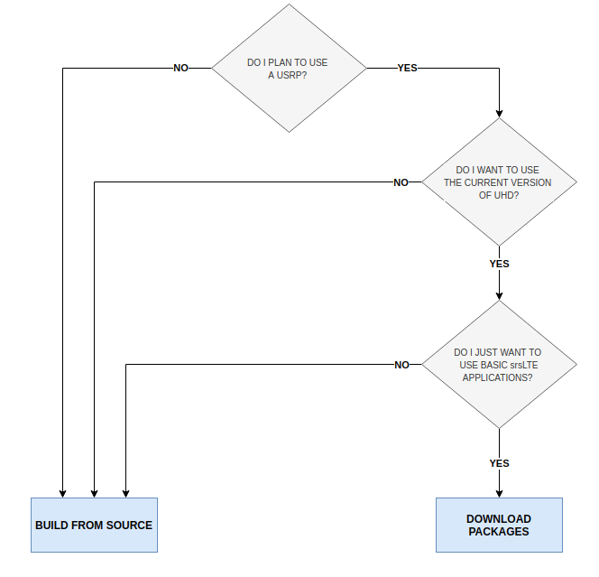

.. _gen_installation:

Installation Guide
==================

Which Installation Should I Use? 
**************************************

srsRAN can be installed from packages or from source. The following decision tree should help users decide which is best for them: 

In short, users looking for a simple installation who only expect to run basic srsRAN applications with USRP front-ends should use the package installation.
Users who wish to modify srsRAN and/or use alternative RF front-ends such as limeSDR and BladeRF should install from source.

Package Installation
*********************

The srsRAN software suite can be installed using packages on Ubuntu::

  sudo add-apt-repository ppa:softwareradiosystems/srsran
  sudo apt-get update
  sudo apt-get install srsran -y
  
Package installs are also available for other distributions.

 - `openSUSE <https://software.opensuse.org/package/srsRAN?search_term=srsran>`_
 - `Arch Linux <https://www.archlinux.org/packages/?q=srsRAN>`_
 - `Debian (Pop OS, Mint, etc) <https://packages.debian.org/search?suite=default&section=all&arch=any&searchon=names&keywords=srsRAN>`_ 
 
Note, only the Launchpad packages for Ubuntu are maintained by SRS. Different distributions will maintain their own packages for srsRAN, which may or may not be up to date. Check the available version before installing 
to ensure you are using the desired version of srsRAN. 

Fedora does not yet have support for a package installation of srsRAN. 

Installation from Source
************************

* Mandatory requirements: 

  * Common:

    * `cmake <https://cmake.org/>`_
    * `libfftw <http://www.fftw.org/>`_
    * `mbedTLS <https://tls.mbed.org>`_

  * srsUE:

    * `Boost <http://www.boost.org>`_

  * srsENB:

    * `Boost <http://www.boost.org>`_
    * `lksctp <http://lksctp.sourceforge.net/>`_
    * `config <http://www.hyperrealm.com/libconfig/>`_

  * srsEPC:

    * `Boost <http://www.boost.org>`_
    * `lksctp <http://lksctp.sourceforge.net/>`_
    * `config <http://www.hyperrealm.com/libconfig/>`_

For example, on Ubuntu, one can install the required libraries with::

  sudo apt-get install build-essential cmake libfftw3-dev libmbedtls-dev libboost-program-options-dev libconfig++-dev libsctp-dev

or on Fedora::

  dnf install cmake fftw3-devel mbedtls-devel lksctp-tools-devel libconfig-devel boost-devel

For CentOS, use the Fedora packages but replace `libconfig-devel` with just `libconfig`.

Note that depending on your flavor and version of Linux, the actual package names may be different.

* Optional requirements: 

  * `srsGUI <https://github.com/srsran/srsgui>`_ - for real-time plotting.
  * `libpcsclite-dev <https://pcsclite.apdu.fr/>`_ - for accessing smart card readers
  * libdw-dev libdw - for truly informative backtraces using backward-cpp

.. _Drivers:

* RF front-end driver:

  * `UHD <https://github.com/EttusResearch/uhd>`_ 
  * `SoapySDR <https://github.com/pothosware/SoapySDR>`_
  * `BladeRF <https://github.com/Nuand/bladeRF>`_
  * `ZeroMQ <https://github.com/zeromq>`_

.. note::
	If using UHD we recommended the LTS version of UHD, i.e. either 3.9.7 or 3.15.

.. warning::
  All mandatory requirements, optional requirements, and RF front-end drivers must be installed **prior** to building srsRAN. Failing to do this will result in
  errors at run-time or prevent srsRAN from building correctly.  

Download and build srsRAN::

  git clone https://github.com/srsRAN/srsRAN.git
  cd srsRAN
  mkdir build
  cd build
  cmake ../
  make
  make test

Install srsRAN::

  sudo make install
  srsran_install_configs.sh user

This installs srsRAN and also copies the default srsRAN config files to *~/.config/srsran*.

Getting Support
***************

Join the community on the `srsRAN-users <https://lists.srsran.com/mailman/listinfo/srsran-users>`_ mailing list.
The mailing list is a great place to ask questions, get support from the community and learn more about the various projects 
users are working on.

